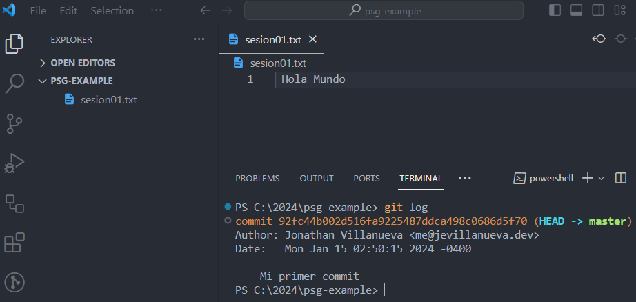
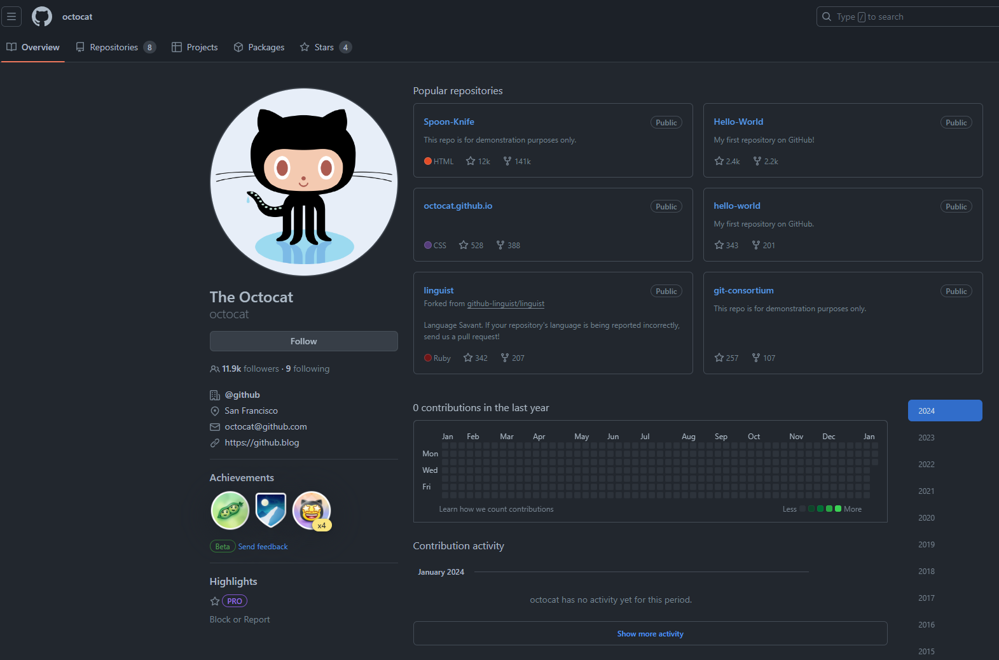

<!-- .slide: data-background-image="../../content/psg-bg-dark.png" data-background-size="100%"-->
 <!-- .element  hidden="true" -->

<br>
<br>
<br>

### Sesión  01
### Iniciando nuestro Setup
### Introducción a VS Code y Git

---
#### ¿Que es un editor de Código?
Un editor de código es un editor de texto diseñado para editar el código fuente de los programas informáticos

---
Tienen características diseñadas para simplificar y acelerar la escritura de código fuente como:
- Resultado de sintaxis
- Autocompletado
- Igualación de llaves

---
Algunos ejemplos de editores de código:

- Visual Studio Code
- Sublime Text
- Atom
- Notepad++
- Vim

---
Utilizaremos **Visual Studio Code** por su facilidad de instalación, compatibilidad entre plataformas y optimización de recursos

---
Características de Visual Studio Code

|                         |                                                                         |
| ----------------------- | ----------------------------------------------------------------------- |
| IntelliSense            |  <!-- .element width="50%" -->            |
| Run & Debug             |  <!-- .element width="50%" -->             |
| Comandos Git Integrados |  <!-- .element width="50%" --> |

---
**IntelliSense**: Es una combinación de autocompletado de código, asistencia de contenido y sugerencia de código


---
**Run & Debug**: Realizar Debug desde el editor de código, ejecutar o enlazar la ejecución de apps y realizar debug utilizando breakpoints

 <!-- .element width="70%" -->

---
**Comandos Git Integrados**: Trabajar con GIT es escencial en el mundo del desarrollo y VS Code permite revisar diffs, stage de archivos, realizar commits desde el editor, push y pull desde cualquier SCM (source code management) 

---
**Extensiones**: Posee la capacidad de instalar extensiones que agregan más características, extiende y personaliza el editor, instalar extensiones para nuevos lenguajes, temas, herramientas de debug, conectar a servicios

 <!-- .element width="40%" -->

---
#### Instalación de VSCode
Visual Studio Code o VS Code se puede utilizar tanto en Windows, Linux y Mac OS se puede descargar los binarios de la siguiente dirección

[code.visualstudio.com](https://code.visualstudio.com/download)

---
Descargaremos los binarios de acuerdo al sistema operativo que estén utilizando

- En Windows descargaremos el archivo .exe
- En Linux descargaremos el archivo .deb o .rpm
- En Mac OS descargaremos el archivo .zip
  - De acuerdo a Chip Intel (i3, i5, i7)
  -  o Apple Silicon(M1, M2)

---
##### Windows

Ejecutar el archivo `.exe`

Instalación tradicional con interfaz guiada añadiendo la opción de agregar al PATH para poder ejecutarlo desde la consola

---

##### Linux (Debian & Ubuntu)

Descargar el archivo `.deb` y ejecutar el siguiente comando en la terminal

```bash [1-2|3-5]
# Ubuntu & Debian
sudo apt install ./<file>.deb
# Otra Forma para Distribuciones más antiguas
sudo dpkg -i <file>.deb
sudo apt-get install -f
```

---
##### Linux (RHEL, Fedora & CentOS)

Descargar el archivo `.rpm` y ejecutar el siguiente comando en la terminal

```bash [1-2|3-5]
# RHEL, Fedora & CentOS
sudo dnf install ./<file>.rpm
# Otra Forma para Distribuciones más antiguas
sudo rpm -ivh <file>.rpm
```

---
##### Otros sistemas operativos

- [openSUSE](https://code.visualstudio.com/docs/setup/linux#_opensuse-and-slebased-distributions)
- [Arch Linux](https://code.visualstudio.com/docs/setup/linux#_aur-package-for-arch-linux)
- [Nix package for NixOS](https://code.visualstudio.com/docs/setup/linux#_nix-package-for-nixos-or-any-linux-distribution-using-nix-package-manager)
- [Termux I](https://www.codewithharry.com/blogpost/install-vs-code-in-android/)
- [Termux II](https://gist.github.com/ppoffice/b9e88c9fd1daf882bc0e7f31221dda01)

---
Mediante package manager o administrador de paquetes
```bash [1-7|8-9]
# Ubuntu & Debian
sudo apt-get install wget gpg
wget -qO- https://packages.microsoft.com/keys/microsoft.asc | gpg --dearmor > packages.microsoft.gpg
sudo install -D -o root -g root -m 644 packages.microsoft.gpg /etc/apt/keyrings/packages.microsoft.gpg
sudo sh -c 'echo "deb [arch=amd64,arm64,armhf signed-by=/etc/apt/keyrings/packages.microsoft.gpg] https://packages.microsoft.com/repos/code stable main" > /etc/apt/sources.list.d/vscode.list'
rm -f packages.microsoft.gpg
sudo apt install apt-transport-https
sudo apt update
sudo apt install code
```

---
Mediante package manager o administrador de paquetes
```bash [1-3|4-6|7-9]
# RHEL, Fedora & CentOS
sudo rpm --import https://packages.microsoft.com/keys/microsoft.asc
sudo sh -c 'echo -e "[code]\nname=Visual Studio Code\nbaseurl=https://packages.microsoft.com/yumrepos/vscode\nenabled=1\ngpgcheck=1\ngpgkey=https://packages.microsoft.com/keys/microsoft.asc" > /etc/yum.repos.d/vscode.repo'
# Versiones superiores a Fedora 22:
Sudo dnf check-update
sudo dnf install code
# Versiones anteriores a Fedora 22:
yum check-update
sudo yum install code
```

---
##### Mac OS 1/2

Desde la página de descarga de [VS Code para Mac](https://code.visualstudio.com/docs/setup/mac)

Descarga el archivo, abrir y arrastrar

"Visual Studio Code.app"

a la carpeta de "Aplicaciones"

---
##### Mac OS 2/2
Se debe añadir al PATH ejecutando desde VS Code

* Paleta de comandos (Ctrl+Shift+P) y escribir "shell command"
* Seleccionar "Shell Command: Install 'code' command in PATH"

---
##### Creación de un proyecto
- Después de instalar procedemos a crear un proyecto vacío, una carpeta vacía y abrirla en VS Code
- Crear la carpeta desde la interfaz o la terminal en una ruta del disco duro

---
##### Creación de un proyecto
- Es recomendable para los nombres de proyectos no utilizar espacios, sino utilizar guiones o barra baja para separar palabras haciendo más fácil el uso desde la terminal

---
##### Creación de un proyecto
```bash
#Windows, Linux y Mac OS
mkdir psg-example
```
La carpeta se convertirá en el proyecto desde el cual trabajaremos

 

---
##### Abriendo el proyecto con VS Code desde la terminal
Para abrir el proyecto podemos ejecutar desde la terminal
```powershell [1-4|5-6]
# Windows
cd C:
cd 2024
code psg-example
# Otra Forma
code C:\path\to\folder\psg-example
```


---
##### Abriendo el proyecto con VS Code desde la terminal
```bash [1-3|5-6]
# Linux and Mac
cd 2024
code psg-example
# Otra Forma 
code /home/path/to/folder/psg-example
```


---
Ejecutando el comando **code** se puede abrir cualquier carpeta de la computadora en VS Code

Se abrirá un VS Code con la carpeta desde el explorador donde se puede ver el nombre del proyecto *"psg-example"*

 <!-- .element width="45%" -->

---
##### Qué es un control de versiones
El control de versiones es también conocido como "control de código fuente" <!-- .element class="fragment" data-fragment-index="1"-->

Es la práctica de rastrear y gestionar los cambios en el código de software <!-- .element class="fragment" data-fragment-index="2"-->

Los desarrolladores de software que trabajan en equipos están escribiendo continuamente nuevo código fuente y cambiando el que ya existe <!-- .element class="fragment" data-fragment-index="3"-->

---
El código de un proyecto de software se organiza en una estructura de carpetas o "árbol de archivos"

---
Un desarrollador del equipo podría estar trabajando en una nueva función mientras otro desarrollador soluciona un error no relacionado cambiando código

---
Cada desarrollador podría hacer sus cambios en varias partes del árbol de archivos al mismo tiempo

---
Una de las herramientas de control de versiones más populares hoy en día se llama "Git" es gratuita y de código abierto

---
##### Ventajas
- Completo historial de cambios a largo plazo de todos los archivos, incluye creación, eliminación y cambios en los archivos

---
- Creación de ramas y fusiones, la creación de ramas permite el flujo de trabajo independiente, los unos de los otros

---
- Trazabilidad, ser capaz de trazar cada cambio que se hace, tener el historial anotado del código al instante y poder visualizar cómo fue construida

---
##### Conceptos básicos de Git

---
##### Repositorio
Abarca toda la colección de archivos y carpetas asociados con un proyecto, junto con el historial de cada archivo

El historial aparece como una línea de tiempo con nodos llamados "commits"

 <!-- .element width="30%" -->

---
##### Commit
Es la operación fundamental, almacena información de los cambios en un repositorio y representa una versión específica del proyecto en un punto en el tiempo

 <!-- .element width="35%" -->

---
##### Commit
Contiene
- Unique identifier, git asigna un identificador único llamado "commit hash" o "commit SHA" a cada commit, es una larga cadena de caracteres que identifica al commit
- Message, cada commit tiene un mensaje asociado que describe los cambios realizados en el mismo, es un resumen

---
##### Commit
- Date & Time, la fecha y la hora que se realiza el commit
- Author, nombre y correo electrónico del autor del commit

---
##### Commit
- Snapshot & Changes, captura instantánea de los archivos modificados en el commit como una fotografía, involucran adición, eliminación y modificaciones en los archivos existentes

---
##### Commit
- Parent Commit, almacena el ID del padre o padres del commit, para tener un orden cronológico y enlazado en las diversas ramas de proyecto

---
##### Branch
Es una línea de desarrollo independiente, es una rama del árbol de archivos

Crear branch o ramas significa trabajar en una línea separada, cada rama se puede volver a fusionar a la línea principal para incorporar sus cambios

 <!-- .element width="40%" -->

---
##### Ventajas de usar Git en desarrollo de software
- Historial completo y rastreable, esencial para resolver problemas y mantener la transparencia en el repositorio
- Desarrollo colaborativo sin fricción, pueden trabajar en paralelo en diferentes características utilizando branches de manera fluida

---
##### Ventajas de usar Git en desarrollo de software
- Reversión sencilla y segura, en caso de errores Git permite retroceder en commits de manera rápida y segura reduciendo el impacto negativo
- Flujo de trabajo flexible, adapta desde un modelo de ramificación sencilla hasta entornos más complejos como GitFlow

---
##### Ventajas de usar Git en desarrollo de software
- Integración con plataformas, Plataformas como GitHub ofrecen características de seguimiento, revisión, colaboración y Git se adapta perfectamente con estas herramientas

---
##### Instalación de Git
Git se instala de diversas formas, se descarga de la página oficial: [git-scm.com/downloads](https://git-scm.com/downloads)

Para Windows descargar el instalador y seguir los pasos de instalación y añadir al PATH

 <!-- .element width="40%" -->

---
Para Linux y Mac instalar mediante package manager o administrador de paquetes
```bash [1-2|3-6|7-8]
# Ubuntu y Debian
apt install git
# Fedora <= 21
yum install git
# Fedora >= 22
dnf install git
# Mac OS
brew install git
```

[Mac OS Instalar brew](https://brew.sh/)

---
Una vez instalado en cualquier sistema podemos utilizar el siguiente comando y probar la instalación
```bash
git --version
```
 <!-- .element width="40%" -->
 <!-- .element width="44%" -->

---
##### Configuración de Git Usuario y Correo
Existen tres tipos de configuraciones de usuario en Git, local, global y de sistema

- Local: Configuración a nivel del repositorio actual, al realizar una confirmación o commit se utilizará los ajustes definidos de manera local para ese proyecto

---
##### Configuración de Git Usuario y Correo
- Global: Configuración a nivel global para el usuario actual, estos ajustes se utilizarán para todos los proyectos desde cualquier ubicación del sistema

---
##### Configuración de Git Usuario y Correo
- Sistema: Configuración a nivel de todo el sistema para todos los usuarios de la computadora

---
Utilizaremos el nivel global para que todos los proyectos utilicen los mismos ajustes de usuario y correo electrónico

---
##### Configuración de Git Usuario y Correo
```bash[1-3|4-5]
# Configuración de usuario y correo global
git config --global user.name "Jhon Doe"
git config --global user.email "jhon_doe@domain.com"
# Verificar configuración
git config -l
```
 <!-- .element width="60%" -->

---
##### Creación de un repositorio local
Para crear el repositorio local dirigirse a la carpeta del proyecto creada anteriormente y ejecutar el comando "git init" para inicializar

```bash
# Inicializar repositorio
cd /home/path/to/folder/psg-example
git init
```
 <!-- .element width="60%" -->

---
Se observa que se encuentra vacío utilizando el comando "git status"

La rama principal creada en el proyecto se llama "master", puede tener otros nombres como "main", "principal" u otros
```bash
# Verificar estado del repositorio
git status
```
 <!-- .element width="60%" -->

---
##### Crear mi primer archivo
Abrir VS Code en la dirección del proyecto
```bash
# Abrir VS Code en la carpeta del repositorio local
cd /home/path/to/folder/psg-example
code .
```
 <!-- .element width="60%" -->

---
El proyecto está vacío y cuenta con un repositorio local, la carpeta .git se encuentra oculta
 <!-- .element width="50%" -->

---
Crear un archivo llamado "sesion01.txt" y escribir "Hola Mundo" en el archivo

Para crear click derecho sobre el espacio del explorador y crear "New File… "

 <!-- .element width="40%" -->

---
Se creará un archivo en blanco en el cual se le dará el nombre y su extensión, el archivo está en la carpeta del proyecto en el disco duro

Escribiremos "Hola Mundo" en el archivo y guardar con Ctrl+S o desde el menú File > Save

 <!-- .element width="40%" -->

---
Se encuentra en el editor, en la línea 1, el texto escrito

En el explorador está el archivo "sesion01.txt", de color verde y con una letra U

- Color verde, Git y el editor lo detecta como archivo nuevo en el proyecto
- "U", el archivo está "Untracked" o sin seguimiento dentro del repositorio al ser nuevo no tiene historial anterior

 <!-- .element width="40%" -->

---
##### Mi primer commit
Utilizando la terminal que ya viene incorporada en el VS Code, iremos en el menú contextual a la dirección Terminal > New Terminal

 <!-- .element width="60%" -->

---
Git status, nos mostrará cual es el estado actual del repositorio y si existen archivos nuevos en el mismo
```bash
# Verificar estado del repositorio
git status
```

 <!-- .element width="60%" -->

---
Adicionaremos el archivo para prepararlo para el commit con el comando "git add"

Una vez adicionado observamos que la letra U de Untracked cambió ahora a la letra A de Added 
```bash
# Adicionar archivo al repositorio
git add sesion01.txt
```
 <!-- .element width="60%" -->

---
Git status, nos muestra el estado con el archivo adicionado y preparado para el commit
```bash
# Verificar estado del repositorio
git status
```

 <!-- .element width="60%" -->

---
Para confirmar el commit del archivo utilizaremos el comando "git commit"

La etiqueta -m que indica que lo siguiente entre comillas es el mensaje del resumen

```bash
# Crear la primera confirmación
git commit -m "Mi primer commit"
```

 <!-- .element width="60%" -->

---
Después de realizar el commit aparece el mensaje que un archivo cambió y se insertó uno nuevo

Observamos que el archivo volvió a su color inicial y ya no tiene ninguna letra eso significa que el archivo ya se encuentra bajo seguimiento del repositorio

 <!-- .element width="60%" -->

---
Para observar el historial de los commit utilizamos el comando "git log"
```bash
# Observar el historial
git log
```

 <!-- .element width="60%" -->

Podemos ver el hash, autor, correo electrónico, fecha y hora y el mensaje del commit realizado

---
Una página interactiva para practicar y conocer más del ciclo de vida de un repositorio

[Learn Git Branching](https://learngitbranching.js.org/?locale=es_ES)

<iframe src="https://learngitbranching.js.org/?locale=es_ES" width="100%" height="400px"></iframe>

---
##### GitHub como plataforma remota
GitHub es una empresa que ofrece un servicio de alojamiento de repositorios GIT basados en la nube

Facilita a los individuos o equipos a utilizar GIT para el control de versiones y colaboración

---
Cualquier persona puede registrarse y alojar repositorios de manera gratuita

Eso hace que GitHub sea la plataforma más popular para alojar proyectos open source


---
Cada persona que utiliza GitHub inicia sesión con una cuenta personal, esta es su identidad en GitHub, tiene un nombre de usuario y un perfil

  <!-- .element width="70%"-->

---
Pasos para crear una cuenta personal en GitHub

1. Ingresa a [github.com](https://github.com)
2. Click en Sign up
3. Continua con los pasos para crear tu cuenta personal
---
  <!-- .element width="40%"-->

---
Después de llenar los datos, se te pedirá que verifiques tu cuenta a través de un correo electrónico

Y listo, ya tienes tu cuenta personal en GitHub

---
##### Resumen


- Un editor de código es una herramienta para editar el código fuente de programas
- Ejemplos populares son Visual Studio Code, Sublime Text, Atom, Notepad++ y Vim
- Visual Studio Code es preferido por su facilidad de instalación y optimización de recursos
- Características de Visual Studio Code incluyen IntelliSense, ejecución y depuración de código, y comandos Git integrados

---
- IntelliSense ofrece autocompletado, asistencia de contenido y sugerencias de código
- Ejecución y depuración permiten debugging y ejecución de aplicaciones
- Comandos Git integrados facilitan el trabajo con Git directamente desde el editor
- Visual Studio Code se puede extender mediante extensiones para agregar más características

---
- La instalación varía según el sistema operativo, descargando desde el sitio web oficial o usando administradores de paquetes en Linux
- Control de versiones, como Git, es esencial para rastrear y gestionar cambios en el código de software
- Git permite historial completo de cambios, ramificación, fusiones y trazabilidad
- Repositorio abarca toda la colección de archivos y carpetas asociados con un proyecto

---
- Commit es una operación fundamental en Git que almacena información de los cambios en un repositorio
- Branch es una rama de desarrollo en Git
- Para instalar Git, se puede descargar desde el sitio web oficial o instalar mediante administradores de paquetes en sistemas Linux y Mac
- La configuración de usuario y correo en Git se realiza a nivel local, global o de sistema

---
- `git config` permite configurar el usuario y correo en Git
- `git init` inicializa un repositorio local en una carpeta
- `git add` adiciona archivos al repositorio
- `git commit` crea un commit con los cambios en el repositorio

---
- GitHub es una plataforma popular para alojar repositorios Git en la nube, facilitando la colaboración y el control de versiones
- Para crear una cuenta en GitHub, se debe registrar en el sitio web y verificar la cuenta a través de un correo electrónico

---
##### Retos

Crear una carpeta con el nombre "retos_sesion_01" dentro del proyecto en la cual por cada ejercicio debe crear un archivo

```bash
# Ejemplo carpeta
psg-example/
    retos_sesion_01/
        ejercicio_01.txt
        ejercicio_02.txt
        ...
```

---
1. Crear un archivo llamado "ejercicio_01.txt" y escribe un mensaje de bienvenida al Python Study Group For Beginners, guardar el archivo y realizar un commit con el mensaje "Bienvenida al PSG For Beginners"

---
2. Crear un archivo llamado "ejercicio_02.txt" y escribe una receta de cocina de tu plato favorito, guardar el archivo y realizar un commit con el mensaje "Receta de mi plato favorito"

---
3. Crea una cuenta en GitHub y envía el link de tu usuario de GitHub en el siguiente formulario  [Formulario de Retos](https://forms.gle/yniyRobj7ds6PEqKA)

---
<!-- .slide: data-background-image="../../content/psg-bg-dark.png" data-background-size="100%"-->

<br>
<br>
<br>
<br>
<br>

[ <!-- .element width="20%"-->](https://github.com/python-la-paz/python-study-group-fundamentals/tree/main/content/sesion01)

Repositorio de la Sesión

---
<!--.slide: data-visibility="hidden"-->
## Bibliografía y Referencias
- [Source Code Editor](https://en.wikipedia.org/wiki/Source-code_editor)
- [IntelliSense](https://code.visualstudio.com/docs/editor/intellisense)
- [Run & Debug](https://code.visualstudio.com/docs/editor/debugging)
- [Source Control](https://code.visualstudio.com/docs/sourcecontrol/overview)
- [Extension Marketplace](https://code.visualstudio.com/docs/editor/extension-marketplace)
- [What is Version Control](https://www.atlassian.com/es/git/tutorials/what-is-version-control)
- [About Repositories](https://docs.github.com/en/get-started/using-git/about-git#about-repositories)
- [Commit in Git](https://medium.com/@Ariobarxan/commit-in-git-9ddc141c674d)
- [Branches in a Nutshell](https://git-scm.com/book/en/v2/Git-Branching-Branches-in-a-Nutshell)
- [Descubriendo Git](https://www.kranio.io/blog/descubriendo-git-caracteristicas-y-ventajas)
- [Git Downloads](https://git-scm.com/downloads)
- [What is Git](https://www.linkedin.com/pulse/what-git-basic-concepts-installation-commands-examples-hassan/)
- [Git Config](https://www.atlassian.com/git/tutorials/setting-up-a-repository/git-config)
- [Setting your commit email address](https://docs.github.com/en/account-and-profile/setting-up-and-managing-your-personal-account-on-github/managing-email-preferences/setting-your-commit-email-address#setting-your-email-address-for-every-repository-on-your-computer)
- [Learn Git Branching](https://learngitbranching.js.org/)
- [Vs Code on Termux](https://www.codewithharry.com/blogpost/install-vs-code-in-android/)