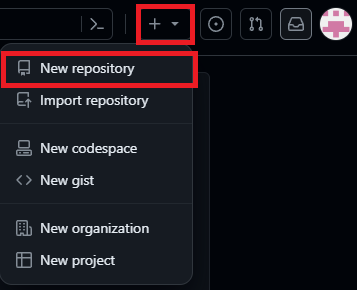
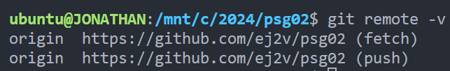
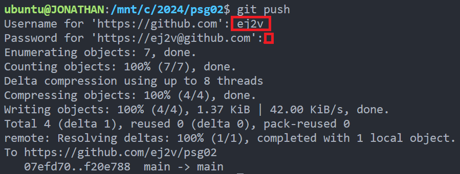
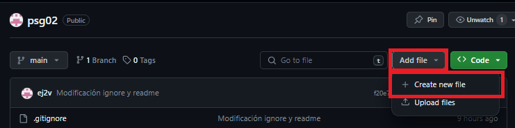
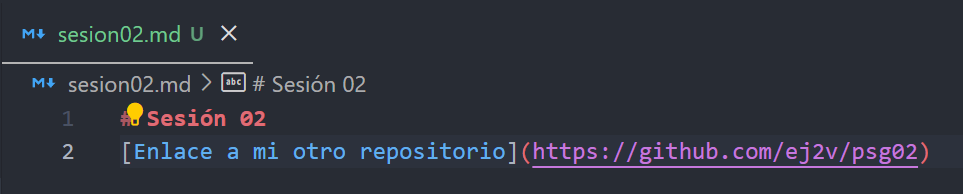

<!-- .slide: data-background-image="../../content/psg-bg-dark.png" data-background-size="100%"-->
 <!-- .element  hidden="true" -->

<br>
<br>
<br>

### Sesión  02
### Iniciando nuestro Setup
### Introducción a Git y GitHub
---
##### Creando un repositorio remoto en GitHub
Después de iniciar sesión en GitHub, en la esquina superior derecha, da click en el signo + y selecciona "New repository"

  <!-- .element width="40%"-->

---
1. Se abrirá una ventana donde irá el nombre del repositorio
2. La visibilidad del repositorio puede ser público o privado, utilizaremos público
3. Un checkbox para inicializar el repositorio con un README, activar el checkbox

---
4. Un dropdown para seleccionar .gitignore, selecciona Python
5. La ventana indica el nombre de la rama principal, en este caso "main"
6. Selecciona "Create repository"
---
  <!-- .element width="60%"-->

---

Se abrirá una ventana con el repositorio creado

  <!-- .element width="50%"-->

En la barra de navegación, esta la url del repositorio
Observamos que tiene los archivos README.md y .gitignore en el branch main

---
Clonaremos el repositorio en nuestra PC con el comando "git clone"

Iremos a la carpeta donde deseas clonar el repositorio y ejecutaremos el comando

```bash
cd 2025
git clone https://github.com/ej2v/psg02
```
  <!-- .element width="60%"-->

---
El repositorio se habrá descargado en la carpeta y lo abriremos con VS Code
  <!-- .element width="60%"-->

---
En VS Code, observamos el archivo README.md y .gitignore que se descargaron del repositorio remoto
  <!-- .element width="90%"-->

---
##### ¿Qué es un archivo .gitignore?
Para entender qué es un .gitignore, debemos entender como detecta Git los archivos

1.  Con seguimiento, son los archivos que Git detecta y que están en el repositorio con anterioridad
2.  Sin seguimiento (U), son los archivos que Git detecta pero que no están en el repositorio
3.  Ignorados, un archivo que se le ha dicho explícitamente a Git que ignore
---
Los archivos ignorados generalmente son

- Caches de dependencia, como node_modules o pycache
- Código compilado, como .pyc o .class
- Directorios de salida de compilación, como dist o build
---
- Archivos generados en tiempo de ejecución, como .log o .lock
- Archivos ocultos o de sistema, como .DS_Store o Thumbs.db
- Archivos personales de configuración, como .idea/workspace.xml
- Archivos de credenciales, como .env o .pem
---
No existe un comando especial para ignorar archivos, por lo que debemos crear un archivo .gitignore para listar archivos, directorios o patrones a ignorar

Se encuentra en la raíz del repositorio y se edita manualmente lo que se desea ignorar

Contienen patrones que establecen coincidencias con nombres de archivos para ignorar

---
##### Ejemplo de patrones
- **\*.log** - ignora todos con extensión .log
- **logs/** - ignora todos los archivos en el directorio logs
- **debug[0-9].log** - ignora debug0.log, debug1.log, ... debug9.log
---
##### Casos especiales
- **!logs/important.log** - al poner un signo de exclamación, no se ignora el archivo important.log
- **foo\\  \[01\\ \].txt** - el uso de  backslash, permite que el corchete sea parte del nombre del archivo y no un patrón como "foo[01].txt"
- **#** - las líneas que comienzan con # son comentarios

---
Practicaremos con el archivo .gitignore

Crear un archivo "claves.txt", simulará ser un archivo de credenciales

Se observa que git lo detecta como sin seguimiento (U)

  <!-- .element width="60%"-->

---
Adicionaremos al final del archivo .gitignore la línea "claves.txt" para crear una regla

Las claves no deben ser subidas al repositorio, por seguridad se debe ignorar

Una vez guardado el archivo .gitignore, se observa que git lo detecta como ignorado

  <!-- .element width="35%"-->

---
##### ¿Qué es un archivo README.md y Markdown (.md)?

Los archivos .md son archivos de texto en formato markdown, en el repositorio se encuentra el archivo README.md

Sirven para comunicar información importante sobre el proyecto, es la primera información que se ve al abrir el repositorio

---
Muestra información sobre el proyecto:

- Qué hace el proyecto
- Por qué el proyecto es útil
- Cómo pueden comenzar los usuarios con el proyecto
- Dónde pueden recibir ayuda los usuarios con tu proyecto
- Quién mantiene y contribuye con el proyecto

---
El archivo README.md en GitHub puede ir en diferentes directorios

- .github - en una carpeta .github
- docs - en una carpeta docs
- En la raíz del repositorio

---
Markdown es un lenguaje de marcado ligero, permite adicionar formato a los elementos escrito en texto plano

Almacena texto que se procesa y genera HTML dinámicamente para visualizarlo

  <!-- .element width="70%"-->

---
##### Sintaxis de Markdown
Es una forma rápida y sencilla de tomar notas o crear contenido para la web, posee la siguiente sintaxis

```markdown[1-4|5-6|7-8|9-10|11-14|15-18|19-20|21-22|23-24]
Títulos
# Título 1
## Título 2
### Título 3
Negrillas
**bold text**
Italic
*italic text*
Citas
> contenido de otra fuente
Listas Ordenadas
1. First Item
2. Second Item
3. Third Item
Listas No Ordenadas
- First Item
- Second Item
- Third Item
Código
`code`
Enlaces
[Titulo](https://miruta.com)
Imágenes

```
---
Estos elementos son los elementos básicos de Markdown, existen más elementos que se pueden consultar en la documentación de [Markdown](https://www.markdownguide.org/basic-syntax/)

---
Pondremos en práctica la sintaxis de Markdown en el archivo README.md

- Título principal con el texto "Sesión 02"
- Un subtítulo H2 con el texto ".gitignore y Markdown" 
- Un texto que cuente con algunas palabras en negrilla
- Una cita
- Una lista ordenada con el contenido del repositorio actual
---
```markdown
# Sesión 02

## .gitignore y Markdown

En esta sesión se utiliza markdown y se modifico el archivo **.gitignore** para que no se suba el archivo **clave.txt**

> Como parte de la sesión 02

Se lista el contenido del directorio actual:

1. .gitignore
2. README.md
3. clave.txt
```
---

Observamos las diferentes partes de la sintaxis de Markdown y desde el explorador se observa que existen cambios en el archivo README.md de color amarillo y una letra "M"

  <!-- .element width="70%"-->

---
##### Realizando un commit
Con estos cambios realizaremos un commit en el repositorio local desde la terminal con "git add" y git "commit"

```bash
# Verificamos el estado
git status
# Adicionamos los cambios
git add .
# Verificamos el estado 
git status
# Realizamos el commit
git commit -m "Modificación ignore y readme"
# Verificamos el log de commits
git log
```

---
  <!-- .element width="100%"-->

---
##### Sincronizar datos de subida
Cuando se clonó el repositorio desde GitHub a la PC local, se realizó una copia del repositorio en la nube (remoto) a la computadora del desarrollador (local)

  <!-- .element width="30%"-->

---
Con el comando git remote -v, se puede ver la URL del repositorio remoto en GitHub

```bash
git remote -v
```
  <!-- .element width="70%"-->

---
Para sincronizar los datos de subida, se utiliza el comando "git push"

Un push comunica un repositorio con otro repositorio, calcula lo que el repositorio local tiene que el repositorio remoto no tiene y luego sube la diferencia al repositorio remoto

Para el proceso se requiere autenticación, se solicitará las credenciales de GitHub

---
Existen dos formas de realizar el push mediante la interfaz de VS Code o mediante la terminal

La interfaz de VS Code es más sencilla, se da click en el botón de Control de Código y se selecciona "Sync"

  <!-- .element width="60%"-->

---
Mediante la terminal, se utilizará las credenciales

GitHub eliminó el uso de contraseñas para autenticarse, ahora se utiliza un token de acceso personal como contraseña

Dirigirse en la página de GitHub a Settings > Developer settings > Personal access tokens > [Tokens (classic)](https://github.com/settings/tokens)

Selecciona "Generate new token" y se abrirá una ventana para crear un token

  <!-- .element width="60%"-->

---
Agregar una nota para identificar el token, seleccionar la fecha de expiración y seleccionar los permisos

  <!-- .element width="50%"-->

---
Una vez creado el token, se copia ya que no se puede ver nuevamente

  <!-- .element width="70%"-->

El token generado se introduce como contraseña en la terminal para realizar el push

---
Después de realizar el push, la terminal solicitará las credenciales de GitHub para autenticarse
```bash
git push
```
  <!-- .element width="70%"-->

Se observa que se realizó el push y se sincronizaron los datos de subida

---
Desde el navegador, se observa que se sincronizaron los datos del repositorio local al repositorio remoto y se visualiza el archivo README.md

  <!-- .element width="60%"-->

---
Como resultado final tenemos sincronizado el repositorio local con el repositorio remoto en GitHub

  <!-- .element width="45%"-->

---
##### Sincronizar datos de bajada

La acción del comando "git pull" es utilizado para buscar cambios (fetch)

Descargarlos de un repositorio remoto y actualizar el repositorio local con el contenido

El comando "git pull", primero ejecuta el comando "git fetch" que busca los cambios del repositorio remoto, luego ejecuta "git merge" que combina la referencia del contenido remoto  con la referencia del contenido local actualizando el repositorio

---
Este escenario se puede visualizar donde D es el punto inicial donde se realizó el clone,

A, B, C son los commits realizados en el repositorio remoto posterior al clone

E, F, G son los commits realizados en el repositorio local

  <!-- .element width="50%"-->

---
Se realiza el comando "git pull" 

Los cambios en el punto donde el main local y main remoto divergen con A, B, C y se realiza el merge generando un nuevo commit H

  <!-- .element width="50%"-->

---
Para probar este escenario utilizaremos el editor online de GitHub para modificar el archivo remoto y desde la terminal realizaremos el pull

Crear el archivo "cloud.txt" en el repositorio remoto con un contenido Lorem Ipsum

  <!-- .element width="50%"-->
  <!-- .element width="50%"-->

---
Después de editar el archivo, hacer click al botón "Commit changes"

  <!-- .element width="50%"-->

---
Ahora el repositorio cuenta con más commits que el repositorio local

  <!-- .element width="70%"-->

---
Los nuevos cambios se deben sincronizar con el repositorio local, utilizamos el comando "git pull"

```bash
git pull
```
  <!-- .element width="70%"-->

Observamos que ya se descargo el archivo cloud.txt

---
Utilizando el comando "git log", se observa que se realizó un nuevo commit con el archivo cloud.txt

```bash
git log
```

Vemos que existe el commit y la cabeza del repositorio main (local) y main (remoto) "origin" es el mismo estando el repositorio actualizado

  <!-- .element width="60%"-->

---
##### Creando un repositorio remoto vacío en GitHub

Vimos que se puede clonar un repositorio remoto en GitHub a la PC local

Se puede modificar bidireccionalmente, los cambios y sincronizarlos

Existen escenarios donde el proyecto se inicia en la PC local y se desea subir a GitHub, para esto se crea un repositorio remoto vacío en GitHub

---
Crearemos un repositorio remoto vacío en GitHub para el primer proyecto "psg-example" donde no tendrá ningún archivo solo su nombre y visibilidad pública

  <!-- .element width="40%"-->

---
Después de crearlo observamos que el repositorio está vacío y tiene sugerencias para iniciar el repositorio

  <!-- .element width="70%"-->

---
##### Agregar remoto a un repositorio local

Abrimos el proyecto "psg-example" desde la terminal
```bash	
cd 2025
code psg-example
```
  <!-- .element width="35%"-->

  <!-- .element width="50%"-->

---
Antes de agregar el remoto crearemos un archivo "sesion02.md" un archivo markdown

Escribiremos como un enlace la URL de nuestro otro repositorio creado "psg02"

```markdown
# Sesión 02
[Enlace a mi otro repositorio](https://github.com/ej2v/psg02)
```

  <!-- .element width="70%"-->

---
Guardamos y realizamos un commit en nuestro repositorio local

```bash
git add .
git commit -m "Sesión 2 Introducción a GitHub"
```

  <!-- .element width="70%"-->

---
Ahora en la terminal de VS Code usaremos el comando "git remote add" para agregar el repositorio remoto

```bash
# Agregar un remoto a un repositorio local
git remote add <nombre_remoto> <url_remoto>
# Cambiar el nombre de nuestra rama principal a un nombre nuevo 
git branch -M <branch_principal>
# Publicar los cambios hacia el repositorio remoto
git push -u <nombre_remoto> <branch_principal>
```

---
Para el proyecto "psg-example" utilizaremos el nombre remoto "origin" y branch principal "main"
```bash	
git remote add origin https://github.com/ej2v/psg-example.git
git branch -M main
```
---
##### Publicar el repositorio local al remoto
El último paso en "git push" agrega la bandera -u que significa "upstream", establece una relación de seguimiento entre la rama local y la rama remota

Para facilitar futuros comandos "git push" y "git pull"

```bash
git push -u origin main
```

  <!-- .element width="70%"-->

---
Ingresando a GitHub, observamos que se sincronizaron los datos del repositorio local al repositorio remoto

  <!-- .element width="70%"-->

---
##### Resumen

- Creamos un repositorio remoto en GitHub
- Selección de .gitignore y README.md
- Clonar un repositorio remoto en la PC local con `git clone`
- Abrir el repositorio en VS Code

---
- `.gitignore` y su función de ignorar archivos y directorios
- `README.md` y su función de mostrar información del proyecto
- Markdown es un lenguaje de marcado ligero para dar formato a texto plano
- Puede ir en diferentes directorios como `.github`, `docs` o en la raíz del repositorio

---
- La sintaxis de Markdown nos permite crear títulos, negrillas, itálicas, citas
- Tmabien crear listas ordenadas y no ordenadas, código, enlaces e imágenes
- Realizamos un commit para guardar los cambios
- El repositorio remoto se puede ver con `git remote -v`

---
- La sincronización de datos de subida con `git push`
- Para utilizar `git push` se necesita un token de acceso personal
- GitHub eliminó el uso de contraseñas para autenticarse
- Se debe crear un token de acceso personal en la página de GitHub para acceder desde la Terminal

---
- Se observa el archivo README.md en el repositorio remoto en GitHub
- La sincronización de datos de bajada con `git pull`
- `git pull` busca cambios en el repositorio remoto y actualiza el repositorio local
- `git log` muestra los commits realizados en el repositorio

---
- Creamos un repositorio remoto vacío en GitHub
- Agregamos un remoto a un repositorio local con `git remote add`
- Publicamos el repositorio local al remoto con `git push -u`

---
##### Retos

Crear una carpeta con el nombre "retos_sesion_02" dentro del proyecto, en la cual por cada ejercicio debes crear un archivo

```bash
# Ejemplo carpeta
psg-example/
    retos_sesion_02/
        ejercicio_01.md
        ejercicio_02.md
    Readme.md
```

---
1. Crea un archivo llamado "ejercicio_01.md" y escribe una receta para hacer un sandwich de mantequilla y mermelada, guarda el archivo y realiza un commit con el mensaje "Receta de sandwich de mantequilla y mermelada", utiliza Markdown y sube el archivo al repositorio remoto con el comando `git push`

---
2. Crea un archivo llamado "ejercicio_02.md" y haz una breve biografía tuya, utiliza Markdown con títulos, negrillas, itálicas, listas ordenadas y no ordenadas, y una cita con una frase que te motiva a seguir adelante, guarda el archivo y realiza un commit con el mensaje "Biografía personal", sube el archivo al repositorio remoto con el comando `git push`

> Puedes añadir una imagen tuya en la carpeta añadirla al markdown y subirla al repositorio

---
3. Crea un archivo "Readme.md" en la raiz del proyecto, escribe una breve descripción de tu repositorio del Python Study Group For Beginners, utiliza Markdown, guarda el archivo y realiza un commit con el mensaje "Descripción del proyecto", sube el archivo al repositorio remoto con el comando `git push`


---
<!-- .slide: data-background-image="../../content/psg-bg-dark.png" data-background-size="100%"-->

<br>
<br>
<br>
<br>
<br>

[ <!-- .element width="20%"-->](https://github.com/python-la-paz/python-study-group-fundamentals/tree/main/content/sesion02)

Repositorio de la Sesión

---
<!--.slide: data-visibility="hidden"-->
## Bibliografía y Referencias

- [What is GitHub?](https://kinsta.com/knowledgebase/what-is-github/)
- [Logos](https://github.com/logos)
- [Creating an account on GitHub](https://docs.github.com/en/get-started/quickstart/creating-an-account-on-github)
- [Customizing your repository](https://docs.github.com/es/repositories/managing-your-repositorys-settings-and-features/customizing-your-repository/about-readmes)
- [What is .gitignore](https://www.atlassian.com/es/git/tutorials/saving-changes/gitignore)
- [Getting started with Markdown](https://www.markdownguide.org/getting-started/)
- [Markdown Cheat Sheet](https://www.markdownguide.org/cheat-sheet/)
- [Compartir y actualizar proyectos](https://git-scm.com/book/es/v2/Ap%C3%A9ndice-C%3A-Comandos-de-Git-Compartir-y-Actualizar-Proyectos)
- [Syncing](https://www.atlassian.com/git/tutorials/syncing)
- [Git Pull](https://www.atlassian.com/git/tutorials/syncing/git-pull)