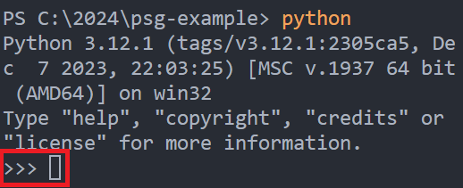

<!-- .slide: data-background-image="../../content/psg-bg-dark.png" data-background-size="100%"-->
 <!-- .element  hidden="true" -->

<br>
<br>
<br>

### Sesión  03
### Iniciando nuestro Setup
### Introducción a Python I
---
##### ¿Por qué aprender a escribir programas?

---
Escribir programas es una actividad muy creativa, puedes escribir programas por muchas razones

- Desde mantenerte activo resolviendo un problema por diversión
- Hasta resolver un problema de análisis de datos complejos

---
En la vida cotidiana estamos rodeados de computadoras (laptops y celulares), son como asistentes personales que se ocupan de muchas tareas

- Sacar fotografías
- Escuchar música
- Revisar correo electrónico
- Llamar a otras personas, etc.
---
Son muy útiles, poseen gran procesamiento y memoria

Si fuera tan fácil explicarle al dispositivo que queremos que haga ahora

Tener un idioma y explicarle que queremos ahora

---
Y ese lenguaje se encuentra en la **programación**

Crear obras escritas que pueda entender las computadoras y realizar acciones

Como tareas repetitivas o aburridas como limpiar el SPAM en el correo electrónico

---
##### Comprendiendo la programación

Necesitas dos capacidades para ser programador:

1. **Saber un lenguaje de programación**, conocer su vocabulario y su gramática, ser capaz de deletrear correctamente las palabras y saber construir "frases" bien formadas y coherentes

---

##### Comprendiendo la programación

Necesitas dos capacidades para ser programador:

2. **Saber contar una historia**, al escribir un cuento se combinan palabras, frases para comunicar la idea al lector, nuestro programa es el cuento y el problema a resolver es la idea a comunicar.

---
Vamos a utilizar Python como nuestro lenguaje de programación

---
 <!-- .element width="20%" -->
##### ¿Qué es Python?
---
Python es un lenguaje de programación
- Interpretado
- Orientado a objetos
- De alto nivel
- Con semántica dinámica
---
La sintaxis simple y fácil de aprender de Python enfatiza en la legibilidad, reduciendo el costo de mantenimiento del programa y la reutilización de código

---
El intérprete de Python y la biblioteca está disponible en formato fuente o binarios sin costo para todas las plataformas y se distribuye gratuitamente

 <!-- .element width="50%" -->

---
##### Algunas características de Python

---
- **Usa una sintaxis elegante**, haciendo los programas escritos fáciles de leer
- **Es un lenguaje "easy-to-use"**, es muy fácil empezar a programar, ideal para desarrollo de prototipos
- El modo interactivo de Python permite probar fragmentos de código fácilmente
- Es fácil extender añadiendo nuevos módulos implementados en lenguajes compilados como C o C++

---
- **Ejecuta en cualquier lugar**, incluido Windows, Linux, Mac OS, de manera no oficial Android y iOS
- **Es software libre en dos sentidos**, no tiene ningún costo de descarga ni costo de uso
- El lenguaje tiene **derechos de autor** pero está bajo una licencia de open source software y puede ser modificado y redistribuido

---
##### Algunas características del
##### *lenguaje de programación Python*

---
- Variedad de tipos de datos básicos disponibles, numbers (punto flotante, complejos, enteros sin límite de longitud), cadenas (ASCII  y Unicode), listas y diccionarios
- Python soporta programación orientada a objetos con clases y múltiples herencias

---
- El código puede ser agrupado en módulos y paquetes
- Admite el manejo de excepciones, resultando en un manejo limpio de errores

---
- Tipos de datos se escriben de manera fuerte y dinámica

Combinar tipos de datos incompatibles genera excepciones que pueden ser detectadas antes como adicionar una cadena a un  número

---
- Python posee componentes avanzados como generadores y listas por comprensión
- Administra automáticamente la memoria liberando y asignando memoria libre al código

---
Escribir código Pythónico no es difícil

Pero tienes que utilizar las reglas de estilo de código (PEP) para mejorar la elegancia y legibilidad del código

Puedes probar, revisar y mejorar tu código la herramienta online [PythonChecker](https://www.pythonchecker.com/)

> Makes Your Code Great Again

---
##### ¿Cuál es su campo de aplicación?

Es ampliamente utilizado en
- Aplicaciones web
- Automatización
- Desarrollo de software
- Ciencia de datos
- Machine learning (ML)

---
##### Desarrollo web del lado del servidor

Incluye las funciones complejas de backend que los sitios web llevan a cabo para mostrar información al usuario

Interacción con las bases de datos, comunicarse con otros sitios web y proteger los datos cuando se los envía a través de la red

---
Python es útil para escribir código del lado del servidor debido a que ofrece muchas bibliotecas 

Que constan de código pre escrito para crear funciones de backend complejas

---
##### Automatización con scripts de Python

Automatiza las tareas que suelen llevar a cabo las personas

Se utilizan ampliamente los scripts de Python para automatizar muchas tareas diarias

---
- Cambiar el nombre de una gran cantidad de archivos a la vez
- Convertir un archivo en otro tipo de archivo
- Eliminar palabras duplicadas de un archivo de texto
- Llevar a cabo operaciones matemáticas básicas

---
- Enviar mensajes por email
- Descargar contenido
- Efectuar análisis básicos de registros
- Encontrar errores en varios archivos

---
##### Tareas de ciencia de datos y machine learning

Extraer conocimientos valiosos a partir de los datos

Mientras se le enseña a las computadoras a aprender automáticamente de los datos y a efectuar predicciones precisas

---
Utilizan Python para realizar tareas de ciencia de datos, como las que se indican:

- Corregir y eliminar datos incorrectos, lo que se conoce como limpieza de datos 
- Extraer y seleccionar varias características de los datos, que consiste en agregar nombres significativos a los datos

---
- Buscar diferentes estadísticas a partir de los datos
- Visualizar los datos mediante el uso de tablas y gráficos, como los gráficos de líneas, los de barras, los circulares y los histogramas

---
Los científicos de datos utilizan las bibliotecas de ML de Python para entrenar los modelos de ML y crear clasificadores que organicen los datos con precisión

---
##### Desarrollo de software

Los desarrolladores de software suelen utilizar Python para realizar distintas tareas de desarrollo y aplicaciones de software

---
- Realizar un seguimiento de los errores en el código del software
- Crear el software de forma automática
- Administrar los proyectos de software

---
- Desarrollar prototipos de software
- Desarrollar aplicaciones de escritorio por medio de las bibliotecas de interfaz gráfica de usuario (GUI)
- Desarrollar juegos simples basados en texto a videojuegos más complejos

---
##### ¿Quién lo mantiene?

Python fue creado por Guido van Rossum, y lanzado en  1991 versión 0.9.0, él fue el Benevolente Dictador de por Vida (BDFL), se retiró como BDFL el año 2018

 <!-- .element width="30%" -->
 
---
- Tenía la autoridad final de tomar decisiones en disputas dentro de la comunidad de desarrollo de Python
- Guía y Visión, establecía los principios que rigen el lenguaje y las directrices para el diseño del mismo

---
- Revisión  de PEPs, tenía la responsabilidad de revisar y aprobar todos los documentos PEPs que son los (Python Enhancement Proposals) que describen características o cambios en Python

---
Posterior a su retiro el mantenimiento del lenguaje de programación Python paso a un modelo de toma de decisiones más democrático

Mantenido por la comunidad y la 

**Python Software Foundation**

---
##### Python Software Foundation (PSF)

Es una organización dedicada al avance de la tecnología open source relacionada con el lenguaje de programación Python

Es la organización actual detrás del lenguaje, y se dedica a crear las condiciones para que Python y la comunidad Python crezcan

---
###### Actividades principales

*Infraestructura*

> Generar estructura y estabilidad para prosperar

- Distribuir Python de forma gratuita y disponible para todos, para siempre

---
- Administradores de la Propiedad Intelectual, establece licencias PSF, poseen derechos sobre la mayoría de las versiones de Python y las marcas comerciales
- Destinan recursos para coordinar y mejorar el código base de Python y las nuevas versiones

---
*Comunidad*

> Crear conexión, diversidad, apoyo y crecimiento para todos dentro la comunidad

- Organizar la PyCon US, evento anual de mayor duración para celebrar, reunirse y aprender en torno a Python

---
- Otorgar subvenciones a grupos de todo el mundo que organizan eventos para y por Pythonistas que se apoyan mutuamente y dan la bienvenida a los recién llegados.
- Responsables de establecer, mantener y cumplir el Código de Conducta, para trabajar en un espacio seguro y acogedor para todos.

---
*Invertir en Python y Herramientas*

> Construir, apoyar y mantener los bienes públicos críticos para la comunidad

- Alojar **PyPI**, el repositorio de paquetes de Python en el que confían miles de usuarios con una amplia gama de proyectos

---
- Adicionado Desarrolladores en CPython a tiempo completo para mejorar la extracción de CPython y abordar mejoras estructurales

---
##### Instalación de Python

Python se puede descargar desde su pagina oficial [Python](https://www.python.org/downloads/) para todas las plataformas

Para Windows es necesario descargar los binarios desde la página oficial e instalarlos, puede ser añadido al PATH para ser accesible desde cualquier lugar

---
 <!-- .element width="100%" -->

---
 <!-- .element width="100%" -->

---
 <!-- .element width="100%" -->

---
Python es una herramienta integral en muchos sistemas operativos basados en Linux 

Por lo cual la mayoría de las veces ya traen una instalación de Python predeterminada

Puedes verificar si se encuentra instalado ejecutando

```sh
python --version
# o
python3 --version
```
---
Si no se encuentra una instalación puede instalarse mediante el gestor de paquetes

```sh [1-2|3-5|6-7|8-11]
# Ubuntu & Debian
apt install python3
# CentOS, Fedora &RHEL
dnf install python3
yum install python3
# MacOS
brew install python
# Utilizamos para verificar la instalación
python --version
# o
python3 --version
```
 <!-- .element width="70%" -->

---
##### ¿Qué es un archivo con extensión ".py"?

Los archivos con la extensión .py contienen código fuente de Python

El formato del archivo **.py** se basa en python que fue diseñado para facilitar la lectura y tiene similitudes con el inglés y las matemáticas

---
Utiliza líneas nuevas para indicar el comando completo en lugar de puntos, comas o paréntesis como se utilizan en otros idiomas

Python se basa en la sangría y los espacios en blanco en lugar de llaves comúnmente usadas

---
Algunas prácticas comunes al nombrar archivos de Python

---
- Usar nombres en minúsculas "script.py"
- Utilizar guiones bajos para separar palabras en lugar de espacios "mi_script.py"

---
- Evita usar caracteres especiales y espacios "year.py" en lugar de "año.py"
- Evita utilizar nombres que coincidan con módulos estándar de Python "math.py" ya que existe el módulo estándar math

---
Según la guía de estilo para Python PEP 8

---
- Utilizar 4 espacios por nivel de indentación
- No usar el símbolo de tabulador sino espaciado

---
- Limitar las líneas de código a 79 caracteres para código
- Limitar las líneas de código a 72 caracteres para comentarios

---
##### Mi primer hola mundo

Abrimos el proyecto que tenemos ya creado en una sesión pasada

```sh
code .\psg-example
```

---
Crearemos el archivo **sesion03.py** este archivo será nuestro primer hola mundo
 <!-- .element width="50%" -->

---
Escribiremos en el área de edición

```python
print ("Hola Mundo")
```
 <!-- .element width="70%" -->

---
La instrucción escrita en el archivo significa lo siguiente
- **print**: Es la función básica para imprimir contenido en la terminal, todos los elementos a imprimir son convertidos a caracteres
- **"Hola Mundo"**: Es el contenido de tipo cadena que vamos a imprimir en la terminal

---
##### Ejecutar desde la terminal

Abrimos una terminal integrada de VS Code

 <!-- .element width="60%" -->

Nos encontramos ubicados en la ruta del proyecto desde aquí podemos ejecutar el archivo que hemos creado

---
Ejecutaremos el comando

```sh
python sesion03.py
```

 <!-- .element width="60%" -->

El comando se divide de la siguiente manera

- python: Esa parte del comando se encarga de invocar al intérprete de Python para ejecutar alguna acción o archivo

---
- sesion03.py: Hace referencia al archivo que queremos que Python ejecute
- Hola Mundo: Es la salida después de ejecutar el archivo ".py"

---
##### Terminal interactiva de python

La consola interactiva es una herramienta que nos permite escribir sentencias de código de Python al mismo tiempo que se ejecutan

Ideal para probar pequeñas porciones de código

Al cerrarla se pierde todo lo que hayamos escrito en ella

---
Para invocar la terminal interactiva solo se debe escribir el comando python

```sh
python
```
 <!-- .element width="60%" -->

Aquí la terminal cambia y nos indica con los caracteres ">>>" que es donde debemos escribir código Python

---
Escribamos ahora ahí "Hola desde la Terminal"  y presionamos Enter

```python
>>> print ("Hola desde la Terminal")
```

 <!-- .element width="60%" -->

---
Para cerrar la terminal interactiva utilizamos la función y palabra clave quit()

```python
>>> quit()
```

 <!-- .element width="60%" --> 

---
Realizaremos un commit de nuestros cambios al repositorio

```sh
git add sesion03.py
git commit -m "Adición de la sesión 3"
git push
```
 <!-- .element width="60%" -->

---
##### Resumen

- Escribir programas es una actividad creativa que puede ser realizada por diversión o para resolver problemas
- En la vida cotidiana estamos rodeados de computadoras que realizan tareas repetitivas o aburridas

---
- Para programar necesitas dos capacidades saber un lenguaje de programación y saber contar una historia
- Python es un lenguaje de programación interpretado, orientado a objetos, de alto nivel y con semántica dinámica

---
- Python es fácil de aprender y de usar, se ejecuta en cualquier lugar y es software libre
- Python es utilizado en aplicaciones web, automatización, desarrollo de software, ciencia de datos y machine learning

---
- Python fue creado por Guido van Rossum y actualmente es mantenido por la Python Software Foundation
- Guido van Rossum fue el Benevolente Dictador de por Vida (BDFL) de Python hasta 2018

---
- Luego de su retiro el mantenimiento de Python paso a un modelo de toma de decisiones más democrático
- Es mantenido por la comunidad y la Python Software Foundation

---
- La PSF es una organización dedicada al avance de la tecnología open source relacionada con Python
- Sus actividades principales son infraestructura, comunidad e invertir en Python y herramientas

---
- Python se puede instalar en Windows, Linux y MacOS
- Los archivos con extensión `.py` contienen código fuente de Python

---
- Utiliza lineas nuevas para indicar el comando completo en lugar de puntos, comas o paréntesis
- Python se basa en la sangría y los espacios en blanco en lugar de llaves comúnmente usadas

---
- Los nombres de los archivos de Python deben ser en minúsculas y utilizar guiones bajos para separar palabras
- No utilizar caracteres especiales y espacios en los nombres de los archivos

---
- No utilizar nombres que coincidan con módulos estándar de Python como math
- Se ejecuta un archivo `.py` con el comando `python nombre_archivo.py`

---
- La terminal interactiva de Python es una herramienta que permite escribir sentencias de código de Python al mismo tiempo que se ejecutan
- Se ejecuta la terminal interactiva de Python con el comando `python`

---
##### Retos

Crear una carpeta con el nombre "retos_sesion_03" dentro del proyecto, en la cual por cada ejercicio debes crear un archivo

```bash
# Ejemplo carpeta
psg-example/
    retos_sesion_03/
        ejercicio_01.py
        ejercicio_02.py
        ejercicio_03.py
```

---
1.  Crea un archivo llamado **ejercicio_01.py** utilizando el comando `print` imprime el titulo de un libro que cambió tu vida, hacer un `commit` y `push`

---
2.  Crea un archivo llamado **ejercicio_02.py** y con múltiples `print` haz un dialogo entre personas, donde se saluden, se pregunten sobre alguno de estos temas: el clima, la comida, el trabajo o las finanzas, se despidan, hacer un `commit` y `push`

---
3.  Crea un archivo llamado **ejercicio_03.py** y utilizando múltiples `print` haz un tutorial de como barrer una habitación, se lo más detallado posible desde como agarrar la escoba hasta como recoger y eliminar la basura, hacer un `commit` y `push`

---
<!--.slide: data-visibility="hidden"-->
## Bibliografía y Referencias

- [Python Learn](https://do1.dr-chuck.com/pythonlearn/ES_es/pythonlearn.pdf)
- [Python](https://www.python.org/doc/essays/blurb/)
- [Python Beginners Guide](https://wiki.python.org/moin/BeginnersGuide/Overview)
- [Python Checker](https://www.pythonchecker.com/)
- [AWS Python](https://aws.amazon.com/es/what-is/python/)
- [Python Institute](https://pythoninstitute.org/about-python)
- [Guido Van Rossum](https://gvanrossum.github.io/)
- [Linux Journal](https://www.linuxjournal.com/content/guido-van-rossum-stepping-down-role-pythons-benevolent-dictator-life)
- [Python Software Foundation](https://www.python.org/psf/about/)
- [Python 3.12.1](https://www.python.org/downloads/release/python-3121/)
- [Python Docs](https://docs.fileformat.com/es/programming/py/)
- [PEP 8](https://peps.python.org/pep-0008/#indentation)
- [Python Print](https://python-reference.readthedocs.io/en/latest/docs/functions/print.html)
- [Python Interpreter](https://docs.python.org/es/3/tutorial/interpreter.html)
- [Python Tutorial](https://tutorial.recursospython.com/consola-interactiva/)