<!-- .slide: data-background-image="../../content/psg-bg-dark.png" data-background-size="100%"-->
 <!-- .element  hidden="true" -->

<br>
<br>
<br>

### Sesión  04
### Iniciando nuestro Setup
### Introducción a Python II
---
##### Sintaxis básica

La sintaxis son las reglas y estructuras fundamentales que rigen la construcción de instrucciones en el lenguaje de programación

Es importante estas reglas ya que permite que el intérprete pueda entender y ejecutar código correctamente

---
Aspectos clave de la sintaxis básica

---
###### Indentación

Python utiliza indentación para definir bloques de código

A diferencia de otros lenguajes que utilizan llaves '{}' o palabras clave como 'begin', 'end' para delimitar los bloques de código

---
La indentación también llamada sangría consiste en espacios en blanco iniciales (espacios o tabulaciones)

La ejecución de un archivo se rechaza si se mezcla tabulaciones y espacios en un mismo archivo

---
Según la guía de estilo de Python PEP8 se debe utilizar 4 espacios por cada nivel de indentación

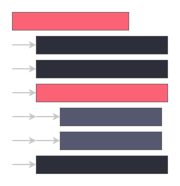 <!-- .element width="40%" -->

---
Ejemplo de indentación incorrecta

```python[1-7|2-7|3|4|5-6|7]
 def perm(l):                       # error: first line indented
for i in range(len(l)):             # error: not indented
    s = l[:i] + l[i+1:]
        p = perm(l[:i] + l[i+1:])   # error: unexpected indent
        for x in p:
                r.append(l[i:i+1] + x)
            return r                # error: inconsistent dedent
```

---
Ejemplo de indentación correcta pero no recomendada

```python[1-11|2|3-4|5|6-10|10|11]
def perm(l):
        # Compute the list of all permutations of l
    if len(l) <= 1:
                  return [l]
    r = []
    for i in range(len(l)):
             s = l[:i] + l[i+1:]
             p = perm(s)
             for x in p:
              r.append(l[i:i+1] + x)
    return r
```

---
Ejemplo de indentación correcta según PEP8

```python[1-11|2|3-4|5-8|9-10|11]
def perm(l):
# Compute the list of all permutations of l
    if len(l) <= 1:
        return [l]
    r = []
    for i in range(len(l)):
        s = l[:i] + l[i + 1:]
        p = perm(s)
        for x in p:
            r.append(l[i:i + 1] + x)
    return r
```

---
###### Comentarios

Son una parte muy importante del código

En especial al momento de leer código propio o ajeno

---
Puede contener una descripción de lo que hace el código o una explicación de por qué se hace de esa manera

Ayudan a comprender lo que se hace en los diferentes bloques de código

---
Los comentarios en Python se pueden hacer de dos maneras

- Comentarios de una sola línea
- Comentarios de varias líneas

---
Al momento de ejecutar código se ignoran los comentarios

Son solo para la comprensión del programador

Un comentario inicia con el carácter hash,

numeral (#)

---
Comentarios de una sola línea

```python
# This is a comment in one line
```

---
Comentarios de varias líneas

```python
# This is a comment
# in multiple 
# lines
```
---
Comentario en línea con código

```python
print("Hola, mundo!")  # This is an inline comment
```

---
Algunas reglas al momento de escribir comentarios

---
1. Siempre actualice el comentario cuando haya cambios en el código, un comentario contradictorio es peor que no tener comentarios
2. Los comentarios deben ser oraciones completas y deben empezar con letra capital

---
3. Los comentarios se recomiendan siempre escribirlos en Inglés, a no ser que esté 120% seguro que su código no va ser leído por personas que no hablan su idioma

---
###### Variables y tipos de datos

En python las variables se pueden declarar sin especificar su tipo de dato ya que es de tipado dinámico

---
Los tipos de datos fundamentales incluyen
- Enteros
- Números de punto flotante
- Cadenas de texto
- Booleanos
- Listas
- Tuplas 
- Conjuntos
- Diccionarios

---
###### Flujo de ejecución lineal

El flujo de ejecución lineal se refiere a la secuencia ordenada de instrucciones que se ejecutan una tras otra

---

Las instrucciones se ejecutan de arriba hacia abajo

Línea por línea sin saltos o desviaciones

---
Ejemplo
```python[1-3|5-6|8-9|11-12]
# Example of execution flow
# Instruction 1
print("Start of the program")

# Instruction 2
print(" Print second instruction")

# Instruction 3
print("Hello, World!")

# Instruction 4
print("End of the program")
```

---
##### Jupyter Notebooks

Es un entorno computacional interactivo antiguamente conocido como IPython, en el cual se puede combinar ejecución de código, texto enriquecido, matemáticas, gráficas y contenido multimedia enriquecido

---

Provee una rica arquitectura para la computación interactiva como
- Una aplicación web para interactuar desde el navegador
- Un terminal interactiva
- Un Kernel para Jupyter
- Soporte para visualización interactiva

---
Utilizaremos el Kernel y la extensión de Jupyter para VS Code para interactuar no haremos uso del servidor de Jupyter desde el navegador

---
##### Instalación de la extensión en VS Code

Para instalar la extensión de Jupyter para VS Code primero ingresamos a la pestaña de extensiones, donde encontraremos un buscador en el cual escribiremos "Jupyter"

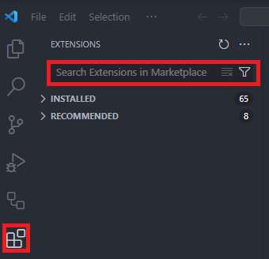 <!-- .element width="40%" -->

---
Listará varias opciones disponibles de las cuales la que vamos a instalar la llamada "Jupyter" y el publisher es Microsoft

Lleva un número 4 ya que es un paquete de varias extensiones más pequeñas

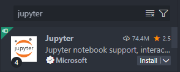 <!-- .element width="40%" -->

---
Seleccionado la extensión podemos ver que es lo que viene con la extensión

La cantidad de veces que fue descargado la versión, la opción de "Instalar" y mucho más

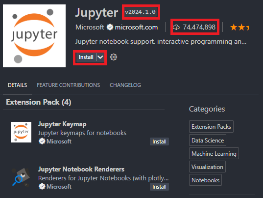 <!-- .element width="40%" -->

---
Una vez instalado podemos instalar el kernel para poder empezar a utilizar los notebooks

---
##### Instalación del Kernel de Jupyter mediante PIP

Vamos a instalar el kernel necesario para correr desde VS Code

Lo instalaremos mediante el comando de instalación de librerías y paquetes de python "pip"

---
pip es "Package Installer for Python" el Instalador de paquetes para Python

Nos permite instalar, desinstalar, listar los paquetes instalados

---
Practicaremos con pip veremos la versión de pip que tenemos instalada
```bash[1-2|3-6]
# Windows
pip --version
# Linux & Mac
pip --version
# o
pip3 --version
```

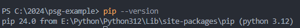 <!-- .element width="60%" -->

---
Listemos los paquetes que tenemos actualmente instalados con el comando "list"

```bash[1-2|3-6]
# Windows
pip list
# Linux & Mac
pip list
# o
pip3 list
```

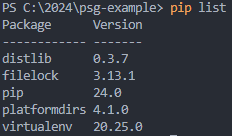 <!-- .element width="40%" -->

---
Instalaremos el kernel de Jupyter con el comando de instalación "install" y el nombre del paquete

```bash
pip install ipykernel
# o
pip3 install ipykernel
```

Al ejecutar instalará el paquete y todas las dependencias necesarias para su funcionamiento

---
Después de instalar podemos listar los paquetes instalados con "list"

```bash
pip list
# o
pip3 list
```

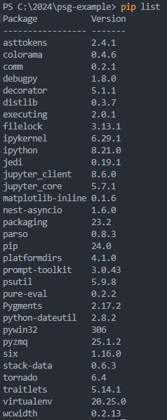 <!-- .element width="17%" -->

---
Ya se encuentra instalado el Kernel

Podemos empezar a utilizar los notebooks de Jupyter

En VS Code

---
##### Mi primer notebook .ipynb

Los archivos de notebooks tienen la extensión **.ipynb**

Interactive PYthon NoteBook

Contienen las entradas y salidas de las sesiones interactivas, el texto y contenido enriquecido

---
Internamente estos documentos son archivos JSON

JSON es un formato de texto plano que puede ser versionado y compartido

---
En nuestro proyecto desde VS Code crearemos un archivo llamado "sesion04.ipynb" y lo abriremos

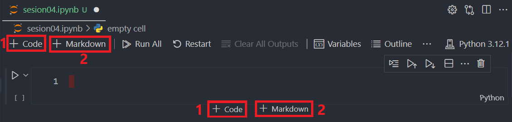 <!-- .element width="70%" -->

1. Botón "+ Code": Nos permite adicionar bloques de código
2. Botón "+ Markdown": Nos permite añadir bloques texto enriquecido con Markdown

---
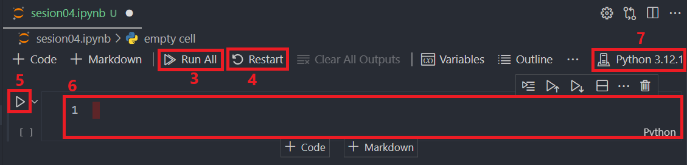 <!-- .element width="70%" -->

3. Botón "Run All": Para ejecutar todos los bloques de código en cadena de arriba hacia abajo
4. Botón "Restart": Para reiniciar toda la ejecución interactiva generada
5. Botón "Play": Para ejecutar una celda específica
6. Área para escribir código o Markdown
7. Kernel actual para realizar la ejecución

---
##### Adicionar bloques de código y comentarios

Escribiremos hola mundo y ejecutaremos usando el botón Play

```python
print ("Hola, Mundo desde Notebook!")
```

---
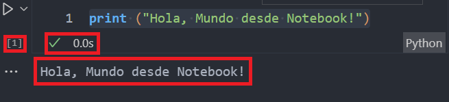 <!-- .element width="70%" -->

- Un número 1 entre corchetes indicando que es el primer fragmento ejecutado
- Tenemos un check y el tiempo que le tomó en ejecutar el código
- Salida de la ejecución

---
Agregaremos un comentario y volvemos a ejecutar

```python
# Code 01
print ("Hola, Mundo desde Notebook!")
```

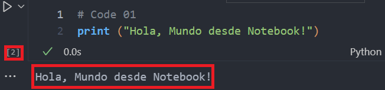 <!-- .element width="70%" -->

- El número de ejecución es 2, porque es la segunda ejecución
- El comentario "Code 01" no se ejecuta y la salida es la misma

---
##### Dibujar un árbol con prints en Notebook

Como un ejercicio práctico dibujen un árbol con prints en el Notebook

<iframe src="https://time-stuff.com/embed.html" frameborder="0" scrolling="no" width="391" height="140"></iframe>

---
Ejemplo

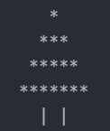 <!-- .element width="20%" -->

---
Solución

```python
#Tree 
print("   *")
print("  ***")
print(" *****")
print("*******")
print ("  | |")
```

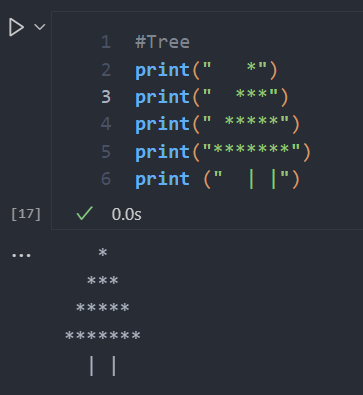 <!-- .element width="30%" -->

---
##### Adicionar texto Markdown al Notebook

Adicionaremos texto markdown al Notebook

Crearemos un bloque con el botón

**+ Markdown**

Se abrirá un bloque en el cual escribiremos texto

---
```markdown
# Sesión 04
- Mi primer notebook
- Imprimir árbol
- Crear Markdown
- Subir a mi repositorio de GitHub
```

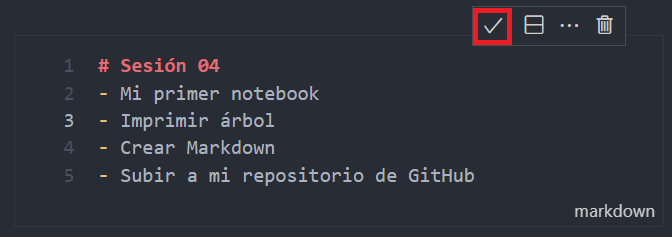 <!-- .element width="70%" -->

---
Después de editar el contenido markdown hacemos click en el Botón check para visualizar el texto Markdown recién creado

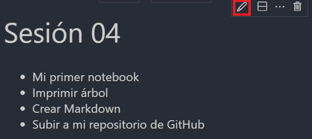 <!-- .element width="70%" -->

Ahora vemos renderizado el contenido y el botón check es ahora botón editar

---
##### Subir a mi repositorio de GitHub

Subiremos los cambios adicionando el archivo .ipynb a un commit y publicaremos los cambios en GitHub

```bash
git add sesion04.ipynb
git commit -m "Sesión 4 Mi primer Notebook"
git push
```

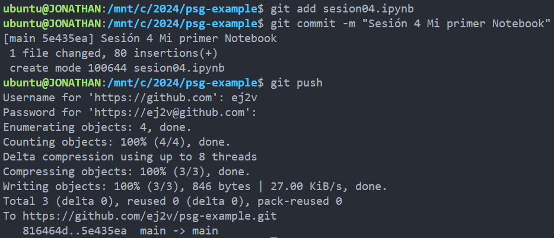 <!-- .element width="70%" -->

---
Abriremos el repositorio en GitHub para visualizar el archivo del Notebook

Con todo su contenido tanto las salidas de ejecución y el markdown escrito

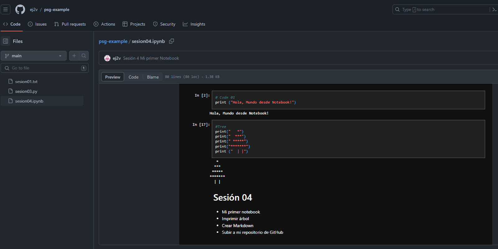 <!-- .element width="70%" -->

---
##### Resumen

- La sintaxis es fundamental para la construcción de instrucciones en Python
- La indentación es el espacio en blanco inicial que se utiliza para definir bloques de código
- Los comentarios son una parte importante del código para la comprensión del programador

---
- Los tipos de datos fundamentales en Python son enteros, números de punto flotante, cadenas de texto, booleanos, listas, tuplas, conjuntos y diccionarios
- El flujo de ejecución lineal se refiere a la secuencia ordenada de instrucciones que se ejecutan una tras otra
- Jupyter Notebooks es un entorno computacional interactivo

---
- Permite combinar ejecución de código, texto enriquecido, matemáticas, gráficas y contenido multimedia enriquecido
- Posee kernel, terminal, aplicación web y soporte para visualización interactiva
- Se instala la extensión de Jupyter para VS Code y el kernel de Jupyter

---
- Se instala el kernel mediante pip con el comando `pip install ipykernel`
- Los archivos de notebooks tienen la extensión .ipynb
- Internamente son archivos JSON

---
- Jupyter posee bloques de código y comentarios
- Los bloques de texto enriquecido utilizan Markdown
- Se pueden ejecutar los notebooks en VS Code

---
- Los notebooks se pueden subir a un repositorio de GitHub
- Se visualizan en GitHub los notebooks con todo su contenido

---
##### Retos

Crear una carpeta con el nombre "retos_sesion_04" dentro del proyecto del "psg-example", por cada ejercicio debes crear un archivo

```bash
# Ejemplo carpeta
psg-example/
    retos_sesion_04/
        ejercicio_01.py
        ejercicio_02.ipynb
        ejercicio_03.py
        ejercicio_04.ipynb
```

---
1. Crea un archivo "ejercicio_01.py", añade un comentario con la descripción de este ejercicio y crea un triángulo rectángulo con prints

```text
*
**
***
****
*****
```

Realiza un `commit` y un `push` para subir tus cambios

---
1. Crea un archivo "ejercicio_02.ipynb", añade un texto en markdown con la descripción de este ejercicio y crea una imagen utilizando símbolos y prints

`Símbolos: * , () \ | / o " ' = C`

```text
Ejemplo
 (()(()
 (=*o*)/")
C(,,)(,,)
```

Realiza un `commit` y un `push` para subir tus cambios

---
1. Crea un archivo "ejercicio_03.py", escribe las reglas de tu juego de mesa favorito con múltiples prints, por ejemplo:

```text
Reglas tres en raya
1. El juego se juega en un tablero de 3x3
2. Los jugadores eligen un símbolo para jugar
3. Inicia el jugador "X"
4. Continua el jugador "O" y así sucesivamente
5. No se puede jugar en una casilla ocupada
6. Gana el jugador que logre alinear tres símbolos en línea horizontal, vertical o diagonal
7. Si no hay más casillas disponibles y no hay ganador es empate
```

Realiza un `commit` y un `push` para subir tus cambios

---
4. Crea un archivo "ejercicio_04.ipynb", y diseña un juego

- El título y descripción deben ser un bloque de markdown
- Las reglas deben ser un bloque de markdown
- El diseño del tablero debe ser un bloque de código en Python con prints
- La descripción de las piezas debe ser un bloque de markdown
- El diseño de las piezas debe ser un bloque de código en Python con prints

Realiza un `commit` y un `push` para subir tus cambios

---
<!-- .slide: data-background-image="../../content/psg-bg-dark.png" data-background-size="100%"-->

<br>
<br>
<br>
<br>
<br>

[ <!-- .element width="20%"-->](https://github.com/python-la-paz/python-study-group-fundamentals/tree/main/content/sesion04)

Repositorio de la Sesión

---
<!--.slide: data-visibility="hidden"-->
## Bibliografía y Referencias

- [Python Syntax](https://www.scaler.com/topics/python/python-syntax/)
- [Lexical Analysis](https://docs.python.org/3/reference/lexical_analysis.html#indentation)
- [PEP 8 Indentation](https://peps.python.org/pep-0008/#indentation)
- [What is Jupyter](https://jupyter-notebook-beginner-guide.readthedocs.io/en/latest/what_is_jupyter.html)
- [Jupyter Notebook Introduction](https://realpython.com/jupyter-notebook-introduction/)
- [IPython Notebook](https://ipython.org/notebook.html)
- [Jupyter](https://jupyter.org/)
- [Notebook](https://jupyter-notebook.readthedocs.io/en/stable/notebook.html)
