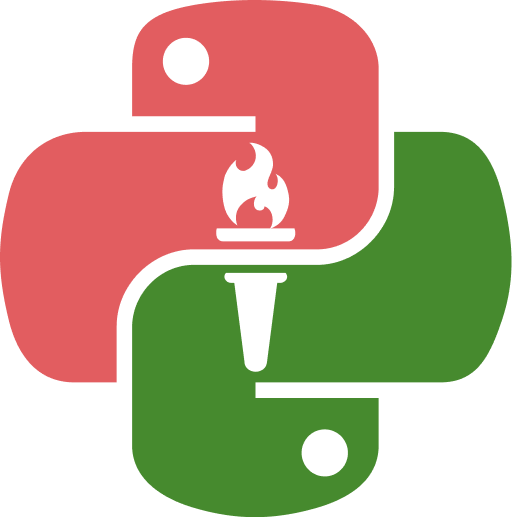

<!-- .slide: data-background-image="../../content/psg-bg-dark.png" data-background-size="100%"-->
 <!-- .element  hidden="true" -->

<br>
<br>
<br>

### Sesión  05
### Tipos de datos
### Datos numéricos
---
##### Valores y Variables

---
Un valor es una de las cosas más básicas que utiliza un programa, un número, una letra

El valor que vimos hasta ahora "Hola Mundo" es un tipo de valor llamado "cadena"

---
Una palabra reservada similar a print nos ayuda a identificar el tipo de valor que se está utilizando, esta función es **type**

---
Crearemos un archivo python "sesion05.py" sobre el cual trabajaremos desde nuestro proyecto

---
Escribiremos el siguiente código
```python
print ( type (1) )
```
Ejecutamos desde la terminal

```bash
python sesion05.py
```

---
 <!-- .element width="45%" -->


&lt;class "int"&gt;: Nos indica de qué tipo es el valor impreso en este caso un entero

- type(1): type devuelve el tipo de valor que se le pasa como contenido
- print ( type (1) ): print imprime el valor que se le pasa en este caso lo que type devuelve que es el tipo de valor

---
Una variable es dar un nombre a un valor

Es de las características más potentes de cualquier lenguaje de programación

Los programadores eligen los nombres para sus variables que tengan sentido

---
Existen unas reglas para escribir nombres en Python

- Pueden contener tanto letras como números
- NO pueden comenzar con un número
- NO pueden contener espacios
- Se puede utilizar mayúsculas como minúsculas
- Se asigna un valor a una variable con el signo igual (=)  después del nombre

---
- Se puede utilizar el carácter barra baja (_) en un nombre
- Puede empezar con un barra baja pero no se recomienda usarlo a menos que escribas una librería que utilizarán otros
- NO se debe usar nombres de palabras reservadas como variables en Python existen hasta el momento 33 palabras reservadas para su propio uso

---
Si se le asigna un valor que no siga las reglas se generará un error de sintaxis para probar esto utilizaremos la terminal interactiva

```sh
python
```
```python
>>> 1variable = 1
>>> mas@ = 1
>>> class = 1
```

 <!-- .element width="25%" -->

---
Es recomendable utilizar nombres de variables que contengan un contexto claro

```python
x1q3z9ahd = 35.0
x1q3z9afd = 12.50
x1q3p9afd = x1q3z9ahd * x1q3z9afd
print(x1q3p9afd)
```

---
```python
horas = 35.0
tarifa = 12.50
salario = horas * tarifa
print(salario)
```

Ambos fragmentos el intérprete los lee idénticamente pero el programador los puede asimilar de manera diferente

Los humanos entienden mejor el segundo programa ya que el nombre de las variables refleja el contexto de lo que se está realizando

---
##### Datos Numéricos

Hay tres tipos numéricos

- Integers (int)
- Floating (float)
- Números complejos (complex)

---
###### ¿Qué son los enteros?

---

Son números que no cuentan con parte decimal

Tienen precisión ilimitada, representan valores grandes o pequeños sin pérdida de precisión

`$ \Z = \{...,-3,-2,-1,0,1,2,3,...\}$`

---
Los números enteros en Python pueden ser declarados mediante diferentes formas y bases

De forma decimal, binaria, octal, hexadecimal, pero sin importar cual sea su base solo afecta a cómo se interpreta y muestra el número

---
##### ¿Cómo declarar un entero? 

Los números enteros se declaran directamente en el código en valores y variables, de forma directa o utilizando el tipo int

```python
# Valor 10 Entero
print (10)
print ( type (10) )
```

 <!-- .element width="50%" -->

---
Declarando el entero en variables

```python
# Variable 100 Entero
variable = 100
print (variable)
print ( type (variable) )
```

 <!-- .element width="50%" -->

---
Declarar usando la función int

```python
# Variable 20 Entero
variable_2 = int (20)
print (variable_2)
print ( type (variable_2) )
```

 <!-- .element width="50%" -->

---
Podemos definir enteros en diferentes bases como binario, octal y hexadecimal

Para estos se utilizan prefijos antes del número

- 0b: para binario, solo acepta números [0,1]
- 0o: para octal, solo acepta números [0,1,2,3,4,5,6,7]
- 0x: para hexadecimal, solo acepta números [0,1,2,3,4,5,6,7,8,9] y caracteres [a,b,c,d,e,f]

---
```python
# Valor 10 en base decimal
print ("Base decimal")
print (10)
# Valor 10 en binario
print ("Base binaria")
print (0b1010)
# Valor 10 en octal
print ("Base octal")
print (0o12)
# Valor 10 en hexadecimal
print ("Base hexadecimal")
print (0xa)
```

 <!-- .element width="50%" -->

---
Podemos declarar enteros tan grandes como la memoria propia del sistema a diferencia de otros lenguajes que tiene un límite por tipo de dato

```python
# Entero con 60 dígitos
variable_3 = 123456789012345678901234567890123456789012345678901234567890
print (variable_3)
print ( type (variable_3) )
```

 <!-- .element width="50%" -->

---
##### ¿Qué son los números con punto flotante?

---

Representan a los números reales tanto positivos como negativos, cuentan con una parte entera y una parte decimal

 <!-- .element width="40%" -->

`$ \R = \{...,-2.5,-1.5,-0.5,0.5,1.5,2.5,...\}$`

---
En python los números con coma o punto flotante son llamados "float"

Implementa el tipo double del lenguaje "C", que es un tipo de dato que posee el doble de precisión que un float normal en "C"

Posee precisión finita, tiene un límite en el cual no es posible representar tanta precisión decimal 

---
##### ¿Cómo declarar un número flotante?

Se declaran directamente en el código en valores y variables de forma directa o utilizando el tipo float

```python
# Valor 0.5 Flotante
print (0.5)
print ( type (0.5) )
```

 <!-- .element width="40%" -->

---
Declarando el float en variables

```python
# Variable 0.100546 Flotante
variable_4 = 0.100546
print (variable_4)
print ( type (variable_4) )
```

 <!-- .element width="40%" -->

---
Declarar usando la función float

```python
# Variable 1 Flotante
variable_7 = float (1)
print(variable_7)
print ( type (variable_7) )
```

 <!-- .element width="40%" -->

---
Precisión máxima con 17 decimales

```python
# Precisión de 17 decimales
variable_5 = 0.9999999999999999
print(variable_5)
print ( type (variable_5) )
```

 <!-- .element width="40%" -->

---
Declarar utilizando notación científica con la letra "e" y el exponente

```python
# Valor 2.0e-3 Flotante
variable_6 = 2.0e-3
print(variable_6)
print ( type (variable_6) )
```

 <!-- .element width="40%" -->

---
##### Operadores aritméticos

Son símbolos especiales que representan cálculos, como la suma, la multiplicación y otros

Los valores que reciben los operadores son operandos

---

- `$+$`  : Suma
- `$-$`  : Resta
- `$*$`  : Multiplicación
- `$/$`  : División
- `$**$` : Potencia
- `$//$` : División entera
- `$\%$` : Módulo o residuo

---
```python[1-3|4-6|7-9|10-12|13-15|16-18|19-21|22-24]
# Operadores aritméticos
a = 10
b = 3
# Suma
print ("Suma")
print (a + b)
# Resta
print ("Resta")
print (a - b)
# Multiplicación
print ("Multiplicación")
print (a * b)
# División
print ("División")
print (a / b)
# Potencia
print ("Potencia")
print (a ** b)
# Módulo o residuo
print ("Módulo o residuo")
print (a % b)
# División entera
print ("División entera")
print (a // b)
```

 <!-- .element width="15%" -->

---
Podemos combinar los operadores para crear operaciones más complejas

Cuando existe más de un operador sigue un orden en la evaluación

Python sigue las convenciones matemáticas

---
El acrónimo **PEMDSR** nos sirve para recordar:
- Paréntesis tiene un nivel superior, puede forzar a que una expresión sea evaluada primero por lo que 2*(3-1) es 4
- Exponenciación o potencia sigue en la lista de prioridad por lo que  2**1+1 es 3

---
- Multiplicación y División siguen en la evaluación teniendo el mismo nivel evaluados de izquierda a derecha 2\*3\*1/2 es 3
- Por último se encuentra la Suma y la Resta donde de la misma forma son evaluados de izquierda a derecha 5-3-1 es 1

---
Un contador tiene 300 minutos y se le suman 3600 segundos, ¿Cuántas horas en total son?

<iframe src="https://time-stuff.com/embed.html" frameborder="0" scrolling="no" width="391" height="140"></iframe>

---
```python
# Operaciones más complejas
minutos = 300
tiempo_extra_segundos = 3600
horas = (minutos + tiempo_extra_segundos / 60) / 60
print (horas)
```
```markdown
Horas:  6.0
```

---
##### Operadores de comparación

Son símbolos especiales que representan comparaciones, como igualdad y mayor que

Los operadores de comparación permiten comparar dos valores

No necesitan ser del mismo tipo para ser comparados

---
- <: Estrictamente menor que  
- \>: Estrictamente mayor que
- ==: Estrictamente igual que
- <=: Menor o igual que
- \>=: Mayor o igual que
- != : Estrictamente diferente que

---
```python
print ("Operadores de comparación")
comparar = 10
print (comparar < 10)
print (comparar > 10)
print (comparar == 10)
print (comparar <= 10)
print (comparar >= 10)
print (comparar != 10)
```
 <!-- .element width="35%" -->

---
Los objetos numéricos de diferente tipo también pueden ser comparados
```python
print ("Operadores de comparación int - float")
entero = 10
flotante = 10.0
print (entero < flotante)
print (entero > flotante)
print (entero == flotante)
print (entero <= flotante)
print (entero >= flotante)
print (entero != flotante)
```

 <!-- .element width="35%" -->

---
##### Commit de la sesión

Realizamos un commit de nuestros cambios realizados al repositorio en GitHub

```sh
git add .
git commit -m "Clase sesión 05"
git push
```

---
##### Resumen

- Los valores son una de las cosas más básicas que utiliza un programa
- Las variables son dar un nombre a un valor
- Los enteros son números que no cuentan con parte decimal

---
- Los números con punto flotante son números reales tanto positivos como negativos
- Los operadores aritméticos son símbolos especiales que representan cálculos
- Los operadores son: suma, resta, multiplicación, división, potencia, división entera y módulo

---
- El acrónimo PEMDSR nos sirve para recordar el orden de evaluación de los operadores
- P: Paréntesis, E: Exponenciación, M: Multiplicación, D: División, S: Suma, R: Resta
- Los operadores de comparación son símbolos especiales que representan comparaciones

---
- Los objetos numéricos de diferente tipo también pueden ser comparados
- Se puede realizar operaciones más complejas combinando los operadores

---
##### Retos

Crear una carpeta con el nombre "retos_sesion_05" dentro del proyecto del "psg-example", por cada ejercicio debes crear un archivo

```bash
# Ejemplo carpeta
psg-example/
    retos_sesion_05/
        ejercicio_01.py
        ejercicio_02.py
        ejercicio_03.py
        ejercicio_04.py
        ejercicio_05.ipynb
```

Subir la carpeta a su repositorio en GitHub cuando termine los retos

---

Practicar los siguientes ejercicios para practicar el uso de números enteros y con punto flotante

1. Escribe un programa en Python que calcule el salario si la cantidad de horas trabajadas es `160` y la tarifa por hora de trabajo es `5.5 USD/hora`
---

2. Escribe un programa en Python que convierta las siguientes temperaturas de grados Celsius a grados Fahrenheit:
- 30 ºC
- -273.99 ºC
- 100 ºC

---
3. Convertir a cuantos días, horas, minutos y segundos corresponde la siguiente cantidad de segundos: 288325

---
4. Calcular el volumen de un cubo donde uno de sus lados mide 10 metros, utilizando la fórmula general del volumen de un cubo

---
5. Convertir y ejecutar el archivo de la "sesion05.py" a un archivo en jupyter notebook "sesion05.ipynb"

---
<!-- .slide: data-background-image="../../content/psg-bg-dark.png" data-background-size="100%"-->

<br>
<br>
<br>
<br>
<br>

[ <!-- .element width="20%"-->](https://github.com/python-la-paz/python-study-group-fundamentals/tree/main/content/sesion05)

Repositorio de la Sesión

---
<!--.slide: data-visibility="hidden"-->
## Bibliografía y Referencias
[Stdtypes](https://docs.python.org/es/3/library/stdtypes.html)
[Pythonlearn](https://do1.dr-chuck.com/pythonlearn/ES_es/pythonlearn.pdf)
[Integer Literals](https://docs.python.org/es/3/reference/lexical_analysis.html#integer-literals)
[Built-in Functions Int](https://www.codecademy.com/resources/docs/python/built-in-functions/int)
[Float Python](https://ellibrodepython.com/float-python)
[Float Literals](https://docs.python.org/es/3/reference/lexical_analysis.html#floating-point-literals)
[Stdtypes Comparisons](https://docs.python.org/es/3.10/library/stdtypes.html#comparisons)
[Value Comparisons](https://docs.python.org/es/3.10/reference/expressions.html#value-comparisons)
