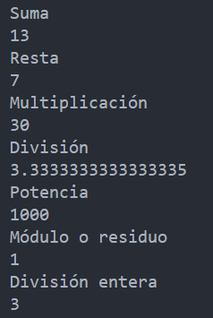

<!-- .slide: data-background-image="../../content/psg-bg-dark.png" data-background-size="100%"-->
 <!-- .element  hidden="true" -->

<br>
<br>
<br>

### Sesión  05
### Tipos de datos
### Datos numéricos
---
### Valores y Variables

---
### ¿Que es un valor?

- Un valor es es uno de los elementos mas básicos que utiliza un programa.

- Puede ser un número, una letra o un conjunto de ambos.

- El valor que vimos hasta ahora "Hola Mundo" es un valor de tipo "cadena"

---

La función `type`, que funciona de forma parecida a `print`, nos permitirá identificar el tipo de dato de un valor.

```python
type(valor)
```

---
Crearemos un archivo python **"sesion05.py"** sobre el cual trabajaremos desde nuestro proyecto

---
Escribiremos la siguiente linea de código
```python
print(type(1))
```
Ejecutamos desde la terminal

```bash
python sesion05.py
```

---
 <!-- .element width="45%" -->


- `<class "int">`: Nos indica el tipo de dato del valor. En este caso es un entero (int)

- `type(1)`: *type* devuelve el tipo de dato del valor que se le pasa como contenido.
- `print(type(1))`: *print* imprime el valor que se le pasa.

---
### ¿Qué es una variable?

- Una *variable* es una forma de asignar un nombre a un *valor* para poder usarlo dentro de un programa.

- Es una de las características más poderosas de cualquier lenguaje de programación, por que permite almacenar datos y reutilizarlos.

- El programador es quien escoge el nombre de sus variables.

---

### Reglas para nombrar variables en Python

---
Existen reglas para nombrar variables en Python

- Pueden contener tanto letras como números
- **NO** pueden comenzar con un número
- **NO** pueden contener espacios
- Se puede utilizar tanto mayúsculas como minúsculas
- El signo igual (=) se usa para asignar un valor a una variable.

```python
nombre_variable = "valor"
```

---
- Pueden contener el carácter barra baja (_) 
- Puede empezar con barra baja pero no se recomienda, a menos que escribas una librería que utilizarán otros
- **NO** se debe usar **palabras reservadas** como nombres de variables. *Python tiene hasta el momento 33 palabras reservadas*

---
Si nombramos una variable sin seguir estas reglas Python generará un **error de sintaxis**

Experimentemos en la terminal interactiva.

```sh
python
```
```python
>>> 1variable = 1
>>> mas@ = 1
>>> class = 1
```

 <!-- .element width="25%" -->

---
Es recomendable utilizar nombres de variables que contengan un contexto claro y describan lo que representan

```python
x1q3z9ahd = 35.0
x1q3z9afd = 12.50
x1q3p9afd = x1q3z9ahd * x1q3z9afd
print(x1q3p9afd)
```

---
```python
horas = 35.0
tarifa = 12.50
salario = horas * tarifa
print(salario)
```

- Ambos fragmentos hacen exactamente lo mismo desde el punto de vista del intérprete. Pero el programador los puede asimilar de manera diferente

- Los humanos entienden mejor el segundo fragmento, porque el nombre de las variables describen lo que representan y otorgan un contexto.

---
### Datos Numéricos

Hay tres tipos numéricos

- Integers (int)
- Floating (float)
- Números complejos (complex)
---
## Números Enteros
### Integers
**int**

---
### ¿Qué son los números enteros?

---

- Son números sin parte decimal.
- Pueden ser positivos, negativos o cero.

- Tienen precisión ilimitada, pueden representar números muy grandes o muy pequeños sin perder exactitud.

`$ \Z = \{...,-3,-2,-1,0,1,2,3,...\}$`

---
- Los números enteros en Python pueden declararse en distintas bases: decimal, binaria, octal y hexadecimal.

- La base solo afecta su forma de escritura, no el valor que representan.

---
#### ¿Cómo declarar un número entero? 

Se puede declarar directamente en el código

```python
# Valor 10 Entero
print (10)
print ( type (10) )
```

 <!-- .element width="50%" -->

---
#### ¿Cómo declarar un número entero? 

Se puede declarar en una variables

```python
# Variable 100 Entero
variable = 100
print (variable)
print ( type (variable) )
```

 <!-- .element width="50%" -->

---
#### ¿Cómo declarar un número entero? 
Se puede declarar usando la función **int**

```python
# Variable 20 Entero
variable_2 = int (20)
print (variable_2)
print ( type (variable_2) )
```

 <!-- .element width="50%" -->

---
Declarando números enteros en otras bases numéricas

| **Base**    | **Prefijo** | **Símbolos válidos** | **Ejemplo** |
| ----------- | ----------- | -------------------- | ----------- |
| Decimal     | *(ninguno)* | 0–9                  | `10`        |
| Binario     | `0b`        | 0, 1                 | `0b1010`    |
| Octal       | `0o`        | 0–7                  | `0o12`      |
| Hexadecimal | `0x`        | 0–9, a–f             | `0xa`       |

---
```python
# Valor 10 en base decimal
print ("Base decimal")
print (10)
# Valor 10 en binario
print ("Base binaria")
print (0b1010)
# Valor 10 en octal
print ("Base octal")
print (0o12)
# Valor 10 en hexadecimal
print ("Base hexadecimal")
print (0xa)
```

 <!-- .element width="50%" -->

---
#### ¿Qué tan grande puede ser el valor de un entero en Python?

- Python no tienen un límite máximo predefinido para los enteros.
- Podemos declarar enteros tan grandes como la memoria del sistema lo permita.
---

```python
# Entero con 60 dígitos
variable_3 = 123456789012345678901234567890123456789012345678901234567890
print (variable_3)
print (type (variable_3))
```

 <!-- .element width="75%" -->

---
## Números con punto flotante
### Floating
**float**

---
### ¿Qué son los números con punto flotante?

---
- Son números que tienen parte decimal
- Pueden ser positivos, negativos o cero.
- Tienen *precisión limitada*, no pueden representar números con una cantidad *infinita* de decimales.

 <!-- .element width="40%" -->

`$ \R = \{...,-2.5,-1.5,-0.5,0.5,1.5,2.5,...\}$`

---
- En python los números con coma o punto flotante son llamados "float"

- Internamente este tipo utiliza el formato de **doble precisión (double)** del lenguaje C.

- Permite almacenar valores decimales con mayor exactitud que un float tradicional en C.

---
#### ¿Cómo declarar un número flotante?

Se puede declarar directamente en el código

```python
# Valor 0.5 Flotante
print (0.5)
print ( type (0.5) )
```

 <!-- .element width="40%" -->

---
#### ¿Cómo declarar un número flotante?

Se puede declarar en una variables

```python
# Variable 0.100546 Flotante
variable_4 = 0.100546
print (variable_4)
print ( type (variable_4) )
```

 <!-- .element width="40%" -->

---
#### ¿Cómo declarar un número flotante?

Se puede declarar usando la función float

```python
# Variable 1 Flotante
variable_7 = float (1)
print(variable_7)
print ( type (variable_7) )
```

 <!-- .element width="40%" -->

---

#### ¿Cómo declarar un número flotante?
Se puede declarar utilizando notación científica con la letra "e" y el exponente

```python
# Valor 2.0e-3 Flotante
variable_6 = 2.0e-3
print(variable_6)
print ( type (variable_6) )
```

 <!-- .element width="40%" -->

---

#### ¿Cual es el limite de precisión de un flotante?

Precisión máxima con 17 decimales

```python
# Precisión de 17 decimales
variable_5 = 0.9999999999999999
print(variable_5)
print ( type (variable_5) )
```

 <!-- .element width="40%" -->


---
## Operadores aritméticos
---
#### ¿Que son los operadores aritméticos?

- Son símbolos especiales que representan operaciones matemáticas como la suma, la multiplicación y otros cálculos.
- Una operación matemática tiene un operador y uno o más operandos.
- Los operandos son los valores que se utilizan en la operación.

---
#### Operadores aritméticos en Python

- `$+$`  : Suma
- `$-$`  : Resta
- `$*$`  : Multiplicación
- `$/$`  : División
- `$**$` : Potencia
- `$//$` : División entera
- `$\%$` : Módulo o residuo

---
```python[1-3|4-6|7-9|10-12|13-15|16-18|19-21|22-24]
# Operadores aritméticos
a = 10
b = 3
# Suma
print ("Suma")
print (a + b)
# Resta
print ("Resta")
print (a - b)
# Multiplicación
print ("Multiplicación")
print (a * b)
# División
print ("División")
print (a / b)
# Potencia
print ("Potencia")
print (a ** b)
# Módulo o residuo
print ("Módulo o residuo")
print (a % b)
# División entera
print ("División entera")
print (a // b)
```

 <!-- .element width="15%" -->

---
- Podemos combinar los operadores para crear operaciones más complejas

- Cuando existe más de un operador se sigue un orden de precedencia en la evaluación de la operación

- Python sigue las reglas matemáticas tradicionales

---
El acrónimo **PEMDSR** nos ayuda a recordar:
- *Paréntesis* tiene la mayor prioridad, Lo que esté dentro se evalúa primero. Por lo tanto `2*(3-1)` es `4`
- *Exponenciación* o potencia sigue en la lista de prioridad. Por lo tanto `2**1+1` es `3`

---
- *Multiplicación* y *División* tienen la misma prioridad y se evalúan de izquierda a derecha. Por lo tanto `2*3*1/2` es `3`
- Finalmente, *Suma* y *Resta* que también comparten prioridad y se evalúan de izquierda a derecha. Por lo tanto `5-3-1` es `1`

---
#### Ejercicio 01

Un contador tiene 300 minutos y se le suman 3600 segundos, ¿Cuántas horas en total son?

*Recuerda que una hora tiene 60 minutos y un minuto tiene 60 segundos*

<iframe src="https://time-stuff.com/embed.html" frameborder="0" scrolling="no" width="391" height="140"></iframe>

---
```python
# Operaciones más complejas
minutos = 300
tiempo_extra_segundos = 3600
horas = (minutos + tiempo_extra_segundos / 60) / 60
print (horas)
```
```markdown
Horas:  6.0
```

---
## Operadores de comparación

---
#### ¿Qué son los operadores de comparación?

- Son símbolos especiales que permiten comparar dos valores.

- Se utilizan para evaluar relaciones como igualdad, mayor que, menor que, entre otras.

- Los valores comparados no necesitan ser del mismo tipo para ser comparados

- El resultado de una comparación siempre es un valor booleano: `True` o `False`.
---
#### Operadores de comparación en Python


- <: Estrictamente menor que  
- \>: Estrictamente mayor que
- ==: Estrictamente igual que
- <=: Menor o igual que
- \>=: Mayor o igual que
- != : Estrictamente diferente que

---
```python
print ("Operadores de comparación")
comparar = 10
print (comparar < 10)
print (comparar > 10)
print (comparar == 10)
print (comparar <= 10)
print (comparar >= 10)
print (comparar != 10)
```
 <!-- .element width="35%" -->

---
Los valores numéricos de diferente tipo también pueden ser comparados
```python
print ("Operadores de comparación con int - float")
entero = 10
flotante = 10.0
print (entero < flotante)
print (entero > flotante)
print (entero == flotante)
print (entero <= flotante)
print (entero >= flotante)
print (entero != flotante)
```

 <!-- .element width="35%" -->

---
##### Commit de la sesión

Realizamos un commit de nuestros cambios realizados al repositorio en GitHub

```sh
git add .
git commit -m "Clase sesión 05"
git push
```

---
## Resumen

- Los valores son uno de los elementos más básicos que utiliza un programa.
- Una variable es simplemente un nombre que se asigna a un valor.
- Los números enteros son valores sin parte decimal.

---
- Los números con punto flotante son números reales tanto positivos como negativos
- Los operadores aritméticos son símbolos especiales que indican cálculos matemáticos.
- Los operadores aritmenticos que podemos usar en Python son: suma `+`, resta `-`, multiplicación `*`, división `/`, potencia `**`, división entera `//` y módulo `%`.

---
- El acrónimo *PEMDSR* nos ayuda a recordar el orden de evaluación de los operadores
  
**P**aréntesis → **E**xponentes → **M**ultiplicación y **D**ivisión → **S**uma y **R**esta.
- Los operadores de comparación son símbolos especiales que representan comparación entre dos valores 

---
- Es posible comparar dos valores numéricos de diferente tipo
- Podemos combinar operadores para construir expresiones mas complejas

---
##### Retos

Crear una carpeta con el nombre "retos_sesion_05" dentro del proyecto del "psg-example", por cada ejercicio debes crear un archivo

```bash
# Ejemplo carpeta
psg-example/
    retos_sesion_05/
        ejercicio_01.py
        ejercicio_02.py
        ejercicio_03.py
        ejercicio_04.py
        sesion05.ipynb
```

Sube la carpeta a tu repositorio en GitHub cuando termines los retos

---

Realiza los siguientes ejercicios para practicar el uso de números enteros y con punto flotante

1. Escribe un programa en Python que calcule el total a pagar si se compran 12 productos iguales donde cada uno cuesta 3.75 USD.

---

2. Escribe un programa en Python que convierta las siguientes temperaturas de grados Fahrenheit a grados Celsius:

- 25 ºF
- 300 ºF
- 76 ºF

---

3. Escribe un programa en Python que convierta 1000000 de segundos en semanas, días, horas, minutos y segundos

Ejemplo:

```bash
788521 segundos = 9 días 3 horas 2 minutos 1 segundo
```

---
4. Calcular el volumen de un cubo donde uno de sus lados mide 15 metros, utilizando la fórmula general del volumen de un cubo

---
5. Convertir y ejecutar el archivo de la "sesion05.py" a un archivo en jupyter notebook "sesion05.ipynb"

---
<!-- .slide: data-background-image="../../content/psg-bg-dark.png" data-background-size="100%"-->

<br>
<br>
<br>
<br>
<br>

[ <!-- .element width="20%"-->](https://github.com/python-la-paz/python-study-group-fundamentals/tree/main/content/sesion05)

Repositorio de la Sesión

---
<!--.slide: data-visibility="hidden"-->
## Bibliografía y Referencias
[Stdtypes](https://docs.python.org/es/3/library/stdtypes.html)
[Pythonlearn](https://do1.dr-chuck.com/pythonlearn/ES_es/pythonlearn.pdf)
[Integer Literals](https://docs.python.org/es/3/reference/lexical_analysis.html#integer-literals)
[Built-in Functions Int](https://www.codecademy.com/resources/docs/python/built-in-functions/int)
[Float Python](https://ellibrodepython.com/float-python)
[Float Literals](https://docs.python.org/es/3/reference/lexical_analysis.html#floating-point-literals)
[Stdtypes Comparisons](https://docs.python.org/es/3.10/library/stdtypes.html#comparisons)
[Value Comparisons](https://docs.python.org/es/3.10/reference/expressions.html#value-comparisons)
