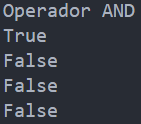
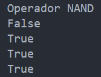

<!-- .slide: data-background-image="../../content/psg-bg-dark.png" data-background-size="100%"-->
 <!-- .element  hidden="true" -->

<br>
<br>
<br>

### Sesión  06
### Tipos de datos
### Datos Booleanos
---
##### ¿Qué es un Booleano?

---
Es un  tipo de dato que tiene exactamente dos constantes

- **True**
- **False**

> Representa valores de verdad
---
En python los booleanos están implementados como una subclase de los números enteros

- Un booleano True puede ser considerado como número  1
- Un booleano False puede ser considerado como número 0

---
Vamos a crear un archivo llamado "sesion06.py"

---
```python [1-3|4-8]
print ("Tipos de datos booleanos")
print (True)
print (False)
print (True + True)
print (True * True)
print (True * False)
print (False + False)
print (False * False)
```

 <!-- .element width="40%" -->

---
Al ser una subclase de los enteros se puede realizar operaciones aritméticas entre números y booleanos

```python [1-3|4-5]
print ("Números y booleanos")
print (10 + True)
print (10 + False)
print (10 * True)
print (10 * False)
```

 <!-- .element width="40%" -->

---
##### ¿Cómo declaro un booleano?

---
1. Directamente en el código escribiendo True o False sin necesidad de comillas 

```python [1-4|5-7]
print ("Declarar variables booleanas")
var_booleana = True
print (var_booleana)
print (type(var_booleana))
var_booleana = False
print (var_booleana)
print (type(var_booleana))
```

 <!-- .element width="40%" -->

---
2. Mediante la función bool()


```python [1-4|5-7|8-10]
print ("Declarar mediante función bool()")
var_booleana = bool(1)
print (var_booleana)
print (type(var_booleana))
var_booleana = bool(0)
print (var_booleana)
print (type(var_booleana))
var_booleana = bool(15)
print (var_booleana)
print (type(var_booleana))
```

 <!-- .element width="40%" -->

---

3. Como resultado de una operación de comparadores lógicos

---
##### Operadores de comparación

Los operadores de comparación son utilizados para comparar dos valores

Como vimos en la "Sesión 05: Datos Numéricos"

---

Existen operadores para realizar una comparación entre números

Se adicionan dos más en total teniendo 8 operadores básicos

---
- &lt; : Estrictamente menor que  
- &gt; : Estrictamente mayor que
- &lt;= : Menor o igual que
- &gt;= : Mayor o igual que

---
- == : Estrictamente igual que
- != : Estrictamente diferente que
- is : igualdad a nivel de identidad si son el mismo objeto
- is not: desigualdad a nivel de identidad si no son el mismo objeto

---
El resultados de la operación de comparación es un objeto de tipo bool

Puede ser True or False

---
```python
print ("Operadores de comparación")
print (10 == 10)
print (10 != 10)
print (10 < 10)
print (10 > 10)
print (10 <= 10)
print (10 >= 10)
print (10 is 10)
print (10 is not 10)
```

 <!-- .element width="40%" -->

---
Los resultados de los comparadores pueden ser asignados a variables y ser utilizados como parte también de expresiones lógicas más complejas

```python [1-4|5-6]
print ("Asignación de variables")
x = 10
mayor_que_cero = x > 0
print (mayor_que_cero)
diferente_de_10 = x != 10
print (diferente_de_10)
```

 <!-- .element width="40%" -->

---
##### Operadores lógicos

Son operadores especiales que nos permiten realizar cálculos lógicos para agrupar, excluir y negar expresiones

---
Existen tres expresiones lógicas:
- Not: "NO", esta expresión es unitaria solo necesita un operador y su objetivo es invertir la expresión

> Si el operador es True el resultado es False, si el operador es False el resultado es True

---
- And: "Y", esta expresión necesita dos operadores

> Si los dos operadores son Verdaderos el resultado es Verdadero, si alguno de los operadores es Falso entonces el resultado es Falso

---
- Or  : "O", esta expresión necesita dos operadores

> Si al menos uno de los operadores es verdadero el resultado es Verdadero, si los dos operadores son Falsos entonces el resultado es Falso

---
```python [1-3|4-5|6-7]
print ("Operadores lógicos")
print (True and True)
print (True and False)
print (False or True)
print (False or False)
print (not True)
print (not False)
```

 <!-- .element width="40%" -->

---
Siguen un orden de prioridad al momento de ser evaluados

1. Se ejecuta el operador de negación "not"
2. Se evalúan las operaciones de conjunción "and"
3. Finalmente las operaciones de disyunción "or"
4. Se puede utilizar paréntesis para evaluar una operación antes que otra como en los operadores aritméticos

---
```python [1-2|3|4|5|6|7]
print ("Operadores lógicos y prioridad")
print (False and False or True)
print (False and (False or True))
print (not True and False or True)
print (not (True and False or False))
print (not True and (False or False))
print (not True and False or False)
```

 <!-- .element width="50%" -->

---
##### Funciones lógicas básicas y Tablas de Verdad

---
Las tablas de verdad son una herramienta que nos permite representar la lógica de los circuitos digitales

Sus combinaciones de entrada y salida en términos

(1 y 0) o (Verdad y Falso)

---
El tamaño de una tabla de verdad se determina por 

`$$ 2^n $$`

n: Es la cantidad de variables a procesar en la tabla

 <!-- .element width="25%" -->

---
Tabla  de verdad para dos variables

 <!-- .element width="30%" -->

---
Tabla  de verdad para tres variables

 <!-- .element width="30%" -->

---
Tabla  de verdad para cuatro variables

 <!-- .element width="30%" -->

---
Las tres unidades básicas son:

- AND: Producto booleano
- OR: Suma booleana
- NOT: Negación booleana

Se puede representar sus tablas de verdad

---
Tabla de verdad de "not"

| A | not A |
|---|-------|
| V |   F   |
| F |   V   |

`$$ \overline{A} $$`
`$$ \neg A $$`

---
Tabla de verdad de "and"

| A | B | A and B |
|---|---|---------|
| V | V | V       |
| V | F | F       |
| F | V | F       |
| F | F | F       |

` $$ A \cdot B $$ `
` $$ A \land B $$ `

---
Tabla de verdad de "or"
| A | B | A or B |
|---|---|--------|
| V | V | V      |
| V | F | V      |
| F | V | V      |
| F | F | F      |

` $$ A + B $$ `
` $$ A \lor B $$ `

` $$ A + B $$ `
` $$ A \lor B $$ `

---
Existen otras funciones lógicas que nacen a partir de las tres fundamentales

- NAND: Negación de la función AND
- NOR: Negación de la función OR

---
- XOR: Función O exclusiva, True cuando los dos términos son diferentes y False cuando son Iguales "O el uno O el otro"
- XNOR: Negación de la función XOR

---
Tablas de verdad de NAND

| A | B | A nand B |
|---|---|----------|
| V | V | F        |
| V | F | V        |
| F | V | V        |
| F | F | V        |

` $$ \overline{A \cdot B} $$ `
` $$ \neg (A \land B) $$ `

---
Tablas de verdad de NOR

| A | B | A nor B |
|---|---|---------|
| V | V | F       |
| V | F | F       |
| F | V | F       |
| F | F | V       |

` $$ \overline{A + B} $$ `
` $$ \neg (A \lor B) $$ `

---
Tablas de verdad de XOR

| A | B | A xor B |
|---|---|---------|
| V | V | F       |
| V | F | V       |
| F | V | V       |
| F | F | F       |

` $$ A \oplus B = A\cdot  \overline{B} + \overline{A} \cdot B $$ ` 
` $$ (A \lor B) \land \neg (A \land B) $$ `

---
Tablas de verdad de XNOR

| A | B | A xnor B |
|---|---|----------|
| V | V | V        |
| V | F | F        |
| F | V | F        |
| F | F | V        |

` $$ \overline{A \oplus B} = A \cdot B + \overline{A + B} $$ `
` $$ \neg((A \lor B) \land \neg (A \land B)) $$ `

---
En Python vimos que los operadores AND, OR, NOT están por defecto como palabras reservadas

El caso de NAND, NOR, XOR, XNOR no existen

Pueden ser construidas fácilmente utilizando los tres operadores fundamentales

---
AND

```python
print ("Operador AND")
print (True and True)
print (True and False)
print (False and True)
print (False and False)
```

 <!-- .element width="30%" -->

---
OR

```python
print ("Operador OR")
print (True or True)
print (True or False)
print (False or True)
print (False or False)
```

 <!-- .element width="30%" -->

---
NOT

```python
print ("Operador NOT")
print (not True)
print (not False)
```

 <!-- .element width="30%" -->

---
NAND

```python
print ("Operador NAND")
print (not (True and True))
print (not (True and False))
print (not (False and True))
print (not (False and False))
```

 <!-- .element width="30%" -->

---
NOR

```python
print ("Operador NOR")
print (not (True or True))
print (not (True or False))
print (not (False or True))
print (not (False or False))
```

 <!-- .element width="30%" -->

---
XOR

```python [1-4|5-7]
print ("Operador XOR")
a = True
b = False
print ((a or b) and not (a and b))
a = True
b = True
print ((a or b) and not (a and b))
```

 <!-- .element width="30%" -->

---
Si un sensor detecta movimiento y tiene batería entonces enciende la luz

```python [1-4|5-7|8-10|11-13]
print ("Ejemplo de uso Sensor y Batería")
sensor = True
bateria = True
print (sensor, "and", bateria, "=", sensor and bateria)
sensor = True
bateria = False
print (sensor, "and", bateria, "=", sensor and bateria)
sensor = False
bateria = True
print (sensor, "and", bateria, "=", sensor and bateria)
sensor = False
bateria = False
print (sensor, "and", bateria, "=", sensor and bateria)
```

 <!-- .element width="40%" -->

---
La importancia de estos operadores en el mundo real

Diseño de circuitos lógicos: AND, OR, NOT, NAND, NOR, XOR y XNOR, para construir circuitos digitales utilizados en todos los aparatos electrónicos

---
Criptografía: XOR y XNOR para cifrado y descifrado realizando mezcla y enmascaramiento de datos

---
Sistemas de control y automatización: NAND y NOR para diseño de relés en sistemas de automatización industrial

---
Diseño de algoritmos: XOR y XNOR para realizar operaciones a nivel de bits o bitwise

(operaciones a nivel binario)

---
Redes de computadoras: NAND y NOR se utilizan para la lógica de acceso permitiendo o denegando el acceso de dispositivos a una red

---
##### Combinación de operadores de comparación, lógicos y aritméticos

Podemos combinar operadores de comparación como lógicos para crear expresiones más complejas

---
Ejemplo 1

Determinar si el número 20 está en el rango 0 a 100

<iframe src="https://time-stuff.com/embed.html" frameborder="0" scrolling="no" width="391" height="140"></iframe>

---
```python
print ("Ejemplo 1 - Comparación y Lógicos")
numero = 20
print (numero >= 0 and numero <= 100)
```
```markdown
Ejemplo 1 - Comparación y Lógicos
True
```

---
Ejemplo 2

Un estudiante obtuvo las siguientes notas en sus exámenes: 15, 20, 16 determinar si el estudiante aprobó con una nota superior a 50

<iframe src="https://time-stuff.com/embed.html" frameborder="0" scrolling="no" width="391" height="140"></iframe>

---
```python
print ("Ejemplo 2 - Aritméticos y comparación")
nota1 = 15
nota2 = 20
nota3 = 16
print ((nota1 + nota2 + nota3) > 50)
```
```markdown
Ejemplo 2 - Aritméticos y comparación
True
```

---
Ejemplo 3

Determinar si el número 15 es divisible por 3 y 5, pero no por 2

<iframe src="https://time-stuff.com/embed.html" frameborder="0" scrolling="no" width="391" height="140"></iframe>

---
```python
print ("Ejemplo 3 - Aritméticos, comparación y lógicos")
numero = 15
print ((numero % 3 ==0) and (numero % 5 ==0) and (numero % 2 !=0))
```
```markdown
Ejemplo 3 - Aritmético, comparación y lógicos
True
```

---
##### Cortocircuitos

---
Es un comportamiento de los operadores lógicos "and" y "or" al momento de evaluar expresiones booleanas

Se basa en la evaluación perezosa

---
Cortocircuito con "and": Cuando se evalúa una expresión en la cual el primer término de la expresión es False

no importa el resultado del segundo término la expresión siempre será False

Por lo cual no evalúa al segundo término por ya sabe que será False el resultado

---
```python [1-3|4|5]
print ("Cortocircuito con operador and")
x = 1
y = 0
print (x > 2 and (x/y) > 2)
print (x > 0 and (x/y) > 0)
```

 <!-- .element width="70%" -->

---

La primera expresión tiene un cortocircuito porque x no es mayor que 2 por lo que el resultado directo es False  y no necesita evaluar la segunda parte

La segunda expresión falla ya que al ser True la primera parte del and necesita de la evaluación de la segunda expresión (x/y) > 0 pero no existe la división sobre 0 por lo que la ejecución termina con un error

> Comentemos la segunda expresión para evitar el error

---
Cortocircuito con "or": Cuando se evalúa una expresión en la cual el primer término de la expresión es True

El resultado siempre será True por lo que Python no evalúa el segundo término

Ya que sabe cuál será el resultado

---
```python [1-3|4|5]
print ("Cortocircuito con operador or")
x = 1
y = 0
print (x > 0 or (x/y) > 0)
print (x > 2 or (x/y) > 2)
```

 <!-- .element width="70%" -->

---
La primera expresión tiene un cortocircuito porque x es mayor que 0 por lo que el resultado directo es True y no necesita evaluar la segunda parte

La segunda expresión falla ya al ser la primera parte False depende del segundo término para el resultado por lo que se evalúa la segunda expresión (x/y) > 2 pero no existe la división sobre 0 por lo que la ejecución termina con un error

> Comentemos la segunda expresión para evitar el error

---
##### Commit

Realizamos un commit de nuestros cambios realizados al repositorio en GitHub

```sh
git add .
git commit -m "Clase sesión 06"
git push
```

---
##### Resumen

- Los booleanos son un tipo de dato que tiene dos constantes True y False
- Los booleanos son subclases de los enteros
- Se pueden realizar operaciones aritméticas entre números y booleanos

---
- Se pueden declarar variables booleanas directamente o mediante la función bool()
- Los operadores de comparación son utilizados para comparar dos valores
- Los operadores lógicos son utilizados para realizar cálculos lógicos

---
- Las tablas de verdad son una herramienta que nos permite representar la lógica de los circuitos digitales
- El tamaño de una tabla de verdad se determina por `2^n`
- Los operadores lógicos fundamentales son AND, OR, NOT

---
- Los operadores lógicos NAND, NOR, XOR, XNOR pueden ser construidos utilizando los operadores fundamentales
- Los operadores lógicos pueden ser combinados con operadores de comparación y aritméticos
- Los cortocircuitos son un comportamiento de los operadores lógicos "and" y "or" al momento de evaluar expresiones booleanas

---
- Los cortocircuitos se basan en la evaluación perezosa
- Los cortocircuitos con "and" y "or" permiten optimizar la evaluación de expresiones booleanas

---
##### Reto
Crear una carpeta con el nombre "reto_sesion_06" en la cual por cada ejercicio debe crear un script de python

```bash
# Ejemplo carpeta
psg-example/
    tarea_sesion_06/
        ejercicio_01.py
        ejercicio_02.py
        ...
        ejercicio_07.py
        sesion06.ipynb
```

Subir la carpeta a su repositorio en GitHub cuando termine los retos

---
1. ¿Si se declara una variable boolean del valor -1 es True o False?
2. Construir el operador XNOR en Python

---
3. Imprime una tabla de verdad para la siguiente afirmación: "Una puerta tiene dos interruptores que controlan dos luces la puerta sólo debe abrirse cuando las dos luces están apagadas o las dos están encendidas, caso contrario la puerta no se abre, ¿qué operador lógico se puede utilizar?"

---
4. La suma de los números 7 y 3 es un número par?
5. Comparar los números 123 y 890, comprobar si tienen la misma paridad ambos pares o ambos impares

---
6. ¿El cuadrado de 123 se encuentra en el siguiente rango? [N > 0 & N < 20000]
7. ¿El cuadrado y la suma de 2 y 2 son iguales?

---
8. Convertir y ejecutar el archivo de la "sesion06.py" a un archivo en jupyter notebook

---
<!-- .slide: data-background-image="../../content/psg-bg-dark.png" data-background-size="100%"-->

<br>
<br>
<br>
<br>
<br>

[ <!-- .element width="20%"-->](https://github.com/python-la-paz/python-study-group-fundamentals/tree/main/content/sesion06)

Repositorio de la Sesión

---
<!--.slide: data-visibility="hidden"-->
## Bibliografía y Referencias
- [Pythonlearn](https://do1.dr-chuck.com/pythonlearn/ES_es/pythonlearn.pdf)
- [Stdtypes](https://docs.python.org/3/library/stdtypes.html#boolean-type-bool)
- [Booleano Python](https://ellibrodepython.com/booleano-python)
- [Tablas de verdad](https://ney.one/tablas-de-verdad-segun-la-cantidad-de-variables-circuitos-logicos/)
- [Principios de  la Tabla de Verdad](https://electropreguntas.com/aprende-los-principios-de-la-tabla-de-verdad-binaria-de-forma-facil-y-practica/)
- [Funciones booleanas](https://sedici.unlp.edu.ar/bitstream/handle/10915/3835/B_-_Funciones_booleanas.pdf)
- [Principios de la tabla de verdad](https://docs.hektorprofe.net/python/operadores-y-expresiones/operadores-logicos/)
- [Operadores lógicos](https://docs.python.org/3.10/library/stdtypes.html#truth-value-testing)
- [Diseño digital](http://www.ollintec.com/SistemasDigitales/libros/Dise%C3%B1o%20digital,%203ra%20Edici%C3%B3n%20-%20M.%20Morris%20Mano-FREELIBROS.ORG.pdf)
- [Digital Logic Design](https://www.portcity.edu.bd/files/636444791235373856_Digitallogicdesign.pdf)
- [Compuertas lógicas](https://www.logicbus.com.mx/blog/compuertas-logicas/)
