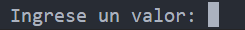
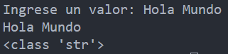
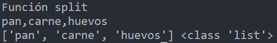

<!-- .slide: data-background-image="../../content/psg-bg-dark.png" data-background-size="100%"-->
 <!-- .element  hidden="true" -->

<br>
<br>
<br>

### Sesión  07
### Tipos de datos
### Cadenas
---
##### ¿Qué es una Cadena?

---
Una cadena es una secuencia de caracteres

Todos los caracteres que son imprimibles y no imprimibles

- Alfabeto
- Números
- Símbolos
- Emojis
- Espacios
- Tabulaciones
- Saltos de línea

---
En Python la información textual se representa con objetos de tipo "str" también llamados strings

---
Son secuencias inmutables de caracteres Unicode

En python utilizan la codificación UTF-8 por defecto

> Unicode Transformation Format - 8-bit

---
Los strings en python utilizan la codificación UTF-8 por defecto

Cada carácter representa una secuencia posible desde 1 a 4 bytes

Es eficiente para el almacenamiento y transmisión de información, en Inglés y otros idiomas occidentales

Los strings también son compatibles con ASCII un estándar más básico que UTF-8

---
Existen otros esquemas de codificación como UTF-16 y UTF-32

Utilizados en sistemas que trabajan en escritura que requiere más de 16 bits de almacenamiento

Como Chino, Japonés, Coreano 

---
##### ¿Cómo declaro una cadena?
Las cadenas se definen en el código de diferentes maneras pero siempre entre alguno de los siguientes caracteres

---
- Comillas Simples: 'Mi cadena permite comillas "dobles" en una sola línea '
- Comillas Dobles: "Mi cadena permite comillas 'simples' en una sola línea "

---
- Triples comillas simples: ''' Mi cadena permite contenido en varias líneas'''
- Triples comillas dobles: """ Mi cadena permite contenido en varias líneas """

---
```python [1,9|2,10|3-5,11|6-8,12]
simple = 'Mi cadena permite comillas "dobles" en una sola línea'
doble  = "Mi cadena permite comillas 'simples' en una sola línea"
triple_simple = '''Mi cadena
permite contenido 
en varias líneas y comillas "dobles" '''
triple_doble = """Mi cadena
permite contenido 
en varias líneas y comillas 'simples' """
print (simple)
print (doble)
print (triple_simple)
print (triple_doble)
```

 <!-- .element width="50%" -->

---
El método "str" recibe un objeto cualquiera y lo retorna como una cadena de caracteres

---
```python [1,5,9|2,6,10|3,7,11|4,8,12]
entero = str(1)
flotante = str(1E-3)
hexadecimal = str(0xA)
booleano = str (True)
print (entero)
print (flotante)
print (hexadecimal)
print (booleano)
print (type(entero))
print (type(flotante))
print (type(hexadecimal))
print (type(booleano))
```

 <!-- .element width="22%" -->

---
##### Escape de caracteres

Es la práctica de colocar un carácter especial o conjunto de caracteres dentro de una cadena para que se interprete de manera diferente

---
Ciertos caracteres tienen significados especiales por lo tanto necesitan ser escapados para ser interpretados

---
En python el carácter especial que nos permite escapar caracteres es  el barra invertida o backslash

`\`

---
Ejemplo, imprimir la cadena:

El mensaje enviado fue: "Hello, I'm a message"

---

```python
print ("El mensaje enviado fue: "Hello, I'm a message"")
print ('El mensaje enviado fue: "Hello, I'm a message"')
```

Realizar un print con comillas simples o dobles genera un error

La cadena contiene ambos caracteres especiales como valores y el intérprete no puede diferenciarlos

---
Vamos a escapar los caracteres especiales internos las comillas dobles y la comilla simple

```python
print ("El mensaje enviado fue: \"Hello, I\'m a message\"")
print ('El mensaje enviado fue: \"Hello, I\'m a message\"')
```

Ya no se generan errores de sintaxis al escribir la cadena

```text
El mensaje enviado fue: "Hello, I'm a message"
El mensaje enviado fue: "Hello, I'm a message"
```

---
Existen combinaciones de escapado que generan caracteres especiales los más comunes son:

- \n : Agrega el carácter ASCII (LF) que representa un salto de línea
- \t : Agrega el carácter ASCII (TAB) que representa una tabulación horizontal

---
- \v : Agrega el carácter ASCII (VT) que representa una tabulación vertical
- \b : Agrega el carácter ASCII (BS) que representa un retroceso
- \\ : Agrega el carácter de backslash o barra invertida
- \ &lt;newline&gt; : Agrega un salto de línea en el código pero no en la impresión

---
```python
mensaje = "Hola,\n\teste es un mensaje \vcon algunos caracteres \
especiales como \\ y tabulador."
print(mensaje)
```
```text
#Linux
Hola,
        este es un mensaje 
                           con algunos caracteres especiales como \ y tabulador.
# Windows Powershell VSCode
Hola,
        este es un mensaje ♂con algunos caracteres especiales como \ y tabulador.
```

---
##### Método Input

El método "input" nos permite ingresar contenido al programa y es procesado como una cadena

---
El texto introducido es de una sola línea y se inserta al programa cuando se realiza Enter al terminar de escribir

```python
entrada = input("Ingrese un valor: ")
print (entrada)
print (type(entrada))
```

 <!-- .element width="50%" -->

---
Después de introducir el valor desde teclado y presionar Enter

 <!-- .element width="50%" -->

---
Cuando introducimos por teclado y es procesado por una cadena puede ser convertido a diferentes tipos como enteros, flotantes, booleanos

```python
entero = int(input("Ingrese un valor entero: "))
print (entero, type(entero))

flotante = float(input("Ingrese un valor flotante: "))
print (flotante, type(flotante))

booleano = bool(input("Ingrese un valor booleano: "))
print (booleano, type(booleano))
```

 <!-- .element width="50%" -->

---
##### Manejo de Indices

Las cadenas son secuencias de caracteres por lo cual pueden ser representados de la siguiente manera

 <!-- .element width="40%" -->

Se observa que la palabra empieza en el número 0 hasta el número 5 en total teniendo 6 caracteres

---
Accedemos a los diferentes caracteres de la cadena utilizando sus índices

```python
print ("Indexado positivo")
fruta = "banana"
print (fruta)
print (fruta[0])
print (fruta[5])
```

 <!-- .element width="40%" -->

---
Los índices también puede ser negativos para la misma cadena

 <!-- .element width="40%" -->

En los índices negativos el último carácter es -1 y el primer carácter es -6

---
Accedemos a los diferentes caracteres de la cadena utilizando sus índices negativos
```python
print ("Indexado negativo")
fruta = "banana"
print (fruta)
print (fruta[-1])
print (fruta[-3])
```

 <!-- .element width="40%" -->

---
##### Segmentación o Slicing

Slicing es la técnica que permite extraer una parte de una secuencia de caracteres utilizando los indices de esta cadena

El resultado es una sub cadena

---
La sintaxis básica del slicing está dada por

 <!-- .element width="50%" -->


- Secuencia: La cadena a procesar
- Inicio: El índice o index donde comienza la sub cadena incluyendo el mismo valor
- Fin: El index donde termina la sub cadena siendo excluyente a este valor
- Paso: Es el tamaño de paso entre los índices por defecto es 1

---
```python [1-3|4-6|7-9]
print ("Slicing")
ciudad =  "LaPaz-Bolivia"
print (ciudad)
print ("Slicing con índices positivos")
print (ciudad[0:6])
print (ciudad[0:6:2])
print ("Slicing con índices negativos")
print (ciudad[-10:-2])
print (ciudad[-10:-2:2])
```

 <!-- .element width="50%" -->

---
Se puede dejar en blanco un espacio del slicing para hacer referencia a todo el contenido inicial o contenido final

```python [1|2|3|4|5|6]
print ("Slicing sin índice inicial y final")
print (ciudad[:6])
print (ciudad[6:])
print ("Slicing sin índice inicial ni final")
print (ciudad[:])
print (ciudad[::2])
```

 <!-- .element width="50%" -->

---
Cuando se trabaja con pasos negativos los slice se realizan de forma 

```python [1|2|3]
print ("Slicing con paso negativo")
print (ciudad[10:4:-1])
print (ciudad[10::-2])
```

 <!-- .element width="50%" -->

---
##### Concatenación de una cadena

Las cadenas se pueden concatenar con el operador + generando una nueva cadena en el resultado

```python
print ("Concatenación de cadenas")
cadena1 = "Hola"
cadena2 = "Mundo"
concatenada = cadena1 + " " + cadena2
print (concatenada)
```

```text
Concatenación de cadenas
Hola Mundo
```

---
##### Repetición de una cadena
Las cadenas pueden ser repetidas utilizando el operador * y un número entero N que genera una nueva cadena repetida N veces

```python
print ("Repetición de cadenas")
cadena = "-#-"
repetida = cadena * 10
print (repetida)
```
```text
Repetición de cadenas
-#--#--#--#--#--#--#--#--#--#-
```

---
##### Longitud de una cadena

Una de las funciones más importantes es la función len que nos permite obtener la longitud de una cadena específica

La longitud de una cadena es del tipo entero

---
```python [1-5|3]
print ("Longitud de una cadena")
cadena = "Hola Mundo :D"
longitud = len(cadena)
print (cadena)
print (longitud, type(longitud))
```

 <!-- .element width="50%" -->

---
##### Métodos de Cadenas

Las cadenas en Python tienen múltiples métodos para realizar tareas y procesarlas

Permitiéndonos hacer modificaciones a las cadenas

Se llama estas funciones utilizando la cadena seguido de un punto, el nombre de la función y paréntesis

*`cadena.funcion()`*

---
###### Upper

upper(): Retorna una copia de la cadena donde todos los caracteres de la cadena son convertidos a su equivalente en mayúsculas

```python
print ("Función Upper")
cadena = "cadena Inicial #1"
mayuscula  = cadena.upper()
print (cadena)
print (mayuscula)
```

 <!-- .element width="50%" -->

---
###### Lower

lower(): Retorna una copia de la cadena donde todos los caracteres de la cadena son convertidos a su equivalente en minúsculas

```python
print ("Función Lower")
cadena = "Cadena INICIAL #2"
minuscula  = cadena.lower()
print (cadena)
print (minuscula)
```

 <!-- .element width="50%" -->

---
###### Capitalize
capitalize(): Retorna una copia de la secuencia de caracteres donde el primer carácter de la cadena es convertido en Mayúscula y el resto de la cadena en minúsculas

```python
print ("Función Capitalize")
cadena = "cadena INICIAL #3"
capital = cadena.capitalize()
print (cadena)
print (capital)
```

 <!-- .element width="50%" -->

---
###### Title

title(): Retorna una copia en formato título de la cadena, la primera letra de cada palabra estará en mayúsculas y el resto en minúsculas

```python
print ("Función Title")
cadena = "CADENA inicial #4"
titulo = cadena.title()
print (cadena)
print (titulo)
```

 <!-- .element width="50%" -->

---
###### Swapcase

swapcase(): Retorna una copia de la cadena donde los caracteres son convertidos en su version inversa, caracteres en upper cambian a lower y vice versa

```python
print ("Función Swapcase")
cadena = "CADena InIcIaL #5"
swap = cadena.swapcase()
print (cadena)
print (swap)
```

 <!-- .element width="50%" -->

---
Existen funciones que permiten buscar contenido dentro las cadenas

---
###### Count

count(): Cuenta las veces que aparece una cadena dentro de otra cadena recibe como parámetro la cadena a buscar

```python
print ("Función Count")
cadena = "Cantidad de veces la letra A"
contar = cadena.count("a")
print(cadena)
print(contar, type(contar))
```

 <!-- .element width="50%" -->

---
###### Find

find(): Busca y devuelve el índice en el que se encuentra la cadena dentro de otra, empezando por la izquierda o inicio, si no encuentra devuelve -1

```python
print ("Función Find")
cadena = "Encontrar las letras las"
buscar = cadena.find("las")
print(cadena)
print(buscar, type(buscar))
```

 <!-- .element width="50%" -->

---
###### Rfind

rfind(): Busca y devuelve el índice en el que se encuentra la cadena dentro de otra cadena, empezando por la derecha o final, si no encuentra devuelve -1

```python
print ("Función Rfind")
cadena = "Encontrar las letras las"
buscar = cadena.rfind("las")
print(cadena)
print(buscar, type(buscar))
```

 <!-- .element width="50%" -->

---
Find y Rfind devuelven -1 si no encuentran la cadena

```python
print ("Función Find y Rfind")
cadena = "Encontrar tres O"
buscar = cadena.find("OOO")
print(cadena)
print(buscar, type(buscar))
buscar = cadena.rfind("OOO")
print(buscar, type(buscar))
```

 <!-- .element width="50%" -->

---
Existen funciones para saber si una cadena contiene sólo números, sólo caracteres alfabéticos o mixtos

---
- isdigit(): Devuelve un booleano si la cadena contiene sólo números
- isalpha(): Devuelve un booleano si la cadena contiene sólo caracteres alfabéticos
- isalnum(): Devuelve un booleano si la cadena contiene solo números y caracteres alfabéticos

---
```python [1-3|4-6|7-9]
print ("Función isdigit")
resultado = "100".isdigit()
print (resultado, type(resultado))
print ("Función isalpha")
resultado = "Hola".isalpha()
print (resultado, type(resultado))
print ("Función isalnum")
resultado = "usuario123".isalnum()
print (resultado, type(resultado))
```

 <!-- .element width="50%" -->

---
Existen funciones que permiten procesar las cadena donde el resultado no son solo cadenas, sino también otros tipos de datos

---
###### Split

split(): Retorna una lista de palabras utilizando un separador para delimitar las cadenas separadas

```python
print ("Función split")
cadena = "pan,carne,huevos"
separado = cadena.split(",")
print (cadena)
print (separado, type(separado))
```


 <!-- .element width="50%" -->

---
###### Join

join(): Retorna una copia de una cadena en la cual concatena la cadena con el contenido de otra cadena

```python
print ("Función join")
cadena = "abcdefghij"
unido = "-".join(cadena)
print (cadena)
print (unido)
```

 <!-- .element width="50%" -->

---
###### Strip

strip(): Remueve los caracteres la izquierda y a la derecha de la cadena por defecto remueve espacios en blanco, si se envía un valor eliminará esos caracteres

```python
print ("Función strip")
cadena = "      Hola    Mundo     "
limpio = cadena.strip()
print (cadena)
print (limpio)
cadena = "-abc--def-ghi-cba----"
limpio = cadena.strip("bac-")
print (cadena)
print (limpio)
```

 <!-- .element width="35%" -->

---
###### Replace

replace(): Retorna una copia de la cadena con contenido reemplazado por otra cadena

```python
print ("Función replace")
cadena = "Me gusta programar en JS, Amo JS"
reemplazado = cadena.replace("JS", "Python")
print (cadena)
print (reemplazado)
```

 <!-- .element width="60%" -->

---
###### format

format(): Realiza una operación de formateo e inserta contenido a la cadena delimitado por llaves {}

```python
print ("Función format")
cadena = "El valor de PI es: {}"
formateado = cadena.format(3.1416)
print (cadena)
print (formateado)
```

 <!-- .element width="50%" -->

---
###### Format

Índices para mostrar contenido

```python
print ("Función format con índices")
cadena = "{2} es la suma de {0} y {1}"
valor_1 = 5
valor_2 = 3
resultado = valor_1+valor_2
formateado = cadena.format(valor_1, valor_2, resultado)
print (cadena)
print (formateado)
```

 <!-- .element width="50%" -->

---
###### Format

Tambien puede utilizar nombres de variables

```python
print ("Función format con nombres")
cadena = "{ciudad} es la capital de {pais}"
pais = "Francia"
ciudad = "París"
formateado = cadena.format(pais=pais, ciudad=ciudad)
print (cadena)
print (formateado)
```

 <!-- .element width="50%" -->

---
Se puede formatear cadenas de forma más directa utilizando *f-strings*

Permite formatear cadenas de forma más directa utilizando el nombre de las variables

---
```python
print ("Función format con f-string")
moneda = "Boliviano"
pais = "Bolivia"
formateado = f"La moneda de {pais} es el {moneda}"
print (formateado)
```

 <!-- .element width="50%" -->

---
##### Commit

Commit de la sesión a nuestro repositorio y push en GitHub

```sh
git add .
git commit -m "Clase sesión 07"
git push
```

---
##### Resumen

- Las cadenas son secuencias de caracteres
- Los caracteres pueden ser imprimibles o no imprimibles
- Las cadenas son inmutables

---
- Se codifican en UTF-8
- También son compatibles con ASCII
- Se pueden declarar con comillas simples, dobles o triples

---
- Se pueden escapar caracteres especiales con backslash `\`
- Se pueden concatenar con el operador +
- Se pueden repetir con el operador *

---
- Se pueden indexar y segmentar
- Existen indexado negativo y slicing
- Se pueden convertir a otros tipos de datos

---
- Se pueden obtener la longitud con la función len
- Existen múltiples métodos para procesar las cadenas
- Se pueden buscar contenido con find y rfind

---
- Se pueden contar caracteres con count
- Se pueden verificar si son números, alfabéticos o mixtos
- Se pueden separar con split y unir con join

---
- Se pueden limpiar con strip
- Se pueden reemplazar con replace
- Se pueden formatear con format y f-strings

---
- Se pueden utilizar índices y nombres de variables
- Se pueden formatear de forma más directa con f-strings
- Se pueden realizar operaciones de formateo con format

---
##### Retos
Crear una carpeta con el nombre "retos_sesion_07" en la cual por cada ejercicio debe crear un script de python

```bash
# Ejemplo carpeta
psg-example/
    retos_sesion_07/
        ejercicio_01.py
        ejercicio_02.py
        ...
        ejercicio_06.py
        sesion07.ipynb
```

Subir la carpeta a su repositorio en GitHub cuando termine los retos

---
1.  Escribir una cadena con una frase de una canción o un poema

---
2.  Escribe un programa que reciba dos enteros por teclado y sume su resultado

---
3.  De la palabra "Fluorescente" mostrar solo los caracteres con índice par

---
4. Invierte la siguiente palabra "programación"

---
5. Escribe un programa que reciba una cadena y retorna verdadero o falso si es palindrome la frase o palabra ejemplo "Anita lava la Tina" es verdad

---
6. Agregar 5 Ejemplos con otras funciones no vistas en la sesión

Utilizar la documentación [Métodos de cadenas](https://docs.python.org/3/library/stdtypes.html#string-methods)

---
7. Convertir y ejecutar el archivo de la "sesion07.py" a un archivo en jupyter notebook
---
<!-- .slide: data-background-image="../../content/psg-bg-dark.png" data-background-size="100%"-->

<br>
<br>
<br>
<br>
<br>

[ <!-- .element width="20%"-->](https://github.com/python-la-paz/python-study-group-fundamentals/tree/main/content/sesion07)

Repositorio de la Sesión

---
<!--.slide: data-visibility="hidden"-->
## Bibliografía y Referencias
- [Pythonlearn](https://do1.dr-chuck.com/pythonlearn/ES_es/pythonlearn.pdf)
- [StdTypes](https://docs.python.org/3/library/stdtypes.html#str)
- [Lexical Analysis Escape Sequences](https://docs.python.org/3/reference/lexical_analysis.html#escape-sequences)
- [Text Sequence Type - str](https://docs.python.org/es/3/library/stdtypes.html#text-sequence-type-str)
- [Input](https://docs.python.org/es/3/library/functions.html#input)
- [Slicing and Indexing](https://www.linode.com/docs/guides/how-to-slice-and-index-strings-in-python/)
- [Métodos de las Cadenas](https://docs.hektorprofe.net/python/metodos-de-las-colecciones/metodos-de-las-cadenas/)
- [String Methods](https://docs.python.org/3/library/stdtypes.html#string-methods)
- [Find](https://docs.python.org/3/library/stdtypes.html#str.find)
- [Split](https://docs.python.org/3/library/stdtypes.html#str.split)
- [Join](https://docs.python.org/3/library/stdtypes.html#str.join)
- [Format](https://docs.python.org/3/library/stdtypes.html#str.format)
