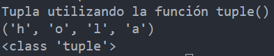

<!-- .slide: data-background-image="../../content/psg-bg-dark.png" data-background-size="100%"-->
 <!-- .element  hidden="true" -->

<br>
<br>
<br>

### Sesión  08
### Estructuras de datos
### Tuplas
---
##### Estructura de datos

Una estructura de datos es una forma de organizar y almacenar datos

De manera eficiente para su uso y manipulación

Las más comunes son tuplas, listas, conjuntos y diccionarios  

---
| Estructura | Características | Ejemplo |
| --- | --- | --- |
|<u>Tupla</u>   | Inmutable, ordenada, indexada | (1,2,3) | 
| Lista | Mutable, ordenada, indexada | [1,2,3] |
| Conjunto | Mutable, no ordenado, no indexado | {1,2,3} |
| Diccionario | Mutable, no ordenado, indexado | {'a':1, 'b':2, 'c':3} |


---
##### ¿Qué es una tupla?

---
Una tupla es un par ordenado de elementos que se almacenan juntos `(x,y)`

En un inicio almacena dos elementos

Posteriormente se extendió a más elementos

---
Una tupla es una secuencia de objetos **INMUTABLES**

Ordenados e indexados

---
- **Inmutable**: No se puede modificar, agregar o eliminar elementos después de su creación
```python
tupla = (1,2,3)
tupla[0] = 4 # Error
```

---
- **Ordenada**: Los elementos tienen un orden definido y no cambian
```python
tupla1 = (1,2,3)
tupla2 = (3,2,1)
print (tupla1 == tupla2) # False
```

---
- **Indexada**: Cada elemento tiene un índice asociado a su posición en la tupla para acceder a él

```python
tupla = (1,2,3)
tupla[0] # 1
tupla[1] # 2
tupla[2] # 3
```

---
¿Para qué se usa una tupla?

---
1. Empaquetado y desempaquetado de valores

```python
coordenadas = (3,5)
x,y = coordenadas
```

---
2. Enviar y devolver múltiples valores de una función

```python
def coordenadas(coordenada):
    x,y = coordenada
    x = x + 1
    y = y + 1
    return (x,y)
```

---
3. En diccionarios se puede utilizar una tupla como llave compuesta

```python
agenda = {('Juan','Perez'): 1234567}
```

---

Una tupla puede almacenar cualquier tipo de dato a la vez

```python
tupla = (1,2.0,'hola',True)
```

---
Al igual que las cadenas de texto

- Se puede acceder a los elementos de una tupla mediante el uso de índices
- Se puede utilizar slicing para obtener subconjuntos de la tupla

---
##### ¿Como declaro una tupla?

En python se declara una tupla utilizando comas para separar los elementos

---
No es necesario utilizar paréntesis pero **Sí** es una buena práctica para identificar hasta donde es una tupla

También se puede utilizar la función `tuple()` para crear una tupla

---

```python
mi_tupla = (elemento1, elemento2, elemento3, ...)
```

- mi_tupla es el nombre de la variable
- elemento1, elemento2, elemento3, son los objetos que se almacenarán en la tupla

---
Crearemos un archivos para la sesion08.py en nuestro proyecto y crearemos tuplas

---
Tupla de enteros

```python
print ("Tupla de enteros")
enteros = (1,2,3,4,5,6)
print (enteros)
print (type(enteros))
```

 <!-- .element width="50%" -->

---
Tupla de cadenas

```python
print ("Tupla de cadenas")
cadenas = ("hola", "mundo", "desde", "python")
print (cadenas)
print (type(cadenas))
```

 <!-- .element width="50%" -->

---
Tupla mixta

```python
print ("Tupla Mixta") 
mixta = (1, "hola", True, 2.5)
print (mixta)
print (type(mixta))
```

 <!-- .element width="50%" -->

---
Tupla vacía

```python
print ("Tupla vacia")
vacia = ()
print (vacia)
print (type(vacia))
```

 <!-- .element width="50%" -->

---
Tupla con un solo elemento

```python
print ("Tupla de un solo elemento")
uno = (1,)
print (uno)
print (type(uno))
```

 <!-- .element width="50%" -->

---
Se usa la función `tuple()` para crear una tupla, su utilidad es convertir una secuencia en una tupla

Utilizado con cadenas, listas, otras tuplas, etc.

---
Tupla de una cadena

```python
print ("Tupla utilizando la función tuple()")
constructor = tuple("hola")
print (constructor)
print (type(constructor))
```

 <!-- .element width="50%" -->

---
##### Indexación y Slicing

Se puede acceder a los diferentes valores de la tupla utilizando indexación

Obtener solo una parte de la tupla utilizando slicing

Similar a las cadenas de texto

---
Se accede a los elementos de la tupla de forma positiva de izquierda a derecha

Empezando en el índice 0

Hasta la `longitud-1` de la tupla

---
Acceso utilizando índices positivos

```python
print ("Indexado positivo de una tupla")
tupla = (1,2.0, "hola", True)
print (tupla[0], type(tupla[0]))
print (tupla[1], type(tupla[1]))
print (tupla[2], type(tupla[2]))
print (tupla[3], type(tupla[3]))
```

 <!-- .element width="50%" -->

---
Se accede a los elementos de la tupla de forma negativa de derecha a izquierda

Empezando en el índice `-1`

Hasta la `-longitud` de la tupla

---

Acceso utilizando índices negativos

```python
print ("Indexado negativo de una tupla")
tupla = (1,2.0, "hola", True)
print (tupla[-1], type(tupla[-1]))
print (tupla[-2], type(tupla[-2]))
print (tupla[-3], type(tupla[-3]))
print (tupla[-4], type(tupla[-4]))
```

 <!-- .element width="50%" -->

---
El slicing se utiliza para obtener subconjuntos de la tupla

Permite extraer una porción de la tupla utilizando dos índices de inicio y fin

El resultado es una nueva tupla

---
La sintaxis para el slicing es

 <!-- .element width="50%" -->

- `inicio` es el índice donde inicia  (incluido)
- `fin` es el índice donde termina  (excluido)
- `paso` es el tamaño del paso entre los elementos

---

Slicing de una tupla

``` python [1-3|4|5-6]
print ("Slicing de una tupla")
tupla = (0,1,2,3,4,5,6,7,8,9,10)
print (tupla)
sub_tupla = tupla[0:5]
print (sub_tupla)
print (type(sub_tupla))
```

 <!-- .element width="50%" -->

---
Slicing con paso positivo

``` python [1-3|4|5-6]
print ("Slicing de una tupla con saltos")
tupla = (0,1,2,3,4,5,6,7,8,9,10)
print (tupla)
sub_tupla = tupla[0:10:2]
print (sub_tupla)
print (type(sub_tupla))
```

 <!-- .element width="50%" -->

---
Slicing con paso negativo

``` python [1-3|4|5-6]
print ("Slicing de una tupla con saltos negativos")
tupla = (0,1,2,3,4,5,6,7,8,9,10)
print (tupla)
sub_tupla = tupla[7:2:-2]
print (sub_tupla)
print (type(sub_tupla))
```

 <!-- .element width="50%" -->

---
##### Concatenación de tuplas

Las tuplas se pueden concatenar utilizando el operador `+`

El resultado es una nueva tupla

`(a,b) + (c,d) = (a,b,c,d)`

---
Concatenación de tuplas

```python
print ("Concatenación de tuplas")
tupla1 = (1,2,3)
tupla2 = (4,5,6)
concatenar = tupla1 + tupla2
print (tupla1, tupla2)
print (concatenar)
print (type(concatenar))
```

 <!-- .element width="50%" -->

---
##### Repetición de tuplas

Las tuplas se pueden repetir utilizando el operador `*` y un número entero `n`

El resultado es una nueva tupla

`(a,b) * n = (a,b,a,b,...,a,b)` n veces

---
Repetición de tuplas

```python
print ("Repetición de tuplas")
tupla = (1,2,3)
repetir = tupla * 3
print (tupla)
print (repetir)
print (type(repetir))
```

 <!-- .element width="50%" -->

---
##### Asignación múltiple de valores

Es una forma de asignar el valor a variables variables en una sola línea desempaquetando los valores de una tupla

---

No utiliza los indices de la tupla ni los paréntesis

La cantidad de variables debe ser igual a la cantidad de elementos de la tupla

---
Asignación múltiple de valores

```python
print ("Asignación múltiple")
persona = ("Jhon", "Doe", 22, 1.75)
nombre, apellido, edad, estatura = persona
print (persona)
print (nombre)
print (apellido)
print (edad)
print (estatura)
```

 <!-- .element width="50%" -->

---
##### Métodos de las tuplas

Las tuplas son inmutables, no tienen métodos que modifiquen su contenido

Solo tienen dos métodos

- `count()`
- `index()`

Se llama a los métodos utilizando la notación con punto

`tupla.metodo()`

---
`index()` recibe un valor y devuelve el índice de la primera aparición de ese valor

Si el valor no existe en la tupla, se genera un error

```python
print ("Método index(valor)")
tupla = (1,2.0, "hola", True)
print (tupla.index(2.0))
print (tupla.index("hola"))
```

 <!-- .element width="50%" -->

---
`count()` recibe un valor y devuelve el número de veces que aparece en la tupla

```python
print ("Método count(valor)")
tupla = (1, 2.0, "hola", False, "hola", "HOLA")
print (tupla.count(1))
print (tupla.count("hola"))
print (tupla.count(10))
```

 <!-- .element width="50%" -->

---
##### Funciones con tuplas

Las tuplas interactúan con funciones propias de Python estas son las más importantes

- `len()`
- `max()`
- `min()`
- `sum()`

Existen otras funciones pueden encontrarse en la [documentación](https://docs.python.org/3/library/stdtypes.html#common-sequence-operations)
y [funciones incorporadas](https://python-reference.readthedocs.io/en/latest/docs/tuple/#functions)

---
`len()` devuelve la longitud de la tupla

```python [1-2|3|4-5]
print ("Función len()")
tupla = (1,2.0, "hola", True)
longitud = len(tupla)
print (tupla)
print (longitud)
```

 <!-- .element width="50%" -->

---
`max()` devuelve el valor máximo de la tupla, se debe asegurar que los elementos sean comparables entre sí

Si la tupla es de cadenas, se comparan alfabéticamente

Si la tupla es de enteros, se comparan numéricamente

NO mezclar tipos de datos

---
`max()`

```python [1-2|3|4-5]
print ("Función max()")
tupla = (1,2,10,5,8,0)
maximo = max(tupla)
print (tupla)
print (maximo)
```

 <!-- .element width="50%" -->

---
`min()` devuelve el valor mínimo de la tupla, se debe asegurar que los elementos sean comparables entre sí

Si la tupla es de cadenas, se comparan alfabéticamente

Si la tupla es de enteros, se comparan numéricamente

NO mezclar tipos de datos

---
`min()`

```python [1-2|3|4-5]
print ("Función min()")
tupla = ("a","z","c","b","f","d")
minimo = min(tupla)
print (tupla)
print (minimo)
```

 <!-- .element width="50%" -->

---
`sum()` devuelve la suma de los elementos de la tupla

Se debe asegurar que los elementos sean numéricos

```python [1-2|3|4-5]
print ("Función sum()")
tupla = (1.0, 0.5, 2.5, 3.1)
suma = sum(tupla)
print (tupla)
print (suma)
```

 <!-- .element width="50%" -->

---
##### Tuplas anidadas

Una tupla puede contener otras tuplas como elementos

```python [1-2|3-4|5|6]
print ("Tuplas anidadas")
tupla = (1,2,3, (4,5,6))
print (tupla)
print (tupla, type(tupla))
print (tupla[3], type(tupla[3]))
print (tupla[3][0], type(tupla[3][0]))
```

 <!-- .element width="50%" -->

---
Anidado al detalle

```python [1-3|4-5|6-7|8-9]
print ("Tuplas anidadas")
tupla = (1,2,3, (4,5,6))
print (tupla, type(tupla))
anidado = tupla[3]
print (anidado, type(anidado))
valor_anidado_0 = anidado[0]
print (valor_anidado_0, type(valor_anidado_0))
valor_anidado_1 = tupla[3][1]
print (valor_anidado_1, type(valor_anidado_1))
```

---
<iframe width="850" height="450" frameborder="0" src="https://pythontutor.com/iframe-embed.html#code=print%20%28%22Tuplas%20anidadas%22%29%0Atupla%20%3D%20%281,2,3,%20%284,5,6%29%29%0Aprint%20%28tupla,%20type%28tupla%29%29%0Aanidado%20%3D%20tupla%5B3%5D%0Aprint%20%28anidado,%20type%28anidado%29%29%0Avalor_anidado_0%20%3D%20anidado%5B0%5D%0Aprint%20%28valor_anidado_0,%20type%28valor_anidado_0%29%29%0Avalor_anidado_1%20%3D%20tupla%5B3%5D%5B1%5D%0Aprint%20%28valor_anidado_1,%20type%28valor_anidado_1%29%29&codeDivHeight=400&codeDivWidth=350&cumulative=false&curInstr=0&heapPrimitives=nevernest&origin=opt-frontend.js&py=3&rawInputLstJSON=%5B%5D&textReferences=false"> </iframe>

---
##### Commit
Commit de la sesión a nuestro repositorio

```sh
git add .
git commit -m "Clase sesión 08"
git push
```

---
##### Resumen

- Una estructura de datos es una forma de organizar y almacenar datos
- Son secuencias inmutables
- Se declaran con comas y paréntesis
- Acceder a los elementos con índices y slicing
- Concatenar y repetir tuplas
- Asignar múltiples valores a variables
- Tienen dos métodos `index()` y `count()`
- `len()`, `max()`, `min()`, `sum()` son compatibles 
- Anidar tuplas

---
##### Retos

Crear una carpeta con el nombre "retos_sesion_08" en la cual por cada ejercicio debe crear un script de python

```bash
# Ejemplo carpeta
psg-example/
    retos_sesion_08/
        ejercicio_01.py
        ejercicio_02.py
        ...
        ejercicio_06.py
        sesion08.ipynb
```

Subir la carpeta a su repositorio en GitHub cuando termine los retos

---
1. Ingresa por teclado dos coordenadas `'x','y'` y una ubicación,
almacena los 3 valores en una tupla e imprime el resultado

---
2. Crea una tupla con los siguientes elementos `1,2,3,4,5,6,7,8,9,10` y realiza:
   - Imprime el primer elemento
   - Imprime el último elemento
   - Imprime un slice del 4 al 7
   - Imprime un slice del 2 al 9 con pasos de 3
   - Imprime un slice del 10 al 1 con saltos de -2

---
3. Ingresa una cadena por teclado y almacena el valor en una tupla 
   - Concatena la tupla `('¡', )` + tupla almacenada + la tupla `('!', )`
   - Imprime el resultado concatenado
   - Repite la tupla final 3 veces e imprime el nuevo resultado

---
4. Las notas de un estudiante durante un semestre son:

`34, 61, 80, 20, 12, 69, 32, 60, 61, 51, 90, 23, 15`

Genera una tupla con los resultados y calcula el promedio
para saber si aprobó o no el semestre utiliza la función `sum()` y `len()`

---
5. De la siguiente guía telefónica

Juan, 591123456, La Paz

Pedro, 591546324, La Paz

Maria, 591222421, El Alto

Sol, 591753159, Oruro

Genera una tupla anidada e imprime el resultado

---
6. De las tuplas de coordenadas

`$(x1,y1) = (40, 80) $` y `$ (x2,y2) = (50, 50)$`

Encuentra las coordenadas del punto medio, almacena en una tupla e imprime el resultado

`$(x,y)$`

---
7. Convertir y ejecutar el archivo de la "sesion08.py" a un archivo en jupyter notebook

---
<!-- .slide: data-background-image="../../content/psg-bg-dark.png" data-background-size="100%"-->

<br>
<br>
<br>
<br>
<br>

[ <!-- .element width="20%"-->](https://github.com/python-la-paz/python-study-group-fundamentals/tree/main/content/sesion08)

Repositorio de la Sesión

---
<!--.slide: data-visibility="hidden"-->
## Bibliografía y Referencias
- [Pythonlearn](https://do1.dr-chuck.com/pythonlearn/ES_es/pythonlearn.pdf)
- [Data Structures](https://docs.python.org/3/tutorial/datastructures.html)
- [Tuples and Sequences](https://docs.python.org/es/3/tutorial/datastructures.html#tuples-and-sequences)
- [Tuples](https://python-reference.readthedocs.io/en/latest/docs/tuple/)
- [Tuplas en Python](https://ellibrodepython.com/tuplas-python)
- [Listas, tuplas y cadenas](https://dcain.etsin.upm.es/~carlos/bookCNP/03.02_ListasTuplasCadenas.html)
- [Sequence Types — list, tuple, range](https://docs.python.org/3.9/library/stdtypes.html#sequence-types-list-tuple-range)
- [tuple.index](https://python-reference.readthedocs.io/en/latest/docs/tuple/lindex.html)
- [len()](https://python-reference.readthedocs.io/en/latest/docs/functions/len.html)
- [max()](https://python-reference.readthedocs.io/en/latest/docs/functions/max.html)
- [min()](https://python-reference.readthedocs.io/en/latest/docs/functions/min.html)
- [sum()](https://python-reference.readthedocs.io/en/latest/docs/functions/sum.html)
- [Common Sequence Operations](https://docs.python.org/3/library/stdtypes.html#common-sequence-operations)
- [Built-in Functions](https://python-reference.readthedocs.io/en/latest/docs/tuple/#functions)
- [Python Tutor](https://pythontutor.com/)