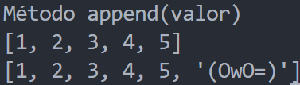
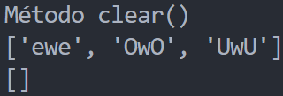
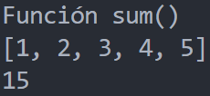
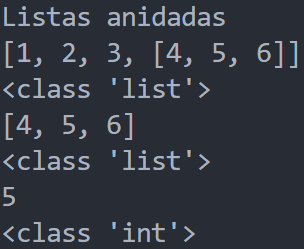

<!-- .slide: data-background-image="../../content/psg-bg-dark.png" data-background-size="100%"-->
 <!-- .element  hidden="true" -->

<br>
<br>
<br>

### Sesión  09
### Estructuras de datos
### Listas
---
##### Estructura de datos

Una estructura de datos es una forma de organizar y almacenar datos

De manera eficiente para su uso y manipulación

Las más comunes son tuplas, listas, conjuntos y diccionarios  

---
| Estructura         | Características                   | Ejemplo               |
| ------------------ | --------------------------------- | --------------------- |
| Tupla              | Inmutable, ordenada, indexada     | (1,2,3)               |
| <u>Lista</u>       | Mutable, ordenada, indexada       | [1,2,3]               |
| Conjunto           | Mutable, no ordenado, no indexado | {1,2,3}               |
| Diccionario        | Mutable, ordenado, indexado       | {'a':1, 'b':2, 'c':3} |

---
##### ¿Que es una lista?

Una lista es una estructura de datos, así como una tupla y una cadena es una secuencia de valores

Al igual que la tupla almacena objetos o items que pueden ser de cualquier tipo

---
Una lista es una secuencia de objetos **MUTABLES**

Ordenados e indexados

---
- **Mutable**: Los elementos de una lista pueden ser modificados después de su creación
```python
lista = [1,2,3]
lista[0] = 4 
print (lista) # [4,2,3]
```

---
- **Ordenada**: Los elementos tienen un orden definido y no cambian a no ser que sean reordenados explícitamente modificando la lista
```python
lista1 = [1,2,3]
lista2 = [3,2,1]
print (lista1 == lista2) # False
```

---
- **Indexada**: Cada elemento tiene un índice asociado a su posición en la lista para acceder a él

```python
lista = [1,2,3]
lista[0] # 1
lista[1] # 2
lista[2] # 3
```

---
##### ¿Cómo declarar una lista?

En python se declara una lista utilizando corchetes `[]` y separando los elementos con comas `,`

```python
mi_lista = [elemento1, elemento2, elemento3, ...]
```
- `mi_lista` es el nombre de la variable

- `elemento1, elemento2, elemento3` son los objetos que se almacenarán en la lista

---
También se puede declarar una lista utilizando la función `list()`

Y mediante listas por comprensión

---
Crearemos un archivos para la sesion09.py en nuestro proyecto y empecemos a crear listas

---
Lista de enteros
```python
print ("Lista de enteros")
mi_lista = [1,2,3,4,5]
print (mi_lista)
```

 <!-- .element width="50%" -->

---
Lista de cadenas
```python
print ("Lista de cadenas")
mi_lista = ["hola", "mundo", "python"]
print (mi_lista)
```
 <!-- .element width="50%" -->

---
Lista mixta
```python
print ("Lista mixta")
mi_lista = [1, "hola", 3.14, "mundo", 5]
print (mi_lista)
```

 <!-- .element width="50%" -->

---
Lista vacía
```python
print ("Lista vacía")
mi_lista = []
print (mi_lista)
```
 <!-- .element width="50%" -->

---
Se usa la función `list()` para crear una lista a partir de una secuencia

Su utilidad es convertir una tupla, cadena o conjunto en una lista

---
Lista a partir de una cadena
```python
print ("Lista a partir de una cadena")
mi_lista = list("hola mundo")
print (mi_lista)
```

 <!-- .element width="70%" -->

---
Lista a partir de una tupla
```python
print ("Lista a partir de una tupla")
mi_tupla = (1,2,3,4,5)
print (mi_tupla)
mi_lista = list(mi_tupla)
print (mi_lista)
```

 <!-- .element width="50%" -->

---
Una lista por comprensión es una forma de crear listas a partir de una expresión o secuencia

Es una forma más compacta y eficiente de crear listas

---
```python
print ("Lista por comprensión")
mi_lista = [x for x in range(10)]
print (mi_lista)
```

 <!-- .element width="50%" -->

---
##### Indexación y slicing

Se puede acceder a los diferentes valores de la lista utilizando indexación

Obtener solo una parte de la lista utilizando slicing

Similar a las cadenas de texto y tuplas

---
Se accede a los elementos de la lista de forma positiva de izquierda a derecha

Empezando en el índice 0

Hasta la `longitud-1` de la lista

 <!-- .element width="50%" -->

---
Acceso utilizando índices positivos

```python
print ("Indexación positivo de una lista")
lista = [1, "hola", 3.14, (1,2)]
print (lista[0], type(lista[0])) 
print (lista[1], type(lista[1])) 
print (lista[2], type(lista[2])) 
print (lista[3], type(lista[3])) 
```

 <!-- .element width="50%" -->

---
Se accede a los elementos de la lista de forma negativa de derecha a izquierda

Empezando en el índice -1

Hasta la `-longitud` de la lista

 <!-- .element width="50%" -->

---
Acceso utilizando índices negativos

```python
print ("Indexación negativo de una lista")
lista = [1, "hola", 3.14, (1,2)]
print (lista[-1], type(lista[-1]))
print (lista[-2], type(lista[-2]))
print (lista[-3], type(lista[-3]))
print (lista[-4], type(lista[-4]))
```

 <!-- .element width="50%" -->

---
La indexación no se limita a obtener los valores de la lista

También se puede modificar los valores de la lista original utilizando la indexación

```python
print ("Modificación de una lista")
lista = [1, "hola", 3.14, (1,2)]
print (lista)
lista[0] = 2
lista[1] = "mundo"
print (lista)
```

```text
[1, 'hola', 3.14, (1, 2)]
[2, 'mundo', 3.14, (1, 2)]
```

---
El slicing se utiliza para obtener una porción de la lista

Permite extraer una porción de la lista utilizando dos índices de inicio y fin

El resultado es una nueva lista

---
La sintaxis para el slicing es

 <!-- .element width="50%" -->

- `inicio` es el índice donde inicia (incluido)
- `fin` es el índice donde termina (excluido)
- `paso` es el incremento o decremento entre los índices (default 1)

---
Slicing positivo y negativo

 <!-- .element width="70%" -->

---
Slicing de una lista

```python [1-3|4-5]
print ("Slicing de una lista")
lista = ["P", "y", "t", "h", "o", "n", "L", "a", "P", "a", "z"]
print (lista)
sub_lista = lista[2:7]
print (sub_lista)
print (type(sub_lista))
```

 <!-- .element width="60%" -->

---
Slicing con paso positivo

```python [1-3|4-5]
print ("Slicing con paso positivo")
lista = ["P", "y", "t", "h", "o", "n", "L", "a", "P", "a", "z"]
print (lista)
sub_lista = lista[0:9:3]
print (sub_lista)
```

 <!-- .element width="60%" -->

---
Slicing con paso negativo

```python [1-3|4-5]
print ("Slicing con paso negativo")
lista = ["P", "y", "t", "h", "o", "n", "L", "a", "P", "a", "z"]
print (lista)
sub_lista = lista[8:2:-4]
print (sub_lista)
```

 <!-- .element width="60%" -->

---
Slicing negativo con paso negativo

```python [1-3|4-5]
print ("Slicing negativo con paso negativo")
lista = ["P", "y", "t", "h", "o", "n", "L", "a", "P", "a", "z"]
print (lista)
sub_lista = lista[-1:-8:-2]
print (sub_lista)
```

 <!-- .element width="60%" -->

---
Slicing negativo con paso positivo

```python [1-3|4-5]
print ("Slicing negativo con paso positivo")
lista = ["P", "y", "t", "h", "o", "n", "L", "a", "P", "a", "z"]
print (lista)
sub_lista = lista[-8:-1:2]
print (sub_lista)
```

 <!-- .element width="60%" -->

---
##### Concatenación de listas

Las listas se pueden concatenar utilizando el operador `+`

El resultado es una nueva lista con los elementos de las listas originales

`$ [a,b,c] + [d,e,f] = [a,b,c,d,e,f] $`

---
Concatenación de listas

```python
print ("Concatenación de listas")
lista1 = [1,2,3]
lista2 = ["a","b","c"]
concatenar = lista1 + lista2
print (lista1, lista2)
print (concatenar)
print (type(concatenar))
```

 <!-- .element width="50%" -->

---
##### Repetición de listas

Las listas se pueden repetir utilizando el operador `*` y un número entero `n`

El resultado es una nueva lista con los elementos de la lista original repetidos `n` veces

`$ [a,b,c] * n = [a,b,c, ... a,b,c,] n veces $`

---
Repetición de listas

```python
print ("Repetición de listas")
lista = [True, False]
repetir = lista * 3
print (lista)
print (repetir)
print (type(repetir))
```

 <!-- .element width="50%" -->

---
##### Métodos de las listas

Las listas al ser mutables tiene una mayor cantidad de métodos que las tuplas 

- Métodos de búsqueda
- Métodos de adición
- Métodos de eliminación
- Métodos de ordenamiento
- Métodos de copia

---
Se utiliza la notación de punto `.` 

`lista.metodo()`

`lista.metodo(valor)`

---
##### Métodos de búsqueda

Los métodos de búsqueda nos permiten buscar información en la lista

- `index()`
- `count()`

---
`index(valor)` recibe un valor y devuelve el índice de la primera aparición en la lista, si no existe lanza un error

 <!-- .element width="50%" -->

---
`index(valor)`

```python [1-2|3-4|5-6]
print ("Método index(valor)")
lista = [1,True,3.14,"hola",5]
valor = "hola"
print (valor, lista.index(valor))
valor = 3.14
print (valor, lista.index(valor))
```

 <!-- .element width="50%" -->

---
`count(valor)` recibe un valor y devuelve el número de veces que aparece en la lista

 <!-- .element width="50%" -->

---
`count(valor)`

```python [1-2|3-4|5-6]
print ("Método count(valor)")
lista = [1,True,3.14,"hola",5, True, True, 3.140]
valor = True
print (valor, lista.count(valor))
valor = 3.14
print (valor, lista.count(valor))
```

 <!-- .element width="50%" -->

---
##### Métodos de adición

Los métodos de adición nos permiten agregar elementos a la lista

- `insert()`
- `append()`
- `extend()`

No retornan un valor, modifican la lista original

---
`insert(i, valor)` recibe un índice y un valor, inserta el valor en la posición del índice

```python [1-3|4-5]
print ("Método insert(i, valor)")
lista = [1,2,3,4,5]
print (lista)
lista.insert(2, "OwO")
print (lista)
```

 <!-- .element width="50%" -->

---
`append(valor)` recibe un valor y lo agrega al final de la lista

```python [1-3|4-5]
print ("Método append(valor)")
lista = [1,2,3,4,5]
print (lista)
lista.append("(OwO=)")
print (lista)
```

 <!-- .element width="50%" -->

---
`extend(iterable)` recibe una secuencia y agrega sus elementos al final de la lista como otra lista, tupla, cadena

```python [1-3|4-5|6-7|8-9]
print ("Método extend(iterable)")
lista = [1,2,3]
print (lista)
lista.extend(":3")
print (lista)
lista.extend(["(¬_¬ )", "(O_O=)"])
print (lista)
lista.extend(("😅", "😎"))
print (lista)
```

 <!-- .element width="50%" -->

---
##### Métodos de eliminación

Los métodos de eliminación nos permiten eliminar elementos de la lista

- `remove()`
- `clear()`

No retornan un valor, modifican la lista original

- `pop()`

Retorna el valor eliminado y modifica la lista original

---
`remove(valor)` recibe un valor y elimina la primera aparición de ese valor en la lista si no existe lanza un error

 <!-- .element width="50%" -->

---
`remove(valor)`

```python [1-3|4-5]
print ("Método remove(valor)")
lista = [1,2,"UwU",4,5, "UwU"]
print (lista)
lista.remove("UwU")
print (lista)
```

 <!-- .element width="50%" -->

---
`pop(i) o pop()` recibe un index o índice y elimina el elemento en esa posición

Si no se especifica el índice elimina el último elemento

 <!-- .element width="50%" -->

---
`pop(i) o pop()`

```python [1-3|4-5|6-8]
print ("Método pop(i)")
lista = ["OwO",3,"UwU",5]
print (lista)
lista.pop(1)
print (lista)
print ("Método pop()")
lista.pop()
print (lista)
```

 <!-- .element width="30%" -->

---
`clear()` elimina todos los elementos de la lista dejándola 
vacía

```python [1-3|4-5]
print ("Método clear()")
lista = ["ewe","OwO","UwU"]
print (lista)
lista.clear()
print (lista)
```

 <!-- .element width="50%" -->

---
##### Métodos de ordenamiento

Los métodos de reordenar nos permiten ordenar los elementos de la lista

- `sort()`
- `reverse()`

No retornan un valor, modifican la lista original

---
`sort()` ordena los elementos de la lista de menor a mayor

```python [1-3|4-5]
print ("Método sort()")
lista = [3,1,5,2,4]
print (lista)
lista.sort()
print (lista)
```

 <!-- .element width="50%" -->

---
`sort(reverse=True)` ordena los elementos de la lista de mayor a menor

```python [1-3|4-5]
print ("Método sort()")
lista = [3,1,5,2,4]
print (lista)
lista.sort(reverse=True)
print (lista)
```

 <!-- .element width="50%" -->

---
`reverse()` invierte el orden de los elementos de la lista

```python [1-3|4-5]
print ("Método reverse()")
lista = [3,1,5,2,4]
print (lista)
lista.reverse()
print (lista)
```

 <!-- .element width="50%" -->

---
##### Métodos de copia

Los métodos de copia nos permiten copiar los elementos de la lista

- `copy()`

---
Cuando se asigna una lista a otra variable se crea una referencia a la lista original

NO se crea una copia de la lista, si se modifica esta se modifica la original

```python [1-3|4-5|6-7]
print ("Asignación de lista")
lista = [1,2,3,4,5]
print (lista)
copia = lista
copia[0] = 6
print (copia)
print (lista)
```
```text
Asignación de lista
[1, 2, 3, 4, 5]
[6, 2, 3, 4, 5]
[6, 2, 3, 4, 5]
```

---
Para crear una copia de la lista se debe utilizar el método `copy()` o el slicing `[:]`

```python [1-3|4|5|6-7]
print ("Método copia con slicing")
lista = [1,2,3,4,5]
print (lista)
copia = lista[:]
copia[0] = 6
print (copia)
print (lista)
```
```text
Método copia con slicing
[1, 2, 3, 4, 5]
[6, 2, 3, 4, 5]
[1, 2, 3, 4, 5]
```

---
`copy()` devuelve una copia de la lista es equivalente al slicing `[:]` 

```python [1-3|4-5|6]
print ("Método copy()")
lista = [3,1,5,2,4]
print (lista)
copia = lista.copy()
print (copia)
print (copia == lista)
```

 <!-- .element width="50%" -->

---
Método copia con slicing

```python python [1-3|4|5|6-7]
print ("Método copia con slicing")
lista = [1,2,3,4,5]
print (lista)
copia = lista.copy()
copia[0] = 6
print (copia)
print (lista)
```

```text
Método copia con slicing
[1, 2, 3, 4, 5]
[6, 2, 3, 4, 5]
[1, 2, 3, 4, 5]
```

---
##### Funciones con listas

Las listas interactúan con funciones propias de python que acepten secuencias de datos

- `len()`
- `max()`
- `min()`
- `sum()`

Existen otras funciones pueden encontrarse en la [documentación](https://docs.python.org/3/library/stdtypes.html#common-sequence-operations) y [funciones incorporadas](https://python-reference.readthedocs.io/en/latest/docs/list/#functions)

---
`len()` devuelve la longitud de la lista o el número de elementos que contiene

---
`len()`

```python [1-3|4]
print ("Función len()")
lista = [1,True,3.14,"🐍",5]
print (lista)
print (len(lista))
```

 <!-- .element width="50%" -->

---
`max()` devuelve el valor máximo de la lista o el elemento más grande

Si la lista contiene cadenas devuelve el valor máximo en orden alfabético

Si la lista contiene enteros y flotantes devuelve el valor máximo numérico

---
`max()`

```python [1-3|4|5-6|7]
print ("Función max()")
lista = [1,2,3,4,5]
print (lista)
print (max(lista))
lista = ["a","b","c","d","e"]
print (lista)
print (max(lista))
```

 <!-- .element width="50%" -->

---
`min()` devuelve el valor mínimo de la lista o el elemento más pequeño

Si la lista contiene cadenas devuelve el valor mínimo en orden alfabético

Si la lista contiene enteros y flotantes devuelve el valor mínimo numérico

---
`min()`

```python [1-3|4|5-6|7]
print ("Función min()")
lista = [1,2,3,4,5]
print (lista)
print (min(lista))
lista = ["a","b","c","d","e"]
print (lista)
print (min(lista))
```

 <!-- .element width="50%" -->

---
`sum()` devuelve la suma de los elementos de la lista

Se debe asegurar que los elementos de la lista sean numéricos

---
`sum()`

```python [1-3|4]
print ("Función sum()")
lista = [1,2,3,4,5]
print (lista)
print (sum(lista))
```

 <!-- .element width="50%" -->

---
##### Comparación de listas

Podemos consultar si una lista contiene un elemento específico utilizando el operador `in`, `not in`

Si una variable hace referencia a otra variable podemos utilizar el `is` , `is not`, para comparar si son la misma lista

---
`in` - `not in`

```python [1-3|4-5|6-7|8]
print ("Comparación de listas")
lista = [1,2,3,4,5]
print (lista)
print (3 in lista)
print (6 in lista)
print (3 not in lista)
print (6 not in lista)
print ([1,2,3] in lista)
```

 <!-- .element width="40%" -->

---
`is` - `is not`

```python [1-5|6|7|8]
print ("Comparación de listas")
lista1 = [1,2,3,4,5]
lista2 = [1,2,3,4,5]
lista3 = [1,2]
print (lista1, lista2, lista3)
print (lista1 is lista2)
print (lista1 is not lista2)
print (lista3 is lista1)
```

 <!-- .element width="50%" -->

---
##### Operadores de comparación

Podemos comparar listas utilizando los operadores de comparación, estos comparan los elementos de las listas uno a uno

- `==` - Igualdad
- `!=` - Desigualdad
- `>` - Mayor que
- `<` - Menor que
- `>=` - Mayor o igual que
- `<=` - Menor o igual que

---
`<` y `<=`
- Comienza comparando el primer elemento de cada lista
- Si son iguales pasa al siguiente elemento de cada lista
- Si el primer elemento de la primera lista es menor que el de la segunda lista, el resultado es `True`
- Si el primer elemento de la primera lista es mayor que el de la segunda lista el resultado es `False`

---
```python 
print ("Menor y Menor Igual que")
print ([1,2,3] <= [1,2,4])
print ([1,2,3] <= [1,2,2,2])
print ([1,2,3] <= [2])
print ([1,2,3] < [1,2,3])
print ([1,2,3] <= [1,2,3])
```

```text
Menor y Menor Igual que
True
False
True
False
True
```

---
`>` y `>=`
- Comienza comparando el primer elemento de cada lista
- Si son iguales pasa al siguiente elemento de cada lista
- Si el primer elemento de la primera lista es mayor que el de la segunda lista, el resultado es `True`
- Si el primer elemento de la primera lista es menor que el de la segunda lista el resultado es `False`

---
```python
print ("Mayor y Mayor Igual que")
print ([1,2,3] >= [1,2,4])
print ([1,2,3] >= [1,2,2,2])
print ([1,2,3] >= [2])
print ([1,2,3] > [1,2,3])
print ([1,2,3] >= [1,2,3])
```

```text
Mayor y Mayor Igual que
False
True
False
False
True
```

---
`==` y `!=`
- Compara si los elementos de las listas son iguales
- Si todos los elementos son iguales el resultado es `True`
- Si al menos un elemento es diferente el resultado es `False`

---
```python
print ("Igual y Desigual que")
print ([1,2,3] == [1,2,3])
print ([1,2,3] == [1,2,4])
print ([1,2,3] != [1,2,3])
print ([1,2,3] != [1,2,4])
```

```text
Igual y Desigual que
True
False
False
True
```

---
##### Listas anidadas

Las listas anidadas son listas que contienen otras listas como elementos

Se pueden crear listas anidadas de cualquier profundidad

---
Listas anidadas

```python [1-4|5-7|8-10]
print ("Listas anidadas")
lista = [1,2,3,[4,5,6]]
print (lista)
print (type(lista))
valor_lista = lista[3]
print (valor_lista)
print (type(valor_lista))
valor = valor_lista[1]
print (valor)
print (type(valor))
```

 <!-- .element width="34%" -->

---
<iframe width="850" height="450" frameborder="0" src="https://pythontutor.com/iframe-embed.html#code=print%20%28%22Listas%20anidadas%22%29%0Alista%20%3D%20%5B1,2,3,%5B4,5,6%5D%5D%0Aprint%20%28lista%29%0Aprint%20%28type%28lista%29%29%0Avalor_lista%20%3D%20lista%5B3%5D%0Aprint%20%28valor_lista%29%0Aprint%20%28type%28valor_lista%29%29%0Avalor%20%3D%20valor_lista%5B1%5D%0Aprint%20%28valor%29%0Aprint%20%28type%28valor%29%29&codeDivHeight=400&codeDivWidth=350&cumulative=false&curInstr=1&heapPrimitives=nevernest&origin=opt-frontend.js&py=311&rawInputLstJSON=%5B%5D&textReferences=false"> </iframe>

---
##### Commit
Commit de la sesión a nuestro repositorio

```sh
git add .
git commit -m "Clase sesión 09"
git push
```

---
##### Resumen Listas

- Las listas son una estructura de datos iterable que almacena objetos o items
- Son mutables, ordenadas e indexadas
- Se declaran con corchetes y comas
- Acceder a los elementos con índices y slicing
- Concatenar y repetir listas con `+` y `*`

---
##### Resumen Listas
- Asignar múltiples valores a variables
- Tienen varios métodos 
  - `index()`, `count()`
  - `insert()`, `append()`, `extend()`
  - `remove()`, `pop()`, `clear()`, 
  - `sort()`, `reverse()`, 
  - `copy()`
- `len()`, `max()`, `min()`, `sum()` son compatibles
- Se puede anidar listas

---
##### Retos

Crear una carpeta con el nombre "retos_sesion_09" en la cual por cada ejercicio debe crear un script de python

```bash
# Ejemplo carpeta
psg-example/
    retos_sesion_09/
        ejercicio_01.py
        ejercicio_02.py
        ejercicio_03.py
        ejercicio_04.py
        sesion09.ipynb
```

Subir la carpeta a su repositorio en GitHub cuando termine los retos

---
1. Crear una lista con 5 números flotantes y 5 enteros y mostrar todos los elementos y sus tipos de datos utilizando sus índices

---
2. De la siguiente lista `[5,4,3,2,2,2,0,0,1,2]` obtener una sub lista inversa utilizando saltos de 3 en 3 

---
3. Crear una lista de personas con 10 nombres de personas
   1. Obtener una sub lista de 5 a 9 con saltos de 2 en 2
   2. Buscar si existe el nombre "José" en la lista original
   3. Ordenar la sub lista alfabéticamente `a-z`
   4. Ordenar la lista original alfabéticamente descendente `z-a`

---
4. Una dulcería tiene 2 listas una con los productos y otra con los precios
   1. Agregar 2 productos nuevos al final de las listas
   2. Eliminar el producto con el nombre "Bon Bon Bum" de las listas
   3. ¿Cuánto cuesta el producto "Oreo" y "Chizitos"?
   4. ¿Cuál es el producto más caro y el más barato?

   > Parte 1/2
---
4. Una dulcería tiene 2 listas una con los productos y otra con los precios
   5. ¿Cuántos productos tienes en total?
   6. ¿Cuanto cuestan todos los productos?
   7. Ordena los productos y precios del más barato al más caro
   8. Eliminar todos los productos de las listas

   > Parte 2/2
---
5. Convertir y ejecutar el archivo de la "sesion09.py" a un archivo en jupyter notebook

---
<!-- .slide: data-background-image="../../content/psg-bg-dark.png" data-background-size="100%"-->

<br>
<br>
<br>
<br>
<br>

[ <!-- .element width="20%"-->](https://github.com/python-la-paz/python-study-group-fundamentals/tree/main/content/sesion09)

Repositorio de la Sesión

---
<!--.slide: data-visibility="hidden"-->
## Bibliografía y Referencias
- [Pythonlearn](https://do1.dr-chuck.com/pythonlearn/ES_es/pythonlearn.pdf)
- [List](https://python-reference.readthedocs.io/en/latest/docs/list/)
- [Listas por comprensión](https://www.analyticslane.com/2019/09/23/listas-por-comprension-en-python/)
- [Data Structures](https://docs.python.org/3/tutorial/datastructures.html#data-structures)
- [Google Python List](https://developers.google.com/edu/python/lists)
- [Built-in Python List](https://builtin.com/data-science/python-list)
- [Stdtypes Lists](https://docs.python.org/3/library/stdtypes.html#lists)
- [Indexing](https://python-reference.readthedocs.io/en/latest/docs/brackets/indexing.html)
- [Slicing](https://python-reference.readthedocs.io/en/latest/docs/brackets/slicing.html)
- [Concatenation](https://python-reference.readthedocs.io/en/latest/docs/operators/concatenation.html)
- [Remove](https://python-reference.readthedocs.io/en/latest/docs/list/remove.html)
- [Common Sequence Operations](https://docs.python.org/3/library/stdtypes.html#common-sequence-operations)
