<!-- .slide: data-background-image="../../content/psg-bg-dark.png" data-background-size="100%"-->
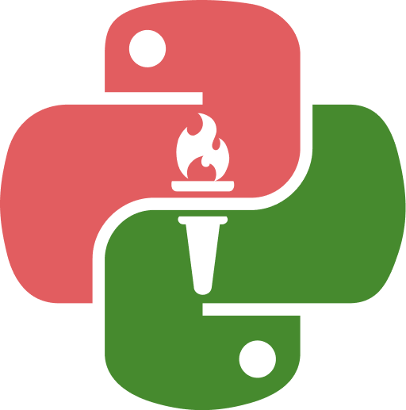 <!-- .element  hidden="true" -->

<br>
<br>
<br>

### Sesión  10
### Estructura de datos
### Conjuntos

---
##### Estructura de datos

Una estructura de datos es una forma de organizar y almacenar datos

De manera eficiente para su uso y manipulación

Las más comunes son tuplas, listas, conjuntos y diccionarios  

---
| Estructura         | Características                   | Ejemplo               |
| ------------------ | --------------------------------- | --------------------- |
| Tupla              | Inmutable, ordenada, indexada     | (1,2,3)               |
| Lista              | Mutable, ordenada, indexada       | [1,2,3]               |
| <u>Conjunto</u>    | Mutable, no ordenado, no indexado | {1,2,3}               |
| Diccionario        | Mutable, ordenado, indexado       | {'a':1, 'b':2, 'c':3} |

---
¿Qué es un conjunto?

Un conjunto es una estructura de datos, al igual que una lista o una tupla

Al  igual que las listas almacena objetos o items que puede ser de a cualquier tipo

---
Se llaman conjuntos porque en matemáticas un conjunto es una colección de elementos únicos sin orden definido

Python adopta la misma definición de conjunto de matemáticas

---

Un conjunto es una secuencia de objetos **MUTABLES**

- **NO ordenados** 
- **NO indexados** 
- **NO duplicados**

---

**Mutable**: Los elementos de un conjunto pueden ser modificados después de su creación

```python [1-2|3-4]
conjunto = {'🍕','🍔','🍟','🌭'}
print(conjunto) # {'🍔', '🌭', '🍕', '🍟'}
conjunto.add('🥗')
print(conjunto)  # {'🍔', '🍕', '🥗', '🍟', '🌭'}
```

---
**NO ordenados**: Los elementos de un conjunto no tienen un orden especifico

```python
conjunto = {'🍕','🍔','🍟','🌭'}
print(conjunto) # {'🍔', '🌭', '🍕', '🍟'}
```

---
**NO indexados**: Los elementos de un conjunto no pueden ser accedidos por un índice

```python 
conjunto = {'🍕','🍔','🍟','🌭'}
print(conjunto[0]) # TypeError: 'set' object is not subscriptable
```

---
**NO duplicados**: Los elementos de un conjunto no pueden ser duplicados

```python 
conjunto = {'🍕','🍔','🍟','🌭','🍕','🍟'}
print(conjunto) # {'🍕', '🍟', '🌭', '🍔'}
```

---
##### Usos de los conjuntos

- Análisis de texto eliminando palabras repetidas
- Gestión de inventarios
- Control de usuarios
- Control de permisos

---
##### ¿Cómo declarar un conjunto?

En python se declara un conjunto utilizando llaves `{}` y separando los elementos con comas `,`

```python
mi_conjunto = {elemento1, elemento2, elemento3, ...}
```

- mi_conjunto: Es el nombre del conjunto
- elemento1, elemento2, elemento3: Son los elementos del conjunto

---
También se puede declarar un conjunto utilizando la función `set()`

Y declarar conjuntos utilizando conjuntos por comprensión

---
Crearemos un archivo con el nombre sesion10.py y empezaremos a crear conjuntos

---
Conjunto de enteros

```python
print ("Conjunto de enteros")
conjunto = {1, 2, 3, 4, 5}
print(conjunto) 
print(type(conjunto))
```

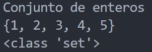 <!-- .element width="50%" -->

---
Conjunto de cadenas

```python
print ("Conjunto de cadenas")
conjunto = {'🍕','🍔','🍟','🌭'}
print(conjunto)
print(type(conjunto))
```

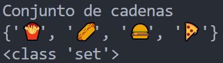 <!-- .element width="50%" -->

---
Conjunto mixto

```python
print ("Conjunto mixto")
conjunto = {1, True, 3.14, '☕'}
print(conjunto)
print(type(conjunto))
```

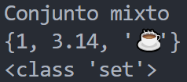 <!-- .element width="50%" -->

---
Se utiliza la función `set()` para crear conjuntos vacíos o a partir de una secuencia

Permite convertir secuencias como listas, tuplas, cadenas en conjuntos

---
Conjunto vacío

```python
print ("Conjunto vacío")
conjunto = set()
print(conjunto)
print(type(conjunto))
```

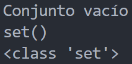 <!-- .element width="50%" -->

---
Conjunto a partir de la cadena

```python
print ("Conjunto a partir de la cadena")
cadena = 'Hola Mundo'
conjunto = set(cadena)
print(conjunto)
print(type(conjunto))
```

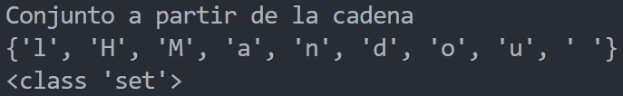 <!-- .element width="60%" -->

---
Conjunto a partir de una tupla

```python
print ("Conjunto a partir de una tupla")
tupla = (1, 2, 3, 4, 5, 5)
conjunto = set(tupla)
print(conjunto)
print(type(conjunto))
```

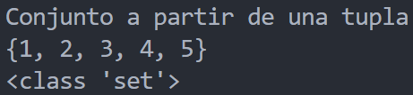 <!-- .element width="50%" -->

---
Conjunto a partir de una lista
```python
print ("Conjunto a partir de una lista")
lista = [True, False, 0, 1]
conjunto = set(lista)
print(conjunto)
print(type(conjunto))
```

 <!-- .element width="50%" -->

---
Conjunto por comprensión

```python
print ("Conjunto por comprensión")
conjunto = {x for x in '🍕🍔🍟🍕🍔🍟🍔🍟'}
print(conjunto)
print(type(conjunto))
```

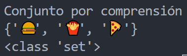 <!-- .element width="50%" -->

---
##### Indexación y Slicing

Los conjuntos no soportan indexación ni slicing

Porque no son ordenados ni indexados

```python
conjunto = {1, 2, 3, 4, 5}
print(conjunto[0]) # TypeError: 'set' object is not subscriptable
```

```python	
conjunto = {1, 2, 3, 4, 5}
print(conjunto[0:3]) # TypeError: 'set' object is not subscriptable
```

---
##### Concatenación de conjuntos

Los conjuntos no soportan la concatenación con el operador `+`

```python
conjunto1 = {1, 2, 3}
conjunto2 = {4, 5, 6}
print(conjunto1 + conjunto2)
# TypeError: unsupported operand type(s) for +: 'set' and 'set'
```

##### Repetición con conjuntos

Los conjuntos no soportan la repetición con el operador `*`

```python
conjunto = {1, 2, 3}
print(conjunto * 3)
# TypeError: unsupported operand type(s) for *: 'set' and 'int'
```

---
##### Métodos de los conjuntos

Los conjuntos soportan métodos como:

- Métodos de adición
- Métodos de eliminación
- Métodos de operaciones con conjuntos
- Métodos de asignación con operaciones
- Métodos de búsqueda
- Métodos de copia

---
Se utiliza la notación de punto `.` 

`conjunto.metodo()`

`conjunto.metodo(valor)`

---
##### Métodos de adición

Los métodos de adición permiten agregar elementos a un conjunto

- `add()`
- `update()`

No retorna ningún valor

---
`add(valor)` recibe un valor y lo agrega al conjunto si no existe

```python [1-3|4-5]
print ("Método add()")
conjunto = {'🍕','🍔','🍟','🌭'}
print (conjunto)
conjunto.add('🥗')
print(conjunto) 
```

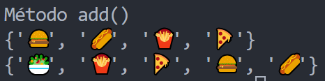 <!-- .element width="50%" -->

---
`update(valores)` recibe una secuencia de valores y los agrega al conjunto si no existen

```python [1-3|4-5|6-7|8-9|10-11]
print ("Método update()")
conjunto = {'🍕','🍔','🍟','🌭'}
print (conjunto)
conjunto.update(['🥤','🍦'])
print(conjunto) 
conjunto.update('🍩🍪')
print(conjunto) 
conjunto.update(('🍫','🍬'))
print(conjunto)
conjunto.update({'🍭','🍮'})
print(conjunto)
```

 <!-- .element width="70%" -->

---
##### Métodos de eliminación

Los métodos de eliminación permiten eliminar elementos de un conjunto

- `remove()`
- `discard()`
- `pop()`
- `clear()`

Solo `pop()` retorna el elemento eliminado

---
`remove(valor)` recibe un valor y lo elimina del conjunto si existe, si no existe lanza un error

```python [1-3|4-5|6-8]
print ("Método remove()")
conjunto = {'🍕','🍔','🍟','🌭'} 
print (conjunto)
conjunto.remove('🍔')
print(conjunto)
# conjunto.remove('🍔')
# print(conjunto)
# Key Error: '🍔'
```

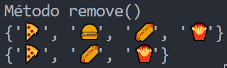 <!-- .element width="50%" -->

---
`discard(valor)` recibe un valor y lo elimina del conjunto si existe, si no existe no lanza un error

```python [1-3|4-5|6-7]
print ("Método discard()")
conjunto = {'🍕','🍔','🍟','🌭'}
print (conjunto)
conjunto.discard('🍔')
print(conjunto)
conjunto.discard('🍔')
print(conjunto)
```

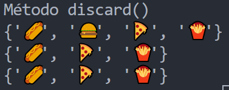 <!-- .element width="50%" -->

---
`pop()` elimina un elemento **aleatorio** del conjunto y lo retorna

```python [1-3|4-5|6-7]
print ("Método pop()")
conjunto = {'🍕','🍔','🍟','🌭', '🥤','🍦'}
print (conjunto)
print(conjunto.pop())
print(conjunto)
print(conjunto.pop())
print(conjunto)
```

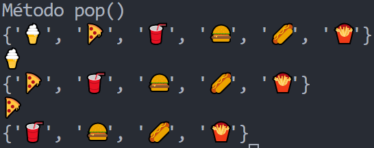 <!-- .element width="50%" -->

---
`clear()` elimina todos los elementos del conjunto

```python [1-3|4-5]
print ("Método clear()")
conjunto = {'🍕','🍔','🍟','🌭'}
print (conjunto)
conjunto.clear()
print(conjunto)
```

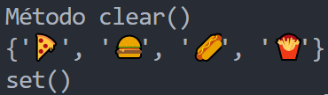 <!-- .element width="50%" -->

---
##### Métodos de operaciones con conjuntos

- `union()` : Unión de conjuntos
- `intersection()` : Intersección de conjuntos
- `difference()` : Diferencia de conjuntos
- `symmetric_difference()` : Diferencia simétrica de conjuntos

Retornan un nuevo conjunto con el resultado de la operación

---
`union(conjunto)` recibe un conjunto y retorna la unión de ambos

Contiene todos los elementos de ambos sin repetir

##### `$A \cup B = \{x | x \in A \lor x \in B\}$`

```python [1-4|5-6]
print ("Método union()")
conjunto1 = {'🍔','🍟', '🥤'}
conjunto2 = {'🍕','🍨','🥤'}
print (conjunto1, conjunto2)
union = conjunto1.union(conjunto2)
print(union)
```

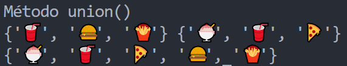 <!-- .element width="50%" -->

---
`intersection(conjunto)` recibe un conjunto y retorna  la intersección de ambos

Contiene los elementos que están en ambos conjuntos

##### `$A \cap B = \{x | x \in A \land x \in B\}$`

```python [1-4|5-6]
print ("Método intersection()")
conjunto1 = {'🍔','🍟', '🥤'}
conjunto2 = {'🍕','🍨','🥤'}
print (conjunto1, conjunto2)
interseccion = conjunto1.intersection(conjunto2)
print(interseccion)
```

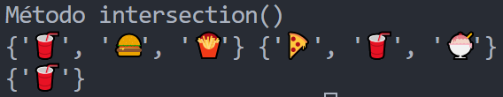 <!-- .element width="50%" -->

---
`difference(conjunto)` recibe un conjunto y retorna la diferencia de ambos conjuntos

Los que están en el 1er conjunto pero no en el 2do

##### `$A - B = \{x | x \in A \land x \notin B\}$`

```python [1-4|5-6|7-8]
print ("Método difference()")
conjunto1 = {'🍔','🍟', '🥤'}
conjunto2 = {'🍕','🍨','🥤'}
print ("1:",conjunto1, "2:",conjunto2)
diferencia = conjunto1.difference(conjunto2)
print("1 y 2:",diferencia)
diferencia = conjunto2.difference(conjunto1)
print("2 y 1:",diferencia)
```

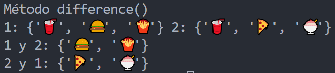 <!-- .element width="50%" -->

---
`symmetric_difference(conjunto)` recibe un conjunto y retorna la diferencia simétrica de ambos

Contiene los elementos que están en un conjunto o en el otro pero no en ambos

##### `$A\bigtriangleup B=\{x | x \in A \land x \notin B \lor x \in B \land x \notin A\}$`

```python [1-4|5-6]
print ("Método symmetric_difference()")
conjunto1 = {'🍔','🍟', '🥤'}
conjunto2 = {'🍕','🍨','🥤'}
print (conjunto1, conjunto2)
diferencia_simetrica = conjunto1.symmetric_difference(conjunto2)
print(diferencia_simetrica)
```

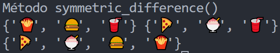 <!-- .element width="50%" -->

---
##### Métodos de asignación con operaciones

Permiten realizar operaciones con conjuntos y asignar el resultado al conjunto inicial

- `intersection_update()` : Intersección
- `difference_update()` : Diferencia
- `symmetric_difference_update()` : Diferencia simétrica

---
`intersection_update(conjunto)` recibe un conjunto y asigna al conjunto inicial la intersección de ambos conjuntos

```python [1-4|5-6]
print ("Método intersection_update()")
conjunto1 = {'🍔','🍟', '🥤'}
conjunto2 = {'🍕','🍨','🥤'}
print (conjunto1, conjunto2)
conjunto1.intersection_update(conjunto2)
print(conjunto1)
```

 <!-- .element width="50%" -->

---
`difference_update(conjunto)` recibe un conjunto y asigna al conjunto inicial la diferencia de ambos conjuntos

```python [1-4|5-6]
print ("Método difference_update()")
conjunto1 = {'🍔','🍟', '🥤'}
conjunto2 = {'🍕','🍨','🥤'}
print ("1:",conjunto1, "2:",conjunto2)
conjunto1.difference_update(conjunto2)
print ("1:",conjunto1, "2:",conjunto2)
```

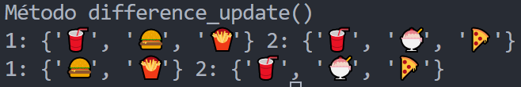 <!-- .element width="50%" -->

---
`symmetric_difference_update(conjunto)` recibe un conjunto y asigna al conjunto inicial la diferencia simétrica de ambos conjuntos

```python [1-4|5-6]
print ("Método symmetric_difference_update()")
conjunto1 = {'🍔','🍟', '🥤'}
conjunto2 = {'🍕','🍨','🥤'}
print (conjunto1, conjunto2)
conjunto1.symmetric_difference_update(conjunto2)
print(conjunto1)
```

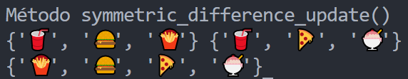 <!-- .element width="50%" -->

---
##### Métodos de búsqueda

Los métodos de búsqueda permiten buscar elementos en un conjunto

- `issubset()` : Subconjunto
- `issuperset()` : Superconjunto
- `isdisjoint()` : Disjunto

Retornan un valor booleano

---
`issubset(conjunto)` recibe una secuencia y retorna `True` si el conjunto es subconjunto del conjunto recibido

```python [1-5|6-7|8-9]
print ("Método issubset()")
conjunto1 = {'🍔','🍟', '🥤'}
conjunto2 = {'🍕','🍨','🥤'}
conjunto3 = {'🍔','🍟'}
print (conjunto1, conjunto2,conjunto3)
# ¿El conjunto1 es subconjunto del conjunto2?
print(conjunto1.issubset(conjunto2))
# ¿El conjunto3 es subconjunto del conjunto1?
print(conjunto3.issubset(conjunto1))
```

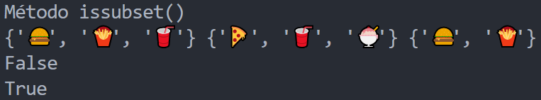 <!-- .element width="60%" -->

---
`issuperset(conjunto)` recibe una secuencia y retorna `True` si el conjunto es superconjunto del conjunto recibido

```python [1-5|6-7|8-9]
print ("Método issuperset()")
conjunto1 = {'🍔','🍟', '🥤'}
conjunto2 = {'🍕','🍨','🥤'}
conjunto3 = {'🍔','🍟'}
print (conjunto1, conjunto2,conjunto3)
# ¿El conjunto1 es superconjunto del conjunto2?
print(conjunto1.issuperset(conjunto2)) # C1 contiene a C2?
# ¿El conjunto1 es superconjunto del conjunto2?
print(conjunto1.issuperset(conjunto3)) # C1 contiene a C3?
```

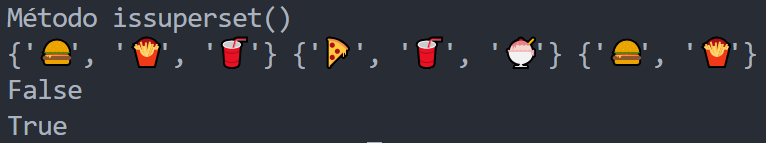 <!-- .element width="60%" -->

---
`isdisjoint(conjunto)` recibe un secuencia y retorna `True` si el conjunto no tiene elementos en común con el conjunto recibido

```python [1-5|6-7|8-9]
print ("Método isdisjoint()")
conjunto1 = {'🍔','🍟', '🥤'}
conjunto2 = {'🍕','🍨'}
conjunto3 = {'🍔','🍟'}
print (conjunto1, conjunto2,conjunto3)
# ¿El conjunto1 no tiene elementos en común con el conjunto2?
print(conjunto1.isdisjoint(conjunto2))
# ¿El conjunto1 no tiene elementos en común con el conjunto3?
print(conjunto1.isdisjoint(conjunto3))
```

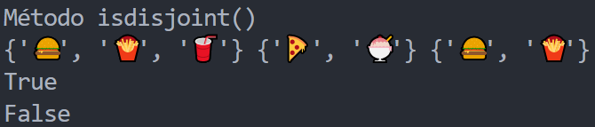 <!-- .element width="50%" -->

---
##### Métodos de copia

Los métodos de copia permiten copiar un conjunto

- `copy()`

Retorna un nuevo conjunto con los mismos elementos

---
Cuando se asigna un conjunto a una variable se asigna por referencia

NO se crea una copia del conjunto sino una referencia al conjunto original

```python [1-3|4-5]
print ("Asignación por referencia")
conjunto = {'🍕','🍔','🍟','🌭'}
print (conjunto)
copia = conjunto
copia.add('🥗')
print(conjunto)
print(copia)
```

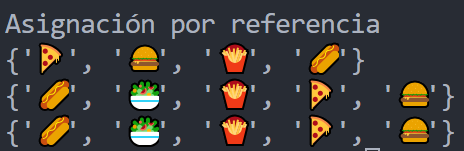 <!-- .element width="50%" -->

---
Para crear una copia de un conjunto se utiliza el método `copy()`

```python [1-3|4-5]
print ("Método copy()")
conjunto = {'🍕','🍔','🍟','🌭'}
print (conjunto)
copia = conjunto.copy()
copia.add('🥗')
print(conjunto)
print(copia)
```

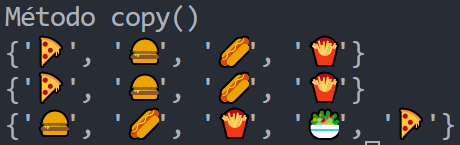 <!-- .element width="50%" -->

---
##### Funciones con conjuntos

Los conjuntos interactúan con funciones propias de python que permiten secuencias

- `len()`
- `max()`
- `min()`
- `sum()`

Existen otras funciones pueden encontrarse en la [documentación](https://docs.python.org/3/library/stdtypes.html#set) y [funciones incorporadas](https://python-reference.readthedocs.io/en/latest/docs/sets/#functions)

---
`len(conjunto)` retorna la cantidad de elementos del conjunto 

```python
print ("Función len()")
conjunto = {'🍕','🍔','🍟','🌭'}
print (conjunto)
print(len(conjunto))
```

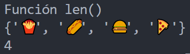 <!-- .element width="50%" -->

---
`max(conjunto)` retorna el elemento mayor del conjunto

Si el conjunto contiene cadenas retorna el elemento mayor en orden lexicográfico

Si el conjunto contiene números retorna el valor mayor

---
`max(conjunto)` 

```python [1-4|5-7]
print ("Función max()")
conjunto = {1, 2, 3, 4, 5}
print (conjunto)
print (max(conjunto))
conjunto = {'🍕','🍔','🍟','🌭'}
print (conjunto)
print(max(conjunto))
```

 <!-- .element width="50%" -->

---
`min(conjunto)` retorna el elemento menor del conjunto

Si el conjunto contiene cadenas retorna el elemento menor en orden lexicográfico

Si el conjunto contiene números retorna el valor menor

---
`min(conjunto)` 

```python [1-4|5-7]
print ("Función min()")
conjunto = {1, 2, 3, 4, 5}
print (conjunto)
print (min(conjunto))
conjunto = {'🍨','🍔','🍟','🍕'}
print (conjunto)
print(min(conjunto))
```

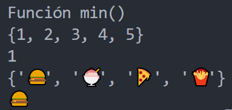 <!-- .element width="50%" -->

---
`sum(conjunto)` retorna la suma de los elementos del conjunto

Solo si el conjunto contiene números

```python [1-3|4]
print ("Función sum()")
conjunto = {1, 2, 3, 4, 5}
print (conjunto)
print (sum(conjunto))
```

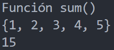 <!-- .element width="50%" -->

---
##### Operadores con conjuntos

Los conjuntos soportan operadores que permiten realizar operaciones

- Operadores de adición
- Operadores de comparación
- Operadores para operaciones con conjuntos
- Operadores para asignación con operaciones

---
##### Operadores de adición

Los operadores de adición permiten agregar elementos a un conjunto

Similar al método `add()`

- `|=` : Update 

---
`|=` recibe un conjunto y agrega al conjunto inicial los elementos del conjunto recibido

```python [1-3|4-6]
print ("Operador |=")
conjunto1 = {'🍔','🍟', '🥤'}
conjunto2 = {'🍕','🍨'}
print (conjunto1, conjunto2)
conjunto1 |= conjunto2
print(conjunto1)
```

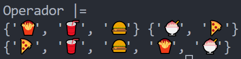 <!-- .element width="50%" -->

---
##### Operadores de comparación

Los operadores de comparación permiten comparar conjuntos

- `==` : Igualdad
- `!=` : Desigualdad
- `<` : Es subconjunto y no igual
- `>` : Es superconjunto y no igual
- `<=` : Es subconjunto o igual
- `>=` : Es superconjunto o igual

---
`==` compara si dos conjuntos son iguales

```python [1-5|6|7]
print ("Operador ==")
conjunto1 = {'🍔','🍟', '🥤'}
conjunto2 = {'🍔','🍟', '🥤'}
conjunto3 = {'🍕','🍨'}
print (conjunto1, conjunto2, conjunto3)
print(conjunto1 == conjunto2)
print(conjunto1 == conjunto3)
```

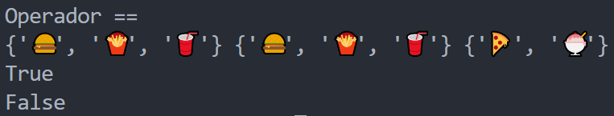 <!-- .element width="70%" -->

---
`!=` compara si dos conjuntos son diferentes

```python [1-5|6|7]
print ("Operador !=")
conjunto1 = {'🍔','🍟', '🥤'}
conjunto2 = {'🍔','🍟', '🥤'}
conjunto3 = {'🍕','🍨'}
print (conjunto1, conjunto2, conjunto3)
print(conjunto1 != conjunto2)
print(conjunto1 != conjunto3)
```

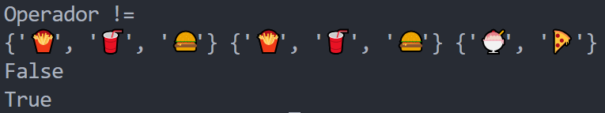 <!-- .element width="70%" -->

---
`<` compara si un conjunto es subconjunto y no igual a otro

```python [1-5|6|7]
print ("Operador <")
conjunto1 = {'🍔','🍟'}
conjunto2 = {'🍔','🍟', '🥤'}
conjunto3 = {'🍕','🍨'}
print (conjunto1, conjunto2, conjunto3)
print(conjunto1 < conjunto2)
print(conjunto1 < conjunto3)
```

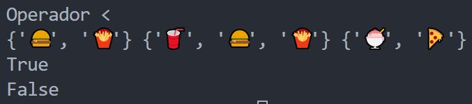 <!-- .element width="70%" -->

---
`>` compara si un conjunto es superconjunto y no igual a otro

```python [1-5|6|7]
print ("Operador >")
conjunto1 = {'🍔','🍟','🥤','🍕'}
conjunto2 = {'🍔','🍟', '🥤'}
conjunto3 = {'🍕','🍨'}
print (conjunto1, conjunto2, conjunto3)
print(conjunto1 > conjunto2)
print(conjunto1 > conjunto3)
```

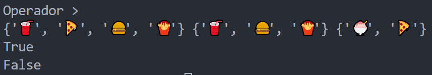 <!-- .element width="70%" -->

---
`<=` compara si un conjunto es subconjunto o igual a otro

```python [1-5|6|7]
print ("Operador <=")
conjunto1 = {'🍔','🍟'}
conjunto2 = {'🍔','🍟'}
conjunto3 = {'🍕','🍨'}
print (conjunto1, conjunto2, conjunto3)
print(conjunto1 <= conjunto2)
print(conjunto1 <= conjunto3)
```

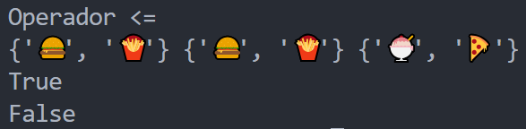 <!-- .element width="60%" -->

---
`>=` compara si un conjunto es superconjunto o igual a otro

```python [1-5|6|7]
print ("Operador >=")
conjunto1 = {'🍔','🍟'}
conjunto2 = {'🍔','🍟'}
conjunto3 = {'🍕','🍨'}
print (conjunto1, conjunto2, conjunto3)
print(conjunto1 >= conjunto2)
print(conjunto1 >= conjunto3)
```

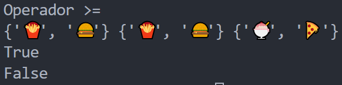 <!-- .element width="60%" -->

---
##### Operadores para operaciones con conjuntos

Los operadores para operaciones con conjuntos permiten realizar operaciones con conjuntos

- `|` : Unión
- `&` : Intersección
- `-` : Diferencia
- `^` : Diferencia simétrica

---
`|` retorna la unión de dos conjuntos

```python [1-4|5-6]
print ("Operador |")
conjunto1 = {'🍔','🍟', '🥤'}
conjunto2 = {'🍕','🍨','🥤'}
print (conjunto1, conjunto2)
union = conjunto1 | conjunto2
print(union)
```

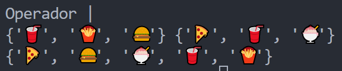 <!-- .element width="60%" -->

---
`&` retorna la intersección de dos conjuntos

```python [1-4|5-6]
print ("Operador &")
conjunto1 = {'🍔','🍟', '🥤'}
conjunto2 = {'🍕','🍨','🥤'}
print (conjunto1, conjunto2)
interseccion = conjunto1 & conjunto2
print(interseccion)
```

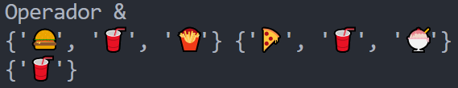 <!-- .element width="60%" -->

---
`-` retorna la diferencia de dos conjuntos

```python [1-4|5-6|7-8]
print ("Operador -")
conjunto1 = {'🍔','🍟', '🥤'}
conjunto2 = {'🍕','🍨','🥤'}
print ("1:",conjunto1, "2:",conjunto2)
diferencia = conjunto1 - conjunto2
print("1 - 2:",diferencia)
diferencia = conjunto2 - conjunto1
print("2 - 1:",diferencia)
```

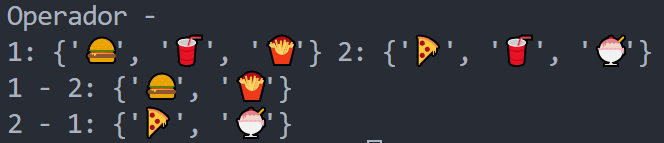 <!-- .element width="60%" -->

---
`^` retorna la diferencia simétrica de dos conjuntos

```python [1-4|5-6]
print ("Operador ^")
conjunto1 = {'🍔','🍟', '🥤'}
conjunto2 = {'🍕','🍨','🥤'}
print (conjunto1, conjunto2)
diferencia_simetrica = conjunto1 ^ conjunto2
print(diferencia_simetrica)
```

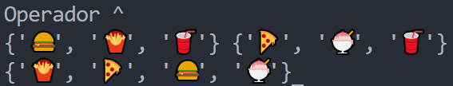 <!-- .element width="60%" -->

---

##### Operadores para asignación con operaciones

Los operadores para asignación con operaciones permiten realizar operaciones con conjuntos y asignar el resultado al conjunto inicial

- `|=` : Unión
- `&=` : Intersección
- `-=` : Diferencia
- `^=` : Diferencia simétrica

---
`|=` recibe un conjunto y agrega al conjunto inicial los elementos del conjunto recibido

```python [1-3|4-6]
print ("Operador |= Unión")
conjunto1 = {'🍔','🍟', '🥤'}
conjunto2 = {'🍕','🍨','🥤'}
print (conjunto1, conjunto2)
conjunto1 |= conjunto2
print(conjunto1)
```

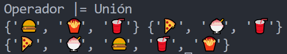 <!-- .element width="60%" -->

---
`&=` recibe un conjunto y asigna al conjunto inicial la intersección de ambos conjuntos

```python [1-3|4-6]
print ("Operador &= Intersección")
conjunto1 = {'🍔','🍟', '🥤'}
conjunto2 = {'🍕','🍨','🥤'}
print (conjunto1, conjunto2)
conjunto1 &= conjunto2
print(conjunto1)
```

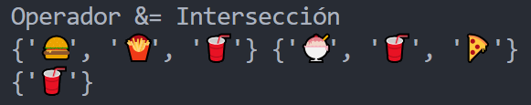 <!-- .element width="60%" -->

---
`-=` recibe un conjunto y asigna al conjunto inicial la diferencia de ambos conjuntos

```python [1-4|5-7|8-9]
print ("Operador -= Diferencia")
conjunto1 = {'🍔','🍟', '🥤'}
conjunto2 = {'🍕','🍨','🥤'}
print ("1:",conjunto1, "2:",conjunto2)
conjunto1 -= conjunto2
print("1 - 2:",conjunto1)
conjunto1 = {'🍔','🍟', '🥤'}
conjunto2 -= conjunto1
print("2 - 1:",conjunto2)
```

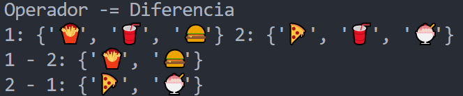 <!-- .element width="60%" -->

---
`^=` recibe un conjunto y asigna al conjunto inicial la diferencia simétrica de ambos conjuntos

```python [1-3|4-6]
print ("Operador ^= Diferencia simétrica")
conjunto1 = {'🍔','🍟', '🥤'}
conjunto2 = {'🍕','🍨','🥤'}
print (conjunto1, conjunto2)
conjunto1 ^= conjunto2
print(conjunto1)
```

 <!-- .element width="50%" -->

---
##### Conjuntos inmutables

Los conjuntos inmutables son conjuntos que no pueden ser modificados después de su creación

En python se declaran utilizando la función `frozenset()`

```python
conjunto = frozenset({'🍔','🍕','🥗','🍟','🌭'})
print(conjunto)
print(type(conjunto))
```

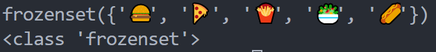 <!-- .element width="70%" -->

---
Poseen los mismos métodos que los conjuntos mutables pero no poseen los métodos de adición, eliminación y asignaciones con operaciones

```python
conjunto = frozenset({1, 2, 3, 4, 5})
print(conjunto)
print(conjunto.add(6)) # AttributeError: 'frozenset' object has no attribute 'add'
print(conjunto.remove(1)) # AttributeError: 'frozenset' object has no attribute 'remove'
print(conjunto |= {6}) # SyntaxError: invalid syntax
```

---
##### Conjuntos anidados

Los conjuntos anidados son conjuntos que contienen otros conjuntos pero tienen que ser inmutables para ser anidados


```python
print ("Conjunto de conjuntos")
conjunto = {frozenset({'🍅','🍓','🍎'}), frozenset({'🍈','🍐','🍏'})}
print(conjunto)
print(type(conjunto))
```

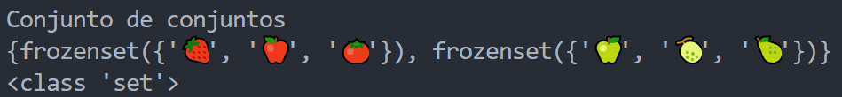 <!-- .element width="70%" -->

---
Si se intenta anidar un conjunto mutable se lanza un error

```python
print ("Conjunto de conjuntos")
conjunto = {{'🍅','🍓','🍎'}, {'🍈','🍐','🍏'}} #TypeError: unhashable type: 'set'
print(conjunto)
print(type(conjunto))
```

---
##### Commit

Commit de la sesión a nuestro repositorio

```bash
git add .
git commit -m "Clase sesión 10"
git push
```

---
##### Resumen Conjuntos

- Los conjuntos son colecciones desordenadas de elementos únicos
- Se declaran utilizando llaves `{}` y separando con comas `,`
- Se utiliza la función `set()` para crear conjuntos vacíos o a partir de una secuencia
- Se utiliza la función `frozenset()` para crear conjuntos inmutables

---
- Los conjuntos inmutables no se pueden modificar después de su creación
- Los conjuntos no soportan indexación ni slicing
- Los conjuntos no soportan la concatenación con el operador `+` ni la repetición con el operador `*`

---
- Los conjuntos soportan métodos de adición, eliminación
  - `add()`, `update()`
  - `remove()`, `discard()`, `pop()`, `clear()`
- Los conjuntos soportan métodos de operaciones con conjuntos
  - `union()`, `intersection()`, `difference()`, `symmetric_difference()`

---
- Los conjuntos soportan métodos de asignación con operaciones
  - `intersection_update()`, `difference_update()`, `symmetric_difference_update()`

---
- Los conjuntos soportan métodos de búsqueda
  - `issubset()`, `issuperset()`, `isdisjoint()`
- Los conjuntos soportan métodos de copia
  - `copy()`
---

- Los conjuntos soportan operadores
  - Comparación: `==`, `!=`, `<`, `>`, `<=`, `>=`
  - Operaciones: `|`, `&`, `-`, `^`
  - Asignación: `|=`, `&=`, `-=`, `^=`

---
- Se pueden anidar conjuntos pero deben ser inmutables

---
##### Retos

Crear una carpeta con el nombre "retos_sesion_10" en la cual por cada ejercicio debe crear un script de python

```bash
# Ejemplo carpeta 
psg-example/
    retos_sesion_10/
        ejercicio_01.py
        ejercicio_02.py
        ejercicio_03.py
        sesion10.ipynb
```

Subir la carpeta a su repositorio en GitHub cuando termine los retos

---
1.  Jane y Jhon llevan saliendo juntos por 4 semanas, cada vez que salen van a comer a un candy bar. Quieren saber que tan compatibles son viendo cuantos platos de comida tienen en común. A continuación tienes los postres que han ido pidiendo en cada salida:

```text
Jane: Lemon Pie, Brownie, Tarta de Manzana, Helado de Chocolate, Flan
Jhon: Carrot Cake, Lemon Pie, Croissant de Chocolate, Tarta de Manzana, Pudding
```

```markdown
Si la cantidad de postres que tienen en común es mayor al 50% 
entonces son compatibles, de lo contrario quieren replantear su relación
```

---
2. El dueño de una tienda de ropa deportiva ha comprado ropa formal y quiere abrir una nueva tienda que combine ambos estilos.
Crea un conjunto con las prendas de ambos tipos con las listas de prendas

```python
inventario_deportivo = ["Short", "Playera", "Sudadera", "Tenis", "Short", "Calcetines"]
inventario_formal = ["Saco", "Corbata", "Pantalón de vestir", "Zapatos", "Calcetines"]
```

---
3. Tienes dos listas: clientes que compraron en la tienda física y clientes que compraron online. 


```python
tienda_fisica = ["Ana", "Luis", "Pedro", "María", "Juan"]
tienda_online = ["Pedro", "María", "Ana", "Carlos", "Laura"]
```

```markdown	
a. Quiénes compraron en ambos canales.
b. Quiénes compraron solo en la tienda física.
c. Quiénes compraron solo online.
```

---

4. Elimina los elementos de oficina repetidos de la cadena

```python
"📎📐📏✏️🖊️🖋️📎📌📏📇🗂️📁📌🗃️✏️📂🖇️"
```

---

5. Convertir y ejecutar el archivo de la "sesion10.py" a un archivo en jupyter notebook

---
<!-- .slide: data-background-image="../../content/psg-bg-dark.png" data-background-size="100%"-->

<br>
<br>
<br>
<br>
<br>

[ <!-- .element width="20%"-->](https://github.com/python-la-paz/python-study-group-fundamentals/tree/main/content/sesion10)

Repositorio de la Sesión

---
<!--.slide: data-visibility="hidden"-->
## Bibliografía y Referencias

- [Sets](https://docs.python.org/3/tutorial/datastructures.html#sets)
- [Conjuntos Sets](https://recursospython.com/guias-y-manuales/conjuntos-sets/)
- [Sets](https://python-reference.readthedocs.io/en/latest/docs/sets/)
- [Stdtypes Sets](https://docs.python.org/3/library/stdtypes.html#set)
- [Sets Álgebra](https://asignatura.us.es/algbas/sets/)
- [Funciones Set](https://python-reference.readthedocs.io/en/latest/docs/sets/#functions)
- [Operadores Set](https://python-reference.readthedocs.io/en/latest/docs/sets/#relational-operators)
- [Frozenset](https://docs.python.org/3/library/stdtypes.html#frozenset)