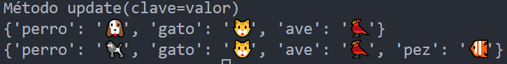

<!-- .slide: data-background-image="../../content/psg-bg-dark.png" data-background-size="100%"-->
 <!-- .element  hidden="true" -->

<br>
<br>
<br>

### Sesión  11
### Estructura de datos
### Diccionarios

---
##### Estructura de datos

Una estructura de datos es una forma de organizar y almacenar datos

De manera eficiente para su uso y manipulación

Las más comunes son tuplas, listas, conjuntos y diccionarios  

---
| Estructura         | Características                   | Ejemplo               |
| ------------------ | --------------------------------- | --------------------- |
| Tupla              | Inmutable, ordenada, indexada     | (1,2,3)               |
| Lista              | Mutable, ordenada, indexada       | [1,2,3]               |
| Conjunto           | Mutable, no ordenado, no indexado | {1,2,3}               |
| <u>Diccionario</u> | Mutable, ordenado, indexado       | {'a':1, 'b':2, 'c':3} |

---
¿Qué es un diccionario?

---
Es una estructura de datos que permite almacenar pares de elementos clave-valor

Al igual que las listas y las tuplas, los diccionarios son colecciones de elementos

---
Se llaman diccionarios porque funcionan de manera similar a un diccionario de palabras

- La palabra es la clave
- El significado es el valor

---

Un diccionario es una secuencia de objetos **MUTABLES**

- **Ordenado**
- **Indexado por claves**
- **Reescribe duplicados**

---

**Mutable**: Los elementos de un diccionario pueden ser modificados después de su creación

```python [1-2|3-4]
diccionario = {'perro': '🐶', 'gato': '🐱', 'ave': '🐦'}
print(diccionario) # {'perro': '', 'gato': '', 'ave': ''}
diccionario['perro'] = '🐩'
print(diccionario) # {'perro': '', 'gato': '', 'ave': ''}
```

---
**Ordenados**: Los elementos de un diccionario mantienen el orden de inserción de los elementos

```python [1-2|3-4]
diccionario = {'perro': '🐶', 'gato': '🐱', 'ave': '🐦'}
print(diccionario) # {'perro': '', 'gato': '', 'ave': ''}
```

---
**Indexado por claves**: Los elementos de un diccionario son indexados por claves

```python
diccionario = {'perro': '🐶', 'gato': '🐱', 'ave': '🐦'}
print(diccionario['perro']) # 🐶 
print(diccionario['gato']) # 🐱 
```

---
**Reescribe duplicados**: Los diccionarios no permiten claves duplicadas se reescribe el valor de la clave

```python
diccionario = {'perro': '🐶', 'gato': '🐱', 'ave': '🐦', 'perro': '🐩'}
print(diccionario) # {'perro': '', 'gato': '', 'ave': ''}
```

---
##### Usos de los diccionarios

- Almacenar información estructurada
- Guardar configuraciones y traducciones
- Recuperar información de bases de datos
- Describir objetos

---
##### ¿Cómo declarar un diccionario?

En python se declara utilizando llaves `{}`

Separando los pares clave-valor con comas `,`

Separando la clave del valor con dos puntos `:`

---
```python
mi_diccionario = {'clave1': 'valor1', 
                  'clave2': 'valor2', 
                  'clave3': 'valor3', ... }
```

- mi_diccionario: Es el nombre de la variable que almacena el diccionario
- clave1, clave2, clave3: Son las claves del diccionario
- valor1, valor2, valor3: Son los valores del diccionario
- `'clave1':'valor1'`: Son los pares clave-valor unidos por dos puntos `:`

---
También se puede declarar un diccionario utilizando la función `dict()`

Y declarar diccionario utilizando diccionarios por comprensión

---
Crearemos un archivo con el nombre sesion11.py

Empezaremos a crear diccionarios

---
Diccionario de clave entera y valor entero

```python
print ("Diccionario de clave entera y valor entero")
diccionario = {1: 10, 2: 20, 3: 30}
print(diccionario)
print(type(diccionario))
```

 <!-- .element width="60%" -->

---
Diccionario de clave entero y valor cadena

```python
print ("Diccionario de clave entero y valor cadena")
diccionario = {1: 'uno', 2: 'dos', 3: 'tres'}
print(diccionario)
print(type(diccionario))
```

 <!-- .element width="60%" -->

---
Diccionario de clave cadena y valor entero

```python
print ("Diccionario de clave cadena y valor entero")
diccionario = {'uno': 1, 'dos': 2, 'tres': 3}
print(diccionario)
print(type(diccionario))
```

 <!-- .element width="60%" -->

---
Diccionario de clave cadena y valor cadena

```python
print ("Diccionario de clave cadena y valor cadena")
diccionario = {'perro': '🐶', 'gato': '🐱', 'ave': '🐦'}
print(diccionario)
print(type(diccionario))
```

 <!-- .element width="60%" -->

---
Diccionario mixto

```python
print ("Diccionario mixto")
diccionario = {1:"ID-XXXXX", "edad": 3, 'animal': '🐶' , ("John","Doe"): 6917222722, "salvaje": False}
print(diccionario)
print(type(diccionario))
```

 <!-- .element width="100%" -->

Las claves pueden ser de cualquier tipo de dato incluido tuplas y conjuntos inmutables 

No puede ser listas, conjuntos ni otros diccionarios

---
Se utiliza la función `dict()` para crear diccionarios vacíos o a partir de secuencias

Permite convertir secuencias como listas, tuplas, conjuntos en diccionarios las secuencias deben tener pares clave-valor

---
Diccionario vacío, se declara con llaves `{}` o con la función `dict()`

Es la razón por la que no se usa `{}` para crear un conjunto vacío

Los diccionarios nacieron antes que los conjuntos

---
Para mantener la consistencia y claridad y coherencia

Se mantuvo la sintaxis de los diccionarios vacíos con `{}`

---
```python [1-4|5-7]
print ("Diccionario vacío")
diccionario = {}
print(diccionario)
print(type(diccionario))
diccionario = dict()
print(diccionario)
print(type(diccionario))
```

 <!-- .element width="50%" -->

---
Diccionario a partir de una lista anidada

Necesita que la lista tenga elementos pares

```python
print ("Diccionario a partir de una lista")
lista = [['perro', '🐶'] , ['gato','🐱'] , ['ave','🐦']]
print(lista)
diccionario = dict(lista)
print(diccionario)
print(type(diccionario))
```

 <!-- .element width="60%" -->

---
Diccionario a partir de una tupla

Necesita que la tupla tenga elementos pares

```python
print ("Diccionario a partir de una tupla de tuplas")
tupla = (('perro', '🐶') , ('gatos','🐱') , ('ave',['🐦','🦅']))
print(tupla)
diccionario = dict(tupla)
print(diccionario)
print(type(diccionario))
```

 <!-- .element width="60%" -->

---
Diccionario mediante comprensión 

```python
print ("Diccionario mediante comprensión")
diccionario = {animal:animal*3 for animal in '🐶🐱🐹🐰'}
print(diccionario)
print(type(diccionario))
```

 <!-- .element width="70%" -->

---
##### Indexación y Slicing

Los diccionarios poseen indexación por clave

No se puede  acceder a los elementos de un diccionario por posición

Si se puede acceder a los elementos de un diccionario por clave

No se puede realizar slicing en un diccionario


---
Un diccionario es una colección de pares clave-valor

 <!-- .element width="50%" -->

---
Accedemos a los elementos de un diccionario por clave

```python
print ("Acceder mediante clave")
diccionario = {'perro': '🐶', 'gato': '🐱', 'ave': '🐦'}
print(diccionario)
print(diccionario['perro'],type(diccionario['perro']))
print(diccionario['gato'],type(diccionario['gato']))
print(diccionario['ave'],type(diccionario['ave']))
```

 <!-- .element width="50%" -->

---
El acceso no solo nos permite obtener el valor de la clave

Sino que también nos permite modificar el valor de la clave

---
Cambiar el valor de un clave
```python
print ("Cambiar el valor de una clave")
diccionario = {'perro': '🐶', 'gato': '🐱', 'ave': '🐦'}
print(diccionario)
diccionario['perro'] = '🐩'
print(diccionario)
```

 <!-- .element width="60%" -->

---
Si la clave no existe, se crea un nuevo par clave-valor

```python
print ("Crear un nuevo par clave-valor")
diccionario = {'perro': '🐶', 'gato': '🐱', 'ave': '🐦'}
print(diccionario)
diccionario['pez'] = '🐠'
print(diccionario)
```

 <!-- .element width="60%" -->

---
Para eliminar un par clave-valor se utiliza la palabra reservada `"del"`

```python
print ("Eliminar un par clave-valor")
diccionario = {'perro': '🐶', 'gato': '🐱', 'ave': '🐦'}
print(diccionario)
del diccionario['ave']
print(diccionario)
```

 <!-- .element width="60%" -->

---
No se puede modificar la clave son inmutables y únicas

Se puede reasignar la clave creando un nuevo par clave-valor y eliminando el anterior

```python
print ("Modificar la clave")
diccionario = {'perro': '🐶', 'gato': '🐱', 'ave': '🐦'}
print(diccionario)
diccionario['perrito'] = diccionario['perro']
del diccionario['perro']
print(diccionario)
```

 <!-- .element width="50%" -->

---
##### Concatenación de diccionarios

No se puede concatenar diccionarios con el operador `+`

```python
print ("Concatenar diccionarios")
diccionario1 = {'perro': '🐶', 'gato': '🐱'}
diccionario2 = {'ave': '🐦', 'pez': '🐠'}
concatenado = diccionario1 + diccionario2 # TypeError: unsupported operand type(s) for +: 'dict' and 'dict'
```

##### Repetición de diccionarios

No se puede repetir diccionarios con el operador `*+*`

```python
print ("Repetir diccionarios")
diccionario = {'perro': '🐶', 'gato': '🐱'}
repetido = diccionario * 3 # TypeError: unsupported operand type(s) for *: 'dict' and 'int'
```

---
##### Métodos de los diccionarios

Los diccionarios poseen los siguientes métodos:

- Métodos de acceso
- Métodos de adición
- Métodos de eliminación
- Métodos de copia

---
Se utiliza la notación de punto `.` 

`diccionario.metodo()`

`diccionario.metodo(valor)`

---
##### Métodos de acceso

Nos permiten obtener información del diccionario

- `get()`
- `items()`
- `keys()`
- `values()`

---
`get(clave)`: Recibe una clave y retorna el valor del par clave-valor, si la clave no existe retorna `None`

```python [1-3|4-5|6-7]
print ("Método get(clave)")
diccionario = {'perro': '🐶', 'gato': '🐱', 'ave': '🐦'}
print (diccionario)
perro = diccionario.get('perro')
print(perro, type(perro))
pez = diccionario.get('pez')
print(pez, type(pez))
```

 <!-- .element width="50%" -->

---
`items()`: Retorna una lista de tuplas con los pares clave-valor, se puede iterar para obtener los pares clave-valor

```python [1-3|4-5|6-8]
print ("Método items()")
diccionario = {'perro': '🐶', 'gato': '🐱', 'ave': '🐦'}
print(diccionario)
items = diccionario.items()
print(items, type(items))
items = list(items) # Convertir a lista
print(items, type(items))
print(items[0], type(items[0]))
```

 <!-- .element width="70%" -->

---
`keys()`: Retorna una lista con las claves del diccionario, se puede iterar para obtener las claves

```python [1-3|4-5|6-8]
print ("Método keys()")
diccionario = {'perro': '🐶', 'gato': '🐱', 'ave': '🐦'}
print(diccionario)
keys = diccionario.keys()
print(keys, type(keys))
keys = list(keys) # Convertir a lista
print(keys, type(keys))
print(keys[0], type(keys[0]))
```

 <!-- .element width="50%" -->

---
`values()`: Retorna una lista con los valores del diccionario, se puede iterar para obtener los valores

```python [1-3|4-5|6-8]
print ("Método values()")
diccionario = {'perro': '🐶', 'gato': '🐱', 'ave': '🐦'}
print(diccionario)
values = diccionario.values()
print(values, type(values))
values = list(values) # Convertir a lista
print(values, type(values))
print(values[0], type(values[0]))
```

 <!-- .element width="50%" -->

---
##### Métodos de adición

Nos permiten agregar elementos al diccionario

- `update()`

---
`update(diccionario)`: Recibe un diccionario y agrega los pares clave-valor al diccionario, si la clave ya existe reescribe el valor

```python [1-3|4-5]
print ("Método update(diccionario)")
diccionario = {'perro': '🐶', 'gato': '🐱', 'ave': '🐦'}
print(diccionario)
diccionario.update({'pez': '🐠', 'perro': '🐩'})
print(diccionario)
```

 <!-- .element width="70%" -->

---
`update(clave=valor)`: Recibe claves y valores, agrega el par clave-valor al diccionario, si la clave ya existe reescribe el valor

```python [1-3|4-5]
print ("Método update(clave=valor)")
diccionario = {'perro': '🐶', 'gato': '🐱', 'ave': '🐦'}
print(diccionario)
diccionario.update(pez='🐠', perro='🐩')
print(diccionario)
```

 <!-- .element width="70%" -->

---
##### Métodos de eliminación

Permiten eliminar elementos del diccionario 

- `clear()`
- `pop()`
- `popitem()`

---
`clear()`: Elimina todos los elementos del diccionario

```python [1-3|4-5]
print ("Método clear()")
diccionario = {'perro': '🐶', 'gato': '🐱', 'ave': '🐦'}
print(diccionario)
diccionario.clear()
print(diccionario)
```

 <!-- .element width="60%" -->

---
`pop(clave)`: Recibe una clave y elimina el par clave-valor del diccionario, retorna el valor de la clave

```python [1-3|4-6]
print ("Método pop(clave)")
diccionario = {'perro': '🐶', 'gato': '🐱', 'ave': '🐦'}
print(diccionario)
gato = diccionario.pop('gato')
print(gato, type(gato))
print(diccionario)
```

 <!-- .element width="50%" -->

---
`popitem()`: Elimina el último par clave-valor del diccionario, retorna el par clave-valor, si el diccionario está vacío retorna un error

```python [1-3|4-6|7-8]
print ("Método popitem()")
diccionario = {'perro': '🐶', 'gato': '🐱'}
print(diccionario)
par = diccionario.popitem()
print(par, type(par))
print(diccionario)
# par = diccionario.popitem()
# print(par, type(par)) # KeyError: 'popitem(): dictionary is empty'
```

 <!-- .element width="50%" -->

---
##### Métodos de copia

Permiten copiar el diccionario con una nueva referencia de memoria

- `copy()`

---
Cuando se asigna un diccionario a una nueva variable se asigna por referencia

NO se crea un dict nuevo sino una referencia al original

```python [1-3|4-5|6-8]
print ("Asignación por referencia")
diccionario = {'perro': '🐶', 'gato': '🐱', 'ave': '🐦'}
print(diccionario)
copia = diccionario
print(copia)
copia['ave'] = '🦅'
print(diccionario)
print(copia)
```

 <!-- .element width="50%" -->

---
Para crear una copia del diccionario se utiliza el método `copy()`

```python [1-3|4-5|6-8]
print ("Método copy()")
diccionario = {'perro': '🐶', 'gato': '🐱', 'ave': '🐦'}
print(diccionario)
copia = diccionario.copy()
print(copia)
copia['ave'] = '🦅'
print(diccionario)
print(copia)
```

 <!-- .element width="50%" -->

---
##### Funciones con diccionarios

Los diccionarios interactúan con funciones  propias de python

- `len()`
- `in` / `not in`
- `iter()`

Existen otras funciones pueden encontrarse en la [documentación](https://docs.python.org/3/library/stdtypes.html#typesmapping)

---
`len(diccionario)`: Retorna la cantidad de pares clave-valor del diccionario

```python [1-3|4-5]	
print ("Función len()")
diccionario = {'perro': '🐶', 'gato': '🐱', 'ave': '🐦'}
print(diccionario)
longitud = len(diccionario)
print(longitud)
```

 <!-- .element width="50%" -->

---
`in` / `not in`: Verifica si una clave existe en el diccionario

```python [1-3|4-5|6-8]
print ("Función in  / not in")
diccionario = {'perro': '🐶', 'gato': '🐱', 'ave': '🐦'}
print(diccionario)
existe = 'perro' in diccionario
print(existe, type(existe))
no_existe = 'pez' not in diccionario
print(no_existe, type(no_existe))
```

 <!-- .element width="50%" -->

---
`iter(diccionario.items)`: Recibe items del diccionario y retorna un iterador

```python [1-3|4-5|6-7|8-9|10-11]
print ("Función iter()")
diccionario = {'perro': '🐶', 'gato': '🐱', 'ave': '🐦'}
print(diccionario)
iterador = iter(diccionario.items())
print(type(iterador))
siguiente = next(iterador)
print(siguiente, type(siguiente))
siguiente = next(iterador)
print(siguiente, type(siguiente))
siguiente = next(iterador)
print(siguiente, type(siguiente))
```

 <!-- .element width="50%" -->

---
##### Diccionarios anidados

Los diccionarios pueden contener otros diccionarios

```python [1-3|4-5|6-7|8-9]
print ("Diccionarios anidados")
diccionario = {'perro': '🐶', 'gato': '🐱',  'ave': {'pajaro': '🐦', 'aguila': '🦅'}}
print(diccionario)
aves = diccionario['ave']
print(aves)
ave = aves['pajaro']
print(ave)
ave = aves['aguila']
print(ave)
```

 <!-- .element width="70%" -->

---
<iframe width="850" height="450" frameborder="0" src="https://pythontutor.com/iframe-embed.html#code=print%20%28%22Diccionarios%20anidados%22%29%0Adiccionario%20%3D%20%7B'perro'%3A%20'%F0%9F%90%B6',%20'gato'%3A%20'%F0%9F%90%B1',%20'ave'%3A%20%7B'pajaro'%3A%20'%F0%9F%90%A6',%20'aguila'%3A%20'%F0%9F%A6%85'%7D%7D%0Aprint%28diccionario%29%0Aaves%20%3D%20diccionario%5B'ave'%5D%0Aprint%28aves%29%0Aave%20%3D%20aves%5B'pajaro'%5D%0Aprint%28ave%29%0Aave%20%3D%20aves%5B'aguila'%5D%0Aprint%28ave%29&codeDivHeight=400&codeDivWidth=350&cumulative=false&curInstr=1&heapPrimitives=nevernest&origin=opt-frontend.js&py=3&rawInputLstJSON=%5B%5D&textReferences=false"> </iframe>

---
##### Commit

Commit de la sesión a nuestro repositorio

```bash
git add .
git commit -m "Clase sesión 11"
git push
```

---
##### Resumen Diccionarios

- Los diccionarios son una estructura de datos que permite almacenar pares clave-valor
- Los diccionarios son mutables, ordenados, indexados por claves y reescriben duplicados
- Se declaran con llaves `{}` o con la función `dict()`

---
- Se accede a los elementos por clave
- Se modifican los elementos por clave
- Se eliminan los elementos por clave

---
- Se acceden a los elementos con los métodos `get()`, `items()`, `keys()` y `values()`
- Se añaden a los diccionarios con el método `update()`

---
- Se eliminan elementos con los métodos `clear()`, `pop()` y `popitem()`
- Se copian con el método `copy()`

---
- Los diccionarios interactúan con funciones propias de python como `len()`, `in` / `not in` y `iter()`
- Los diccionarios pueden contener otros diccionarios
- Pueden almacenar cualquier tipo de dato

---
##### Retos

Crear una carpeta con el nombre "retos_sesion_11" en la cual por cada ejercicio debe crear un script de python

```bash
# Ejemplo carpeta 
psg-example/
    retos_sesion_11/
        ejercicio_01.py
        ejercicio_02.py
        ejercicio_03.py
        ejercicio_04.py
        ejercicio_05.py
        sesion11.ipynb
```

Subir la carpeta a su repositorio en GitHub cuando termine los retos

---
1. Utiliza un diccionario para almacenar información de un animal marino de un acuario, registra información como especie, habitat, dieta, estado de salud, edad y en un set  los nombre de los responsables de su cuidado

---
2. Crea un diccionario de alimentos y que animales domésticos lo consumen,  por ejemplo
```python
{"carne" : ["gato", "perro"], "zanahoria" : ["conejo"] }
```

   - Añade al diccionario 4 alimentos más, usando `update(clave=valor)`
   - Existe en el diccionario de alimentos la comida 'trigo'?
   - Elimina la comida 'zanahoria' del diccionario de alimentos

---
3. Crea un diccionario con la siguiente tupla de especies animales

```python
(('canino', '🐶') , ('felino','🐱') , ('aves',['🐦','🦅']))
```

  - Del diccionario obtén y elimina el valor de la clave 'aves'
  - Modifica el valor de la clave 'felino' por '🐈'
  - Cambia la clave canino por caninos y su valor por ['🐶','🐕']

---
4. Gestión de hábitats en peligro: Crea un diccionario que asocie especies animales en peligro de extinción con información sobre sus hábitats amenazados, lo que permite priorizar la protección de áreas críticas para la supervivencia de estas especies

```python
{"polo norte" : {
    "especies": {"oso polar", "morsa", "ballena"}
  }, "amazonas" : {
    "especies": {"tigre", "mono", "guacamayo"}
  }
}
```

---
 - Añade al diccionario 2 habitats más usando update() con 2 especies cada uno
 - Existe en el diccionario el habitat 'amazonas'?
 - Añade al amazonas la especie 'anaconda'

---
5. Eres NOE y tienes que guardar dos animales de cada especie en un arca, crea un diccionario con las especies

```python
{"🐶" : 2, "🐱" : 2, "🐯" : 2, "🐵" : 2, "🦄" : 0, "🦒" : 1}
```  

---
 - Añade al arca 3 especies más usando update()
 - Toma lista de los animales en el arca iterando el diccionario
 - Existe en el arca la especie 'dragon' 🐲?
 - Elimina la especie unicornio del arca
 - Modifica el valor de la especie jirafa por 2
 - Vacía el arca después del diluvio

---
6. Convertir y ejecutar el archivo de la "sesion11.py" a un archivo en jupyter notebook

---
<!-- .slide: data-background-image="../../content/psg-bg-dark.png" data-background-size="100%"-->

<br>
<br>
<br>
<br>
<br>

[ <!-- .element width="20%"-->](https://github.com/python-la-paz/python-study-group-fundamentals/tree/main/content/sesion11)

Repositorio de la Sesión

---
<!--.slide: data-visibility="hidden"-->
## Bibliografía y Referencias

- [Python Learn](https://do1.dr-chuck.com/pythonlearn/ES_es/pythonlearn.pdf)
- [Datastructures Dictionaries](https://docs.python.org/3/tutorial/datastructures.html#dictionaries)
- [Stdtypes Typesmapping](https://docs.python.org/3/library/stdtypes.html#typesmapping)
- [Dictionary](https://www.programiz.com/python-programming/dictionary)
- [Python Dict](https://cs.stanford.edu/people/nick/py/python-dict.html)
- [Python Dictionaries](https://www.dataquest.io/blog/python-dictionaries/)