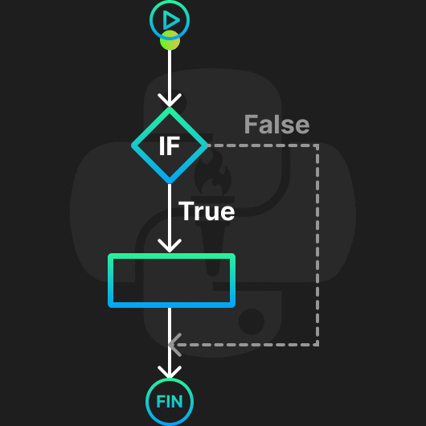
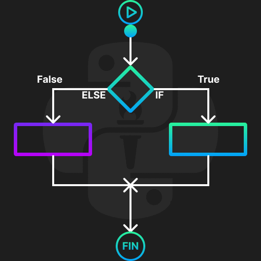
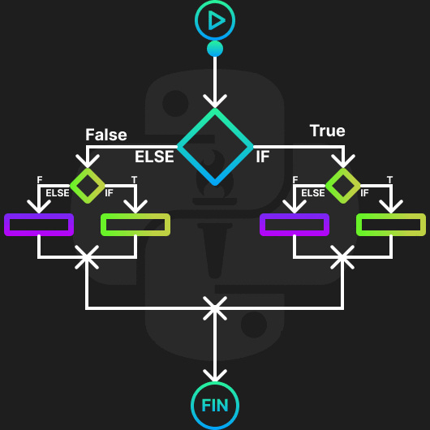
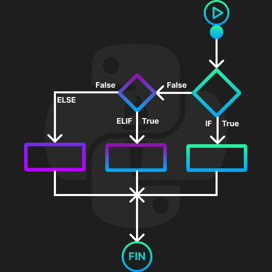

<!-- .slide: data-background-image="../../content/psg-bg-dark.png" data-background-size="100%"-->
 <!-- .element  hidden="true" -->

<br>
<br>
<br>

### Sesión  12
### Estructura de control de flujo
### Sentencias condicionales

---
##### Estructura de control

En un programa las estructuras de control son el orden en el que se ejecutan las instrucciones

Python soporta las siguientes estructuras de control

- Secuencial o lineal
- Selección o condicionales
- Repetición o ciclos

---

##### Secuencial o lineal

Es la ejecución de las instrucciones en el orden en el que se escriben

```python [1|2|3]
primero = 1
segundo = 2
tercero = 3
```

---
El problema con la secuencialidad es que no siempre queremos que las instrucciones se ejecuten en el orden en el que se escriben

Para eso existen las estructuras de control de selección y repetición

---

Hasta el momento hemos visto sólo ejecución secuencial de instrucciones en Python

---
##### Selección o condicionales

Las estructuras de selección o condicionales permiten ejecutar un bloque de código si se cumple una condición

---
Permite a los programas tomar decisiones y ejecutar diferentes acciones dependiendo de las condiciones

---
En Python se utilizan las siguientes condicionales

- `if`
- `else`
- `if` anidado
- `elif`

---
Crearemos un archivo con el nombre sesion12.py

Empezaremos a escribir condicionales

---
##### if

La sentencia `if` permite ejecutar un bloque de código si se cumple una condición

La condición tiene que ser un booleano

---
Visualmente

 <!-- .element width="40%" -->

---
##### Como se declara un `if`

`if` tiene la siguiente estructura

```python
if condicion:
    print ("Cumple")
```

- `if`, es la palabra reservada
- `condicion`, es una expresión evaluada con `True` o `False`
- `:`, es el delimitador de la condición
- `print ("Cumple")`, es el bloque de código con indentación que se ejecuta si la condición es `True`

---
En Python la estructura de un condicional `if` es la siguiente

```python
print ("Inicio")
condicion = True
if condicion:
    # Bloque de código
    print ("Cumple condición")
print ("Fin")
```

```python
Inicio
Cumple condición
Fin
```

---
Ejemplo:
Dado un número, imprimir si es par
  
```python [1-2|3|4|5]
print ("Inicio")
numero = 4
if numero % 2 == 0: # Si el módulo de 2 es 0
    print ("El número es par")
print ("Fin")
```

```text
Inicio
El número es par
Fin
```

---
##### if-else

La sentencia `else` permite ejecutar un bloque de código si no se cumple la condición del `if`

Si la condición es `True` se ejecuta el bloque de código del `if`

Si la condición es `False` se ejecuta el bloque de código del `else`

---
Visualmente

 <!-- .element width="55%" -->

---
Como se declara un `if-else`

`if-else` tiene la siguiente estructura

```python
if condicion:
    print ("Cumple")
else:
    print ("No cumple")
```
- `if` - `else`, son palabras reservadas
- `condicion`, es una expresión `True` o `False`
- `:`, es el delimitador en `if` y `else`
- `print ("Cumple")`, bloque por `True`
- `print ("No cumple")`, bloque por `False`


---
En Python la estructura de un condicional `if-else` es la siguiente

```python
print ("Inicio")
condicion = False
if condicion:
    # Bloque de código
    print ("Cumple condición")
else:
    # Bloque de código
    print ("No cumple condición")
print ("Fin")
```

```text
Inicio
No cumple condición
Fin
```
---
Ejemplo:
Dado un número, imprimir si es par o impar

```python [1-2|3-4|5-6|7]
print ("Inicio")
numero = 3
if numero % 2 == 0: # Si el módulo de 2 es 0
    print ("El número es par")
else:
    print ("El número es impar")
print ("Fin")
```

```text
Inicio
El número es impar
Fin
```

---
##### if-anidado

La sentencia `if` anidado permite ejecutar un bloque de código si se cumple una condición

Dentro del bloque de código del `if-else` se puede anidar otro `if-else` de manera ilimitada

---
Visualmente

 <!-- .element width="55%" -->

---
Como se declara un `if-anidado`

`if-anidado` tiene la siguiente estructura

```python
if condicion_1:
    print ("Cumple 1")
    if condicion_2:
        print ("Cumple 2")
    else:
        print ("No cumple 2")
else:
    print ("No cumple 1")
```

- `if`, `else`, son palabras reservadas
- `condicion_1`, `condicion_2`, son expresiones
- `:`, es el delimitador en `if` y `else`
- La indentación incrementa en cada nivel de anidación

---
En Python la estructura de un condicional `if-anidado` es la siguiente

```python
print ("Inicio Anidado")
condicion_1 = True
condicion_2 = False
if condicion_1:
    print ("Cumple condición 1")
    if condicion_2:
        print ("Cumple condición 2")
    else:
        print ("No cumple condición 2")
else:
    print ("No cumple condición 1")
print ("Fin")
```

```text
Inicio Anidado
Cumple condición 1
No cumple condición 2
Fin
```

---
Ejemplo: Dado un número, imprimir si es par, impar o cero

```python [1-2|3-7|4-5|6-7|8-9|10]
print ("Inicio Par, Impar o Cero")
numero = 0  
if numero > 0 or numero < 0:
    if numero % 2 == 0: # Si el módulo de 2 es 0
        print ("El número es par")
    else:
        print ("El número es impar")
else:
    print ("El número es cero")
print ("Fin")
```

```text
Inicio Par, Impar o Cero
El número es cero
Fin
```

---
Una desventaja de los condicionales anidados es que pueden ser difíciles de leer y entender

Tener una indentación excesiva puede hacer que el código no sea optimo

---
En Python existe una estructura de control que permite simplificar los condicionales anidados

Se llama `elif`

---
##### elif

La sentencia `elif` es la abreviatura de `else if`

Permite ejecutar un bloque de código si no se cumple la condición del `if` y sí cumple una nueva condición

---
Visualmente

 <!-- .element width="55%" -->

---
Como se declara un `elif`

`elif` tiene la siguiente estructura

```python
if condicion_1:
    print ("Cumple 1")
elif condicion_2:
    print ("Cumple 2")
else:
    print ("No cumple 1 ni 2")
```

- `if`, `elif`, `else`, son palabras reservadas
- `condicion_1`, `condicion_2`, son expresiones
- `:`, es el delimitador en `if`, `elif` y `else`
- La indentación solo incrementa en el primer nivel

---
En Python la estructura de un condicional `elif` es la siguiente

```python [1-3|4-5|6-7|8-9|10]
print ("Inicio ELIF")
condicion_1 = False
condicion_2 = True
if condicion_1:
    print ("Cumple condición 1")
elif condicion_2:
    print ("Cumple condición 2")
else:
    print ("No cumple condición 1 ni 2")
print ("Fin")
```

```text
Inicio ELIF
Cumple condición 2
Fin
```

---
Ejemplo: Dado un número, imprimir si es positivo, negativo o cero

```python
print ("Inicio Positivo, Negativo o Cero")
numero = -1
if numero > 0:
    print ("El número es positivo")
elif numero < 0:
    print ("El número es negativo")
else:
    print ("El número es cero")
```

```text
Inicio Positivo, Negativo o Cero
El número es negativo
```

---
Existe una forma de compactar una condicional en una sola línea

Se llama operador ternario

---
##### Operador ternario

El operador ternario es una forma de compactar una condicional en una sola línea

Como su nombre lo indica, tiene tres partes

```python
resultado = verdadero if condicion else falso
```

- Condición
- Resultado verdadero si es `True`
- Resultado falso si es `False`

---
En Python la estructura de un operador ternario es la siguiente

```python
print ("Inicio Ternario")
condicion = True
resultado = "Cumple" if condicion else "No cumple"
print (resultado)
print ("Fin")
```

```text
Inicio Ternario
Cumple
Fin
```

---
Ejemplo: Dado un número, imprimir si es par o impar

```python
print ("Inicio Ternario Par, Impar")
numero = 3
resultado = "El número es par" if numero % 2 == 0 else "El número es impar"
print (resultado)
print ("Fin")
```

```text
Inicio Ternario Par, Impar
El número es impar
Fin
```

---
##### Truthiness

¿Qué es Truthiness?

---
Es un término que se utiliza para describir el valor de verdad de un objeto

En Python, todos los objetos tienen un valor de verdad

---
Hay valores que se consideran `True`

y otros que se consideran `False`

---
En enteros

- `0` es `False`
- `1` es `True`
- `-1` es `True`

Todos los números enteros positivos y negativos son `True` excepto `0`

`$x \in \mathbb{Z} \land x \neq 0$`

---
Se puede utilizar un entero como condición

Introducir dos números enteros y dividirlos

```python [1-3|4|5|5-8|9]
print ("Truthiness Enteros")
dividendo = int(input("Dividendo: "))
divisor = int(input("Divisor: "))
print (dividendo,divisor)
if divisor: #divisor != 0
    print (dividendo / divisor)
else:
    print ("No se puede dividir entre cero")
print ("Fin")
```

```text
Truthiness Enteros
Dividendo: 10
Divisor: 0
10 0
No se puede dividir entre cero
Fin
```

---
En los flotantes

- `0.0` es `False`
- `1.0` es `True`
- `-1.0` es `True`

Todos los números flotantes positivos y negativos son `True` excepto `0.0`

`$x \in \mathbb{R} \land x \neq 0.0$`

---
Se puede utilizar un flotante como condición

Introducir dos números flotantes y dividirlos

```python [1-3|4|5|5-8|9]
print ("Truthiness Flotantes")
dividendo = float(input("Dividendo: "))
divisor = float(input("Divisor: "))
print (dividendo,divisor)
if divisor: #divisor != 0.0
    print (dividendo / divisor)
else:
    print ("No se puede dividir entre cero")
print ("Fin")
```

```text
Truthiness Flotantes
Dividendo: 10.5
Divisor: 0.5
10.0 0.5
21.0
Fin
```

---
En las cadenas

- `""` es `False`
- `" "` es `True`
- `"hola"` es `True`
- `"0"` es `True`

Todas las cadenas no vacías son `True`

Las cadenas vacías son `False`

---
Se puede utilizar una cadena como condición

Introducir una cadena y verificar si es vacía

```python [1-3|4|5|5-8|9]
print ("Truthiness Cadenas")
cadena = input("Cadena: ")
print (cadena)
if cadena: # len(cadena) != 0 or cadena != "" 
    print ("La cadena no está vacía")
else:
    print ("La cadena está vacía")
print ("Fin")
```

```text
Truthiness Cadenas
Cadena: 🐍
🐍
La cadena no está vacía
Fin
```

---
En las tuplas

- `()` es `False`
- `(0,)` es `True`
- `("0",)` es `True`
- `("♎",)` es `True`

Todas las tuplas no vacías son `True`

Las tuplas vacías son `False`

---
Se puede utilizar una tupla como condición

Introducir una tupla y verificar si es vacía

```python [1-3|4|5|5-8|9]
print ("Truthiness Tuplas")
tupla = tuple(input("Tupla: "))
print (tupla)
if tupla: # len(tupla) != 0 or tupla != ()
    print ("La tupla no está vacía")
else:
    print ("La tupla está vacía")
print ("Fin")
```

```text
Truthiness Tuplas
Tupla: ♈♉♊♋
('♈', '♉', '♊', '♋')
La tupla no está vacía
Fin
```

---
En las listas

- `[]` es `False`
- `[0]` es `True`
- `[""]` es `True`
- `["♎"]` es `True`

Todas las listas no vacías son `True`

Las listas vacías son `False`

---
Se puede utilizar una lista como condición

Introducir una lista y verificar si es vacía

```python [1-3|4|5|5-8|9]
print ("Truthiness Listas")
lista = list(input("Lista: "))
print (lista)
if lista: # len(lista) != 0 or lista != []
    print ("La lista no está vacía")
else:
    print ("La lista está vacía")
print ("Fin")
```

```text
Truthiness Listas
Lista: ♌♍♎♏
['♌', '♍', '♎', '♏']
La lista no está vacía
Fin
```

---
En conjuntos

- `set()` es `False`
- `{0}` es `True`
- `{"0"}` es `True`
- `{"♎"}` es `True`

Todos los conjuntos no vacíos son `True`

Los conjuntos vacíos son `False`

---
Se puede utilizar un conjunto como condición

Introducir un conjunto y verificar si es vacío

```python [1-3|4|5|5-8|9]
print ("Truthiness Conjuntos")
conjunto = set(input("Conjunto: "))
print (conjunto)
if conjunto: # len(conjunto) != 0 or conjunto != set()
    print ("El conjunto no está vacío")
else:
    print ("El conjunto está vacío")
print ("Fin")
```

```text
Truthiness Conjuntos
Conjunto: ♐♑♒♓
{'♐', '♑', '♒', '♓'}
El conjunto no está vacío
Fin
```

---
En diccionarios

- `{}` es `False`
- `{'': ''}` es `True`
- `{"0":0}` es `True`
- `{"♎":"Libra"}` es `True`

Todos los diccionarios no vacíos son `True`

Los diccionarios vacíos son `False`

---
Se puede utilizar un diccionario como condición

Introducir la clave y un valor y verificar si es vacío

```python [1-4|5-6|7|8-11|12]
print ("Truthiness Diccionarios")
diccionario = {}
clave = input("Clave: ")
valor = input("Valor: ")
if clave:
  diccionario = {clave:valor}
print (diccionario)
if diccionario: # diccionario != {}
    print ("El diccionario no está vacío")
else:
    print ("El diccionario está vacío")
print ("Fin")
```

```text
Truthiness Diccionarios
Clave: ♈
Valor: Aries
{'♈': 'Aries'}
El diccionario no está vacío
Fin
```

---
None es un valor especial en Python

- `None` es `False`

`None` es un valor especial que representa la ausencia de un valor

---
Se puede utilizar `None` como condición

Introducir un valor y verificar si es `None`

```python [1-3|4-7|8]
print ("Truthiness None")
valor = None
print (valor, type(valor))
if valor: # valor != None
    print ("El valor no es None")
else:
    print ("El valor es None")
print ("Fin")
```

```text
Truthiness None
None <class 'NoneType'>
El valor es None
Fin
```

---
Con operadores ternarios es bastante útil para asignar valores a variables

```python [1-3|4-6|7-9]
entero = int(input("Entero: "))
resultado = "Diferente de 0" if entero else "Igual a 0"
print (resultado)
flotante = float(input("Flotante: "))
resultado = "Diferente de 0.0" if flotante else "Igual a 0.0"
print (resultado)
cadena = input("Cadena: ")
resultado = "No está vacía" if cadena else "Está vacía"
print (resultado)
```

```text
Entero: 0
Igual a 0
Flotante: 0.0
Igual a 0.0
Cadena:
Está vacía
```

---
##### Ejemplos de usos

---
Tienes un dispositivo que mide la temperatura y si la temperatura es mayor a 30°C enciende un ventilador y si es menor a 20°C lo apaga

3 minutos

<iframe src="https://time-stuff.com/embed.html" frameborder="0" scrolling="no" width="391" height="140"></iframe>

---
```python [1|2-3|4-5]
temperatura = float(input("Temperatura: "))
if temperatura > 30:
    print ("Encender ventilador")
elif temperatura < 20:
    print ("Apagar ventilador")
```

```text
Temperatura: 35
Encender ventilador
```

```text
Temperatura: 15
Apagar ventilador
```

```text
Temperatura: 25
```

---
Tienes una cesta de frutas y quieres saber si tienes manzanas, si hay manzanas las cuentas y si no hay compras dos manzanas

3 minutos

<iframe src="https://time-stuff.com/embed.html" frameborder="0" scrolling="no" width="391" height="140"></iframe>

---
Con solo un if
```python [1-2|3-4|5-7]
cesta = ['🍎','🍑','🍓','🍉']
print (cesta)
if '🍎' in cesta:
    print (f"Hay {cesta.count('🍎')} manzanas")
else:
    cesta.extend(['🍎','🍎'])
    print (cesta)
```

```text
['🍎', '🍑', '🍓', '🍉']
Hay 1 manzanas
```

---
Con operador ternario
```python [1-2|3|4-5]
cesta = ['🍑','🍓','🍉']
print (cesta)
resultado = f"Hay {cesta.count('🍎')} manzanas" if '🍎' in cesta else cesta.extend(['🍎','🍎'])
print (resultado)
print (cesta)
```

```text
['🍑', '🍓', '🍉']
None
['🍑', '🍓', '🍉', '🍎', '🍎']
```

---
En un diccionario tienes almacenado un animal y quieres saber si es un mamífero
```python
animal = {'especie':'🐶', 'nombre': 'Firulais', 'mamifero': True}
```

2 minutos

<iframe src="https://time-stuff.com/embed.html" frameborder="0" scrolling="no" width="391" height="140"></iframe>

---
```python
animal = {'especie':'🐶', 'nombre': 'Firulais', 'mamifero': True}
print (animal)
if animal.get('mamifero'): # animal['mamifero']
    print ("Es un mamífero")
else:
    print ("No es un mamífero")
```

```text
{'especie': '🐶', 'nombre': 'Firulais', 'mamifero': True}
Es un mamífero
```

---
Dado dos conjuntos, verificar si tienen elementos en común y mostrarlos y si no, unirlos

```python
{'⚽','🏀','🏐'} , {'🏈','🏉','🏓'}
```

3 minutos

<iframe src="https://time-stuff.com/embed.html" frameborder="0" scrolling="no" width="391" height="140"></iframe>

---
```python
conjunto_1 = {'⚽','🏀','🏐'}
conjunto_2 = {'🏈','🏉','🏓'}
print (conjunto_1, conjunto_2)
if conjunto_1.isdisjoint(conjunto_2): # len(conjunto_1.intersection(conjunto_2)) == 0
    conjunto_1.update(conjunto_2)
    print (conjunto_1)
else:
    print ("Tienen elementos en común")
    print (conjunto_1.intersection(conjunto_2))
```

```text
{'⚽', '🏀', '🏐'} {'🏈', '🏉', '🏓'}
{'⚽', '🏀', '🏐', '🏈', '🏉', '🏓'}
```

```text
{'⚽', '🏀', '🏐'} {'🏈', '🏉', '🏓', '🏀'}
Tienen elementos en común
{'🏀'}
```

---
Validar si un correo electrónico es válido usando input

- ✅: `mail@domain.com`, `ma.il@domain.com`
- ❌: `mail@domain`, `maildomain.com`, `@.`
- ❌: `mail@@domain.com`, `mail@.com`

5 minutos

<iframe src="https://time-stuff.com/embed.html" frameborder="0" scrolling="no" width="391" height="140"></iframe>

---
Solución anidada

```python  [1|2|3|4|5|2-14]
correo = input("Correo: ")
if "@" in correo and "." in correo and correo.count("@") == 1:
    if correo.find("@") < correo.rfind(".") and correo.find("@") > 0 and correo.rfind(".") < len(correo) - 1:
        if correo.rfind(".") - correo.find("@") > 1:
            if correo.find(".") - correo.find("@") > 1:
                print ("El correo es válido")
            else:
                print ("El correo no es válido")
        else:
            print ("El correo no es válido")
    else:
        print ("El correo no es válido")
else:
    print ("El correo no es válido")
```

```text
Correo: mail@domain
El correo no es válido
```

---
Solución con elif

```python  [1|2-3|4-5|6-7|8-9|10-11]
correo = input("Correo: ")
if "@" not in correo or "." not in correo or correo.count("@") != 1:
    print("El correo no es válido")
elif correo.find("@") >= correo.rfind(".") or correo.find("@") == 0 or correo.rfind(".") == len(correo) - 1:
    print("El correo no es válido")
elif correo.rfind(".") - correo.find("@") <= 1:
    print("El correo no es válido")
elif correo.find(".") - correo.find("@") == 1:
    print("El correo no es válido")
else:
    print("El correo es válido")
```

```text
Correo: a.b@c.d
El correo es válido
```


---
##### Commit

Commit de la sesión a nuestro repositorio

```bash
git add .
git commit -m "Clase sesión 12"
git push
```

---
##### Resumen Sentencias condicionales

- Las estructuras de control permiten tomar decisiones o repetir instrucciones
- Las sentencias condicionales permiten ejecutar un bloque de código si se cumple una condición
- Las condicionales en Python son - `if`, `else`, `elif`

---
- Las condicionales reciben una expresión que se evalúa como `True` o `False`
- Se pueden anidar condicionales
- Existe el operador ternario para simplificar condicionales

---
- El operador ternario se compone de tres partes `"verdadero if condicion else falso"`
- Truthiness es el valor de verdad de un objeto
- Se puede utilizar un objeto como condición

---
- `0`, `0.0`, `""`, `()`, `[]`, `{}`, `set()`, `None` son `False`
- None es un valor especial en Python que representa la ausencia de un valor

---

 <!-- .element width="40%" -->
 <!-- .element width="40%" -->

---
 <!-- .element width="40%" -->
 <!-- .element width="40%" -->

---
##### Retos

Crear una carpeta con el nombre "retos_sesion_12" en la cual por cada ejercicio debe crear un script de python

```bash
# Ejemplo carpeta 
psg-example/
    retos_sesion_12/
        ejercicio_01.py
        ejercicio_02.py
        ejercicio_03.py
        ejercicio_04.py
        ejercicio_05.py
        ejercicio_06.py
        sesion11.ipynb
```

Subir la carpeta a su repositorio en GitHub cuando termine los retos

---
1. Crear un script que pida un número entero y verifique si es par o impar usando operador ternario

---
2. Tienes una página web y un usuario quiere acceder a ella, verifica si el usuario inició sesión para acceder a la página, caso contrario muestra un mensaje de error

---
3. El usuario Jhon Doe esta en una red social sus amigos son:

```python
{Alice, Bob, Charlie, David, Eve}
```

La usuaria Jess Doe tiene los siguientes amigos

```python
{Alice, Bob,  Frank, Grace}
```

¿Tienen Jhon y Jess amigos en común?, ¿Cuáles son?

---
4. Una tienda ofrece descuentos a sus clientes, si el cliente es mayor de edad y tiene una compra mayor a 1000, se le aplica un descuento del 10%, si es menor de edad y tiene una compra mayor a 500 se le aplica un descuento del 5%, si no cumple ninguna condición se le aplica un descuento del 2%

---
5. Un usuario ingresa su nombre y gustos musicales por teclado separados por coma, verifica si el usuario ingresó un nombre válido usando truthiness, convertir los gustos musicales en una lista y verifica si tiene el gusto `rock` en su lista de gustos musicales

```text
Nombre: Jhon Doe
Gustos musicales: rock,pop,jazz
```

---
6. Crea una calculadora por consola que realice las operaciones de suma, resta, multiplicación y división, ingresa dos números y la operación a realizar, verifica si la operación es válida y muestra el resultado


```text
Número 1: 10
Número 2: 5
Operación: +
-------------
Resultado: 15
```

---
7. Convertir y ejecutar el archivo de la "sesion12.py" a un archivo en jupyter notebook

---
<!-- .slide: data-background-image="../../content/psg-bg-dark.png" data-background-size="100%"-->

<br>
<br>
<br>
<br>
<br>

[ <!-- .element width="20%"-->](https://github.com/python-la-paz/python-study-group-fundamentals/tree/main/content/sesion12)

Repositorio de la Sesión

---
<!--.slide: data-visibility="hidden"-->
## Bibliografía y Referencias

- [Python Learn](https://do1.dr-chuck.com/pythonlearn/ES_es/pythonlearn.pdf)
- [If statements](https://docs.python.org/3/tutorial/controlflow.html#if-statements)
- [Compound statements - IF](https://docs.python.org/3/reference/compound_stmts.html#if)
- [Control flow statements in Python](https://www.educative.io/answers/what-are-control-flow-statements-in-python)
- [Truthiness](https://www.pythonmorsels.com/truthiness/)
- [Truthy and Falsy values in Python](https://www.freecodecamp.org/news/truthy-and-falsy-values-in-python/)