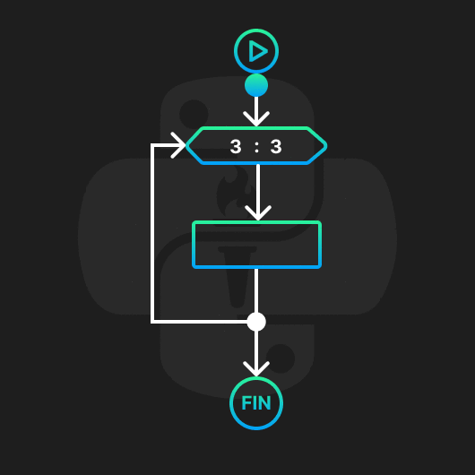
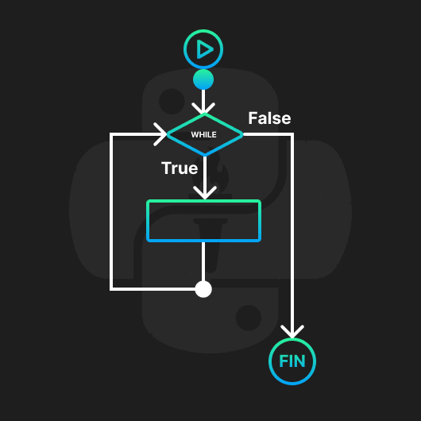
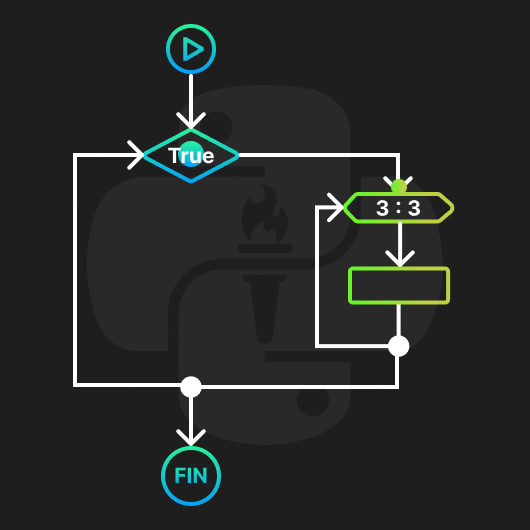

<!-- .slide: data-background-image="../../content/psg-bg-dark.png" data-background-size="100%"-->
 <!-- .element  hidden="true" -->

<br>
<br>
<br>


### Sesión  13
### Estructura de control de flujo
### Sentencias iterativas

---
##### Estructura de control

En un programa las estructuras de control son el orden en el que se ejecutan las instrucciones

Python soporta las siguientes estructuras de control

- Secuencial o lineal
- Selección o condicionales
- Repetición o ciclos

---

##### Secuencial o lineal

Es la ejecución de las instrucciones en el orden en el que se escriben

```python [1|2|3]
primero = 1
segundo = 2
tercero = 3
```

---
El problema con la secuencialidad es que no siempre queremos que las instrucciones se ejecuten en el orden en el que se escriben

Para eso existen las estructuras de control de selección y repetición

---

Hasta el momento hemos visto ejecución secuencial y condicionales

---
##### Repetición o ciclos

Los ciclos son estructuras de control que permiten ejecutar un bloque de código varias veces de manera consecutiva

---
Permite a los programas ejecutar una secuencia de instrucciones varias veces

---
En Python existen dos tipos de ciclos

- Ciclo `for`
- Ciclo `while`

---
Crearemos un archivo con el nombre sesion13.py

Empezaremos a escribir ciclos

---
##### For

El ciclo `for` es un ciclo que se ejecuta un número determinado de veces

En el caso de los for se recorre una secuencia de elementos

Se puede recorrer un rango de números

o listas, tuplas, diccionarios, etc.

---
Visualmente 

 <!-- .element width="40%" -->

---
Para utilizar rango de números primero veremos la función `range()`

```python
range(5)
```
```text
range(0, 5)
```

---
Range es una función que genera una secuencia inmutable de números

```python
range(5)
```
```text
0, 1, 2, 3, 4
```

---
Recibe tres argumentos

- Inicio (por defecto 0 e Inclusivo)
- Fin (Obligatorio y Exclusivo)
- Paso (por defecto 1)

```python
range(1, 10, 2)
```
```text
1, 3, 5, 7, 9
```

---
Puede haber rangos negativos

```python
range(10, 0, -1)
```
```text
10, 9, 8, 7, 6, 5, 4, 3, 2, 1
```

---
Podemos convertir el rango en una lista

```python
print(list(range(5)))
```
```text
[0, 1, 2, 3, 4]
```

No es necesario convertirlo a lista para usarlo en un ciclo `for`

---
Son útiles para iterar sobre una secuencia de números

---
##### Como se declara un `for` con `range`

`for` tiene la siguiente estructura

```python
for variable in range(inicio, fin, paso):
    print(variable)
```

- `for` es la palabra reservada
- `variable` es la variable que se usará para iterar
- `in` es palabra reservada de pertenencia
- `range(inicio, fin, paso)` es la secuencia de números
- `:` es el delimitador de inicio del ciclo
- `print(variable)` es el código a ejecutar posee un nivel de indentación

---
Cuando iteramos el nombre de la variable puede ser cualquier nombre

Es común usar `i` que es la abreviatura de índice o iterador

Cuando se itera más de una lista se puede usar `i`, `j`, `k` 

---
Las variables definidas en el ciclo `for` existen dentro del ciclo 

NO se recomienda usarlas fuera del ciclo

Es una mala práctica usar la variable del ciclo fuera del ciclo

```python
for i in range(5):
    print(i)
print(i)
```

```text
0
1
2
3
4
4
```

---
En python la estructura de control `for` es la siguiente

```python
print ("Inicio")
for i in range(5): # rango (0,5,1)
    print(i)
print ("Fin")
```

```text
Inicio
0
1
2
3
4
Fin
```

---
Ejemplo 1, sumar los números del 1 al 10 de 2 en 2

```python [1-2|3-4|5]
print ("Ejemplo 1")
suma = 0
for i in range(1, 11, 2): # 1, 3, 5, 7, 9
    suma = suma + i #suma += i
print(suma)
```

```text
Ejemplo 1
25
```

---
Ejemplo 2, crear un árbol de navidad de 6 niveles

```python [1|2-3]
print ("Ejemplo 2")
for i in range(0, 6):
    print(" "*(5-i) + "*"*i*2+"*")
```

```text
Ejemplo 2
     *
    ***
   *****
  *******
 *********
***********
```

---
Ejemplo 3, crear una serie de números cuadrados del 1 al 10

```python [1|2-3]
print ("Ejemplo 3")
for i in range(1, 11):
    print(i**2, end=" ")
```

```text
Ejemplo 3
1 4 9 16 25 36 49 64 81 100
```

---
Ejemplo 4, crear una lista de números pares del 1 al 10

```python [1-2|3-4|5]
print ("Ejemplo 4")
pares = []
for i in range(0, 11, 2):
    pares.append(i)
print(pares)
```

```text
Ejemplo 4
[0, 2, 4, 6, 8, 10]
```

---
Visualmente

<iframe width="850" height="450" frameborder="0" src="https://pythontutor.com/iframe-embed.html#code=print%20%28%22Ejemplo%204%22%29%0Apares%20%3D%20%5B%5D%0Afor%20i%20in%20range%280,%2011,%202%29%3A%0A%20%20%20%20pares.append%28i%29%0Aprint%28pares%29&codeDivHeight=400&codeDivWidth=350&cumulative=false&curInstr=1&heapPrimitives=nevernest&origin=opt-frontend.js&py=3&rawInputLstJSON=%5B%5D&textReferences=false"> </iframe>

---
Ejercicio 1, imprimir los 10 primeros de la serie números cúbicos

2 minutos

<iframe src="https://time-stuff.com/embed.html" frameborder="0" scrolling="no" width="391" height="140"></iframe>

---

```python
print ("Ejercicio 1")
for i in range(1, 11):
    print(i**3, end=" ")
```

```text
Ejercicio 1
1 8 27 64 125 216 343 512 729 1000
```

---
##### Como se declara un `for` con secuencias

La estructura de control `for` también puede iterar sobre secuencias

- Listas
- Tuplas
- Diccionarios
- Cadenas de texto

---
`for` tiene la siguiente estructura

```python
for variable in secuencia:
    print(variable)
```

- `for` es la palabra reservada
- `variable` es el nombre de la variable que se usará para iterar
- `in` es la palabra reservada de pertenencia
- `secuencia` es la secuencia de elementos
- `:` es el delimitador de inicio del ciclo
- `print(variable)` es el código a ejecutar posee un nivel de indentación

---
Cuando se itera sobre una secuencia es común nombrar las variables con nombres que representen el elemento

```python
for fruta in ['🍎','🍌','🍇','🍉']:
    print(fruta)
```

```text
🍎
🍌
🍇
🍉
```

---
Ejemplo 5, imprimir los elementos de una lista fiestas

```python [1-2|3-4]
print ("Ejemplo 5")
fiesta = ['🎄','🎆','🎁','🎊','✨','🧨']
for objeto in fiesta:
    print(objeto)
```

```text
Ejemplo 5
🎄
🎆
🎁
🎊
✨
🧨
```

Al iterar una lista se obtiene los elementos de la lista

---
Ejemplo 6, imprimir los elementos de una tupla de frutas separados por coma

```python [1-2|3-4]
print ("Ejemplo 6")
frutas =  ('🍅','🍇','🍈','🍉','🍊')
for fruta in frutas:
    print(fruta, end=", ")
```

```text
Ejemplo 6
🍅, 🍇, 🍈, 🍉, 🍊, 
```

Al iterar una tupla se obtiene los elementos

---
Ejemplo 7, imprimir los elementos de un diccionario

```python [1-2|3-4]
print ("Ejemplo 7")
frutas = {'🍅':'Tomate','🍇':'Uva','🍈':'Melón','🍉':'Sandía','🍊':'Naranja'}
for clave in frutas:
    print(clave, frutas[clave])
```

```text
Ejemplo 7
🍅 Tomate
🍇 Uva
🍈 Melón
🍉 Sandía
🍊 Naranja
```

Al iterar un diccionario devuelve las claves

---

Ejemplo 8, imprimir los elementos del ciclo de vida de un pollo con flechas

```python [1-2|3-4]
print ("Ejemplo 8")
ciclo_vida = '🥚🐣🐥🐤🐔🍗'
for etapa in ciclo_vida:
    print(etapa, end="->")
```

```text
Ejemplo 8
🥚->🐣->🐥->🐤->🐔->🍗->
```

---
Se puede recorrer elementos con indexación como listas y tuplas de 3 formas

- Mediante `in` como pertenencia
- Mediante `len()` y `range()`
- Mediante `enumerate()`

---
Mediante `in`

Ejemplo 9, Listar los elementos de la siguiente serie ['🐶','🐱','🐰','🐭']

```python [1-2|3-4]
print ("Ejemplo 9")
animales = ['🐶','🐱','🐰','🐭']
for animal in animales:
    print(animal)
```

```text
Ejemplo 9
🐶
🐱
🐰
🐭
```

---
Mediante `len()` y `range()`

Ejemplo 10, Listar los elementos de la siguiente serie ['🐶','🐱','🐰','🐭']

```python [1-2|3-4]
print ("Ejemplo 10")
animales = ['🐶','🐱','🐰','🐭']
for i in range(len(animales)):
    print(animales[i])
```

```text
Ejemplo 10
🐶
🐱
🐰
🐭
```

---
Mediante `enumerate()`

Primero veremos la función `enumerate()`

Es una función que devuelve un objeto enumerado que contiene pares de índices y valores como tuplas

```python
enumerate(['🐶','🐱','🐰','🐭'])
```
```text
(0, '🐶'), (1, '🐱'), (2, '🐰'), (3, '🐭')
```

Nos permite recorrer una secuencia y obtener el índice y el valor en cada iteración

---
Ejemplo 11, Listar los elementos de la siguiente serie ['🐶','🐱','🐰','🐭']

```python [1-2|3-4]
print ("Ejemplo 11")
animales = ['🐶','🐱','🐰','🐭']
for i, animal in enumerate(animales):
    print(i, animal, animales[i])
```

```text
Ejemplo 11
0 🐶 🐶
1 🐱 🐱
2 🐰 🐰
3 🐭 🐭
```

---
Ejercicio 2, imprimir la cantidad de veces los elementos de la cadena '⚽🏀🏐🎱' de acuerdo a su posición más 1

```text
⚽
🏀🏀
🏐🏐🏐
🎱🎱🎱🎱
```

3 minutos

<iframe src="https://time-stuff.com/embed.html" frameborder="0" scrolling="no" width="391" height="140"></iframe>

---

```python
print ("Ejercicio 2")
esferas = '⚽🏀🏐🎱'
for i, esfera in enumerate(esferas):
    print(esfera*(i+1))
```

```text
Ejercicio 2
⚽
🏀🏀
🏐🏐🏐
🎱🎱🎱🎱
```

---
##### While

El ciclo `while` es un ciclo que se ejecuta mientras una condición sea verdadera

Es como un ciclo `for` pero no se sabe cuantas veces se ejecutará 

Similar a un `if` pero se ejecuta varias veces

---
Visualmente

 <!-- .element width="40%" -->

---
La estructura de control `while` es la siguiente

```python
while condicion:
    print("Código a ejecutar")
```

- `while` es la palabra reservada
- `condicion` es la expresión que se evaluará tiene que ser `True` o `False`
- `:` es el delimitador de inicio del ciclo
- `print("Código a ejecutar")` es el código a ejecutar posee un nivel de indentación
- `condicion` se evalúa en cada iteración

---
Ejemplo 12, imprimir los números mientras sean menores o igual a 5 empezando desde 0

```python [1-2|3|4|5]
print ("Ejemplo 12")
i = 0
while i <= 5:
    print(i)
    i += 1
```

```text
Ejemplo 12
0
1
2
3
4
5
```

---
Ejemplo 13, sumar los números mientras no se ingrese por teclado el número 0

```python [1-3|4|5-6|7]
print ("Ejemplo 13")
suma = 0
numero = int(input("Ingrese un número: "))
while numero != 0:
    suma += numero
    numero = int(input("Ingrese un número: "))
print(suma)
```

```text
Ejemplo 13
Ingrese un número: 5
Ingrese un número: 3
Ingrese un número: 2
Ingrese un número: 0
10
```

---
Ejercicio 3, Ingresa un número por teclado y genera un contador hasta 0, si el número es negativo no hace nada

2 minutos

<iframe src="https://time-stuff.com/embed.html" frameborder="0" scrolling="no" width="391" height="140"></iframe>

---
```python [1-2|3-5]
print ("Ejercicio 3")
numero = int(input("Ingrese un número: "))
while numero >= 0:
    print(numero)
    numero -= 1
```

```text
Ejercicio 3
Ingrese un número: 5
5
4
3
2
1
0
```

---
##### Break

La sentencia `break` es una palabra reservada que se usa para salir de un ciclo

---

Termina el ciclo actual y ejecuta la siguiente instrucción después del ciclo

Es útil para salir de un ciclo cuando se cumple una condición antes de que termine el ciclo


---
Ejemplo 14, De la siguiente lista de frutas imprimir los elementos hasta que se encuentre un gusano `🐛` con `for`

```python [1-2|3|4-6|7]
frutas = ['🍎','🍌','🍇','🍉','🍊','🐛','🍋','🍍']
print ("Ejemplo 14")
for fruta in frutas:
    if fruta == '🐛':
        break
    print(fruta)
print ("Fin")
```

```text
Ejemplo 14
🍎
🍌
🍇
🍉
🍊
Fin
```

---
Con `while`

```python [1-3|4|5-6|7]
frutas = ['🍎','🍌','🍇','🍉','🍊','🐛','🍋','🍍']
print ("Ejemplo 14")
i = ""
while i != '🐛':
    i = frutas.pop(0)
    print(i)
print ("Fin")
```

```text
Ejemplo 14
🍎
🍌
🍇
🍉
🍊
🐛
Fin
```

---
##### Ciclos infinitos

Un ciclo infinito es un ciclo que no tiene una condición de salida

Se ejecuta indefinidamente hasta que se detiene manualmente con  `Ctrl+C`

o mediante un `break`

---
Se puede usar para ejecutar tareas en segundo plano

Un mal uso de un ciclo infinito puede hacer que el programa se bloquee

---
Ejemplo 15, Crear un ciclo infinito que imprima un contador incremental

```python [1-2|3|4-5]
print ("Ejemplo 15")
contador = 0
while True:
    print(contador)
    contador += 1
```

```text
Ejemplo 15
0
1
2
...
37310
...
Ctrl+C
Traceback (most recent call last):
  File "<stdin>", line 2, in <module>
KeyboardInterrupt
```

---
Ejemplo 16, Crear un ciclo infinito que pida una cadena de texto la ponga en mayúsculas y la imprima hasta que se ingrese la palabra `salir`

```python [1|2|3-6|7]
print ("Ejemplo 16")
while True:
    texto = input("Ingrese un texto: ")
    if texto == 'salir':
        break
    print(texto.upper())
print ("Fin")
```

```text
Ejemplo 16
Ingrese un texto: Python
PYTHON
Ingrese un texto: La Paz
LA PAZ
Ingrese un texto: salir
Fin
```

---
Ejercicio 4, Crear un ciclo infinito que reciba un número por teclado y verifique si es par o impar hasta que se ingrese el número 0

3 minutos

<iframe src="https://time-stuff.com/embed.html" frameborder="0" scrolling="no" width="391" height="140"></iframe>

---
```python
print ("Ejercicio 4")
while True:
    numero = int(input("Ingrese un número: "))
    if numero == 0:
        break
    print ("Par" if numero % 2 == 0 else "Impar")
```

```text
Ejercicio 4
Ingrese un número: 5
Impar
Ingrese un número: 4
Par
Ingrese un número: 0
```

---
##### Estructuras por comprensión

Las Estructuras por comprensión son una forma de crear estructuras de manera concisa utilizando una sola línea de código

Utiliza la estructura de un ciclo `for` y se puede agregar condicionales

Se puede crear listas, tuplas, diccionarios y conjuntos

---
Estructura de una lista por comprensión

```python
[expresion for variable in secuencia]
```

- `expresion` es la expresión que se evaluará
- `for` es la palabra reservada
- `variable` es el nombre de la variable que se usará para iterar
- `in` es la palabra reservada de pertenencia
- `secuencia` es la secuencia de elementos
- `[` y `]` son los delimitadores de la lista

---
Estructura de una lista por comprensión y condicional

```python
[expresion for variable in secuencia if condicion]
```

- `expresion` es la expresión que se evaluará
- `for` es la palabra reservada
- `variable` es el nombre de la variable que se usará para iterar
- `in` es la palabra reservada de pertenencia
- `secuencia` es la secuencia de elementos
- `if` es la palabra reservada de condición
- `condicion` es la expresión que se evaluará
- `[` y `]` son los delimitadores de la lista

---
Ejemplo 17, Crear una lista de los números pares del 2 al 10

```python [1|2|3]
print ("Ejemplo 17")
pares = [i for i in range(2, 11, 2)]
print(pares)
```

```text
Ejemplo 17
[2, 4, 6, 8, 10]
```

---
Ejemplo 18, Crear una lista de los números pares del 2 al 10 con condicional

```python [1|2|3]
print ("Ejemplo 18")
pares = [i for i in range(2, 11) if i % 2 == 0]
print(pares)
```

```text
Ejemplo 18
[2, 4, 6, 8, 10]
```

---
Ejemplo 19, Crear un diccionario números 2 al 10 donde si es par vale "Par" y si es impar valga "Impar"

```python [1|2|3]
print ("Ejemplo 19")
pares = {i: "Par" if i % 2 == 0 else "Impar" for i in range(2, 11)}
print(pares)
```

```text
Ejemplo 19
{2: 'Par', 3: 'Impar', 4: 'Par', 5: 'Impar',
 6: 'Par', 7: 'Impar', 8: 'Par', 9: 'Impar', 10: 'Par'}
```

---
Ejercicio 5, Crear una tupla de los números impares del 1 al 10 usando una tupla por comprensión

2 minutos

<iframe src="https://time-stuff.com/embed.html" frameborder="0" scrolling="no" width="391" height="140"></iframe>

---
```python
print ("Ejercicio 5")
impares = tuple(i for i in range(1, 11) if i % 2 != 0)
print(impares)
```

```text
Ejercicio 5
(1, 3, 5, 7, 9)
```

---
##### Ciclos anidados

Son ciclos dentro de otros ciclos

Se pueden anidar ciclos `for` y `while`

---
Visualmente

 <!-- .element width="40%" -->


---
Ejemplo 20, Imprimir las tablas de multiplicar del 1 y 2

```python [1|2-3|4-5]
print ("Ejemplo 20")
for i in range(1, 3):
    print(f"Tabla del {i}")
    for j in range(1, 11):
        print(f"{i} x {j} = {i*j}")
```

```text
Tabla del 1
1 x 1 = 1
1 x 2 = 2
1 x 3 = 3
1 x 4 = 4
1 x 5 = 5
1 x 6 = 6
1 x 7 = 7
1 x 8 = 8
1 x 9 = 9
1 x 10 = 10
Tabla del 2
2 x 1 = 2
2 x 2 = 4
2 x 3 = 6
2 x 4 = 8
2 x 5 = 10
2 x 6 = 12
2 x 7 = 14
2 x 8 = 16
2 x 9 = 18
2 x 10 = 20
```

---
Ejemplo 21,  Introducir un número por teclado y crear una tabla de multiplicar de ese número del 1 al 10, si se ingresa 0 termina el programa

```python [1|2|3|4-5|6|7-8|9]
print ("Ejemplo 21")
while True:
    numero = int(input("Ingrese un número: "))
    if numero == 0:
        break
    print(f"Tabla del {numero}")
    for i in range(1, 11):
        print(f"{numero} x {i} = {numero*i}")
print ("Fin")
```

```text
Ejemplo 21
Ingrese un número: 5
Tabla del 5
5 x 1 = 5
...
5 x 10 = 50
Ingrese un número: 0
Fin
```

---
Una matriz es una lista de listas que se puede recorrer con ciclos anidados

Las matrices nos sirven para representar datos en dos dimensiones

Son útiles para representar tablas, imágenes, mapas, etc.

---

```python
matriz = [[1, 2, 3], [4, 5, 6], [7, 8, 9]]
for fila in matriz:
    for columna in fila:
        print(columna, end=" ")
    print()
```

```text
1 2 3
4 5 6
7 8 9
```

---
Ejemplo 22, Introducir un número por teclado y crear una matriz nxn con la letra X

```python
print ("Ejemplo 22")
n = int(input("Ingrese un número: "))
matriz = [['X' for i in range(n)] for j in range(n)]
for fila in matriz:
    for columna in fila:
        print(columna, end=" ")
    print()
print (matriz)
```

```text
Ejemplo 22
Ingrese un número: 5
X X X X X
X X X X X
X X X X X
X X X X X
X X X X X
[['X', 'X', 'X', 'X', 'X'], ['X', 'X', 'X', 'X', 'X'], ['X', 'X', 'X', 'X', 'X'], ['X', 'X', 'X', 'X', 'X'], ['X', 'X', 'X', 'X', 'X']]
```

---
Ejercicio 6, Crear una matriz ingresando un número por teclado para el tamaño de la matriz y en cada posición colocar una tupla con (i, j)

4 minutos

<iframe src="https://time-stuff.com/embed.html" frameborder="0" scrolling="no" width="391" height="140"></iframe>

---
```python
print ("Ejercicio 6")
n = int(input("Ingrese un número: "))
matriz = [[(j, i) for i in range(n)] for j in range(n)]
for fila in matriz:
    for columna in fila:
        print(columna, end=" ")
    print()
print (matriz)
```

```text
Ejercicio 6
Ingrese un número: 4
(0, 0) (0, 1) (0, 2) (0, 3) 
(1, 0) (1, 1) (1, 2) (1, 3) 
(2, 0) (2, 1) (2, 2) (2, 3) 
(3, 0) (3, 1) (3, 2) (3, 3) 
[[(0, 0), (0, 1), (0, 2), (0, 3)], [(1, 0), (1, 1), (1, 2), (1, 3)], [(2, 0), (2, 1), (2, 2), (2, 3)], [(3, 0), (3, 1), (3, 2), (3, 3)]]
```

---
##### Resumen Sentencias iterativas

- Las estructuras de control permiten tomar decisiones o repetir instrucciones
- Las sentencias iterativas son ciclos que permiten repetir instrucciones
- Los ciclos `for` se utilizan para recorrer secuencias
- Los ciclos `while` se utilizan para repetir instrucciones mientras una condición sea verdadera

---
- La sentencia `break` se utiliza para salir de un ciclo
- `range()` se utiliza para generar una secuencia de números
- Se puede recorrer mediante rangos o secuencias
- Las listas por comprensión son una forma de crear listas de manera concisa

---
- `enumerate()` se utiliza para obtener el índice y el valor de una secuencia
-  `enumerate()` devuelve un objeto enumerado que contiene pares de índices y valores como tuplas

---
- Los ciclos anidados son ciclos dentro de otros ciclos
- Las matrices son listas de listas que se pueden recorrer con ciclos anidados
- Los ciclos infinitos son ciclos que no tienen una condición de salida
- Los ciclos infinitos se pueden detener con `break` o `Ctrl+C`

---
- Las variables definidas en un ciclo existen dentro del ciclo
- No se recomienda usar las variables del ciclo fuera del ciclo

---

 <!-- .element width="30%" -->
 <!-- .element width="30%" -->
 <!-- .element width="30%" -->

---
##### Retos

Crear una carpeta con el nombre "retos_sesion_13" en la cual por cada ejercicio debe crear un script de python

```bash
# Ejemplo carpeta 
psg-example/
    retos_sesion_13/
        ejercicio_01.py
        ejercicio_02.py
        ejercicio_03.py
        ejercicio_04.py
        ejercicio_05.py
        ejercicio_06.py
        ejercicio_07.py
        sesion13.ipynb
```

Subir la carpeta a su repositorio en GitHub cuando termine los retos

---
1. Imprimir los 20 primeros números de la serie de Fibonacci

---
2. Imprimir los 20 primeros números primos

---
3. Dar las felicitaciones a los estudiantes que aprobaron el curso de la siguiente tupla de estudiantes

```python
estudiantes = [('Juan', 51), ('Pedro', 80), ('Maria', 90), ('Ana', 40), ('Luis', 30)]
```

---
4. Crea un ciclo infinito que reciba una palabra por teclado y verifique si es palíndrome, termina la ejecución si se ingresa la palabra `salir`

---
5. Imprimir un tablero de ajedrez de 8x8 con los caracteres `#` y `*`

---
6. Crea un ciclo infinito que reciba un número por teclado y verifique si es un número primo, termina la ejecución si se ingresa el número 0

---
7. Crear una serie de números del 1 al 100, si el número es divisible por 3 imprimir `Fizz`, si el número es divisible por 5 imprimir `Buzz`, si el número es divisible por 3 y 5 imprimir `FizzBuzz`

---
8. Convertir y ejecutar el archivo de la "sesion13.py" a un archivo en jupyter notebook

---
<!-- .slide: data-background-image="../../content/psg-bg-dark.png" data-background-size="100%"-->

<br>
<br>
<br>
<br>
<br>

[ <!-- .element width="20%"-->](https://github.com/python-la-paz/python-study-group-fundamentals/tree/main/content/sesion13)

Repositorio de la Sesión

---
<!--.slide: data-visibility="hidden"-->
## Bibliografía y Referencias

- [Python Learn](https://do1.dr-chuck.com/pythonlearn/ES_es/pythonlearn.pdf)
- [Range](https://docs.python.org/3/library/stdtypes.html#range)
- [For Statements](https://docs.python.org/3/tutorial/controlflow.html#for-statements)
- [While](https://docs.python.org/3/tutorial/controlflow.html#the-range-function)
- [While Reference](https://docs.python.org/3/reference/compound_stmts.html#while)
- [Enumerate](https://docs.python.org/3/library/functions.html#enumerate)
- [Break](https://docs.python.org/3/reference/simple_stmts.html#the-break-statement)
