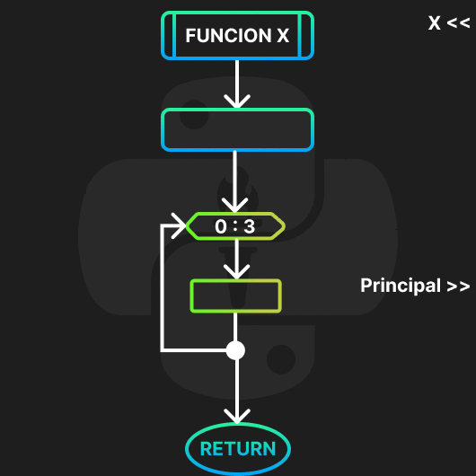
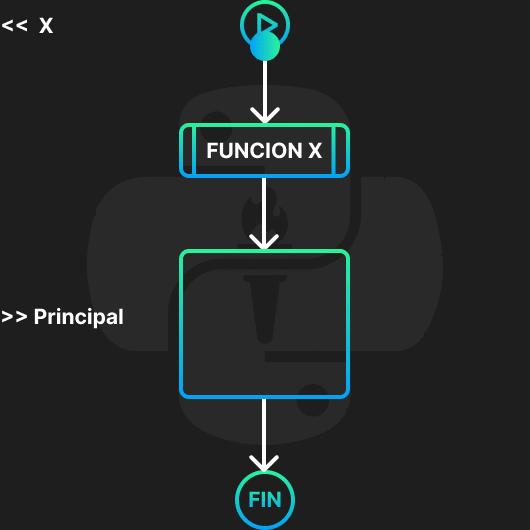
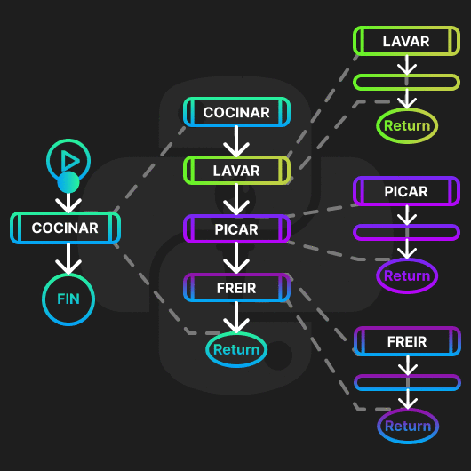
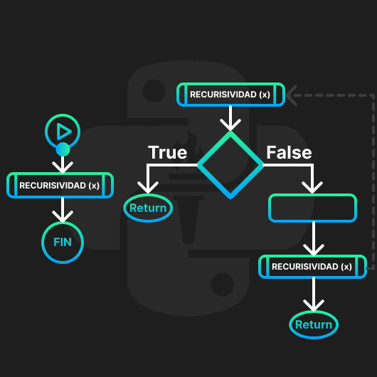

<!-- .slide: data-background-image="../../content/psg-bg-dark.png" data-background-size="100%"-->
 <!-- .element  hidden="true" -->

<br>
<br>
<br>


### Sesión  14
### Funciones
### Bloques de código

---
##### ¿Qué es una función?

---
Una función es un bloque de código que realiza una tarea específica

Se le asigna un nombre y se puede llamar en cualquier parte del programa

Solo se ejecuta cuando se llama por su nombre

---
Permite dividir un programa en bloques de código más pequeños

Facilita la lectura y mantenimiento del código

Permite reutilizar el código

---
Visualmente

 <!-- .element width="40%" -->
 <!-- .element width="40%" -->

---
Hasta el momento hemos utilizado algunas funciones como

- `print()`
- `input()`
- `len()`
- `max()`
- `min()`
- `sum()`
- `range()`
- `enumerate()`

---
También hemos utilizado funciones dentro de tipos y estructuras de datos con notación de punto

- `append()`
- `remove()`
- `sort()`
- `upper()`
- `lower()`

---
##### ¿Cómo se declara una función?

Para definir un bloque de código como función se utiliza la palabra reservada `def`

```python
def nombre_funcion():
    print ("Bloque de código")
```

- `def` es la palabra reservada
- `nombre_funcion` es el nombre de la función
- `()` son los paréntesis que pueden contener parámetros
- `:` es el delimitador de inicio del bloque de código
- `print` es el código a ejecutar
- Posee un nivel de indentación

---
Una función puede recibir argumentos de entrada

Una función puede no devolver ningún valor

Una función puede devolver un valor o varios valores

---
Para devolver un valor se utiliza la palabra reservada `return` seguida del valor a devolver

```python
def nombre_funcion():
    return "Bloque de código"
```

---
Se llama a una función utilizando su nombre seguido de paréntesis y los argumentos si los tiene

```python
def nombre_funcion():
    print ("Bloque de código")

nombre_funcion()
print (type(nombre_funcion))
```

```text
Bloque de código
<class 'function'>
```

---
##### Funciones según PEP-8

- Los nombres de las funciones deben ser en minúsculas y separados por guiones bajos
- Los nombres de las funciones deben ser descriptivos

---
##### Ejecución de una función

---
Crearemos un archivo con el nombre sesion14.py

Empezaremos a escribir funciones

---

Las funciones se deben definir antes de ser llamadas

```python [1-2|4]
def nombre_funcion():
    print ("Bloque de código")

nombre_funcion()
```

```text
Bloque de código
```
Se genera un error si se llama a una función que no ha sido definida

```python [1|3-4]
nombre_funcion()

def nombre_funcion():
    print ("Bloque de código")
```

```text
NameError: name 'nombre_funcion' is not defined
```


---
##### Funciones sin argumentos y sin retorno

- No esta definido ningún parámetro
- No recibe argumentos de entrada
- No devuelve ningún valor

```python [1-2|4]
def funcion():
    print ("Bloque de código")

funcion()
```

```text
Bloque de código
```

---
Ejemplo 1, Crear una función para imprimir una lista de 10 números pares y llamarla dos veces

```python [1-2|3-5|7-9]
print ("Ejemplo 1")
print ("1. Definir función")
def imprimir_pares():
    pares = [i for i in range(0, 21, 2)]
    print (pares)

print ("2. Llamar función")
imprimir_pares()
imprimir_pares()
```

```text
Ejemplo 1
1. Definir función
2. Llamar función
[0, 2, 4, 6, 8, 10, 12, 14, 16, 18, 20]
[0, 2, 4, 6, 8, 10, 12, 14, 16, 18, 20]
```

---
Ejercicio 1, crear una función que imprima un mensaje de bienvenida del siguiente conjunto de forma aleatoria

```python
mensajes = {"Bienvenido al Python Study Group 🐍",
"¡Hola y bienvenido al Python Study Group! ✨",
"Hola, aprendamos Python juntos 🐍"}
```

2 minutos

<iframe src="https://time-stuff.com/embed.html" frameborder="0" scrolling="no" width="391" height="140"></iframe>

---
Solución 1

```python
def bienvenida():
    mensajes = {"Bienvenido al Python Study Group 🐍",
    "¡Hola y bienvenido al Python Study Group! ✨",
    "Hola, aprendamos Python juntos 🐍"}
    print (mensajes.pop())

bienvenida()
```

```text
Bienvenido al Python Study Group 🐍
```

---
##### Funciones sin argumentos y con un retorno

- No esta definido ningún parámetro
- No recibe argumentos de entrada
- Devuelve un valor

```python [1-2|4-5]
def funcion():
    return "Bloque de código"

resultado = funcion()
print (resultado)
```

```text
Bloque de código
```

---
Ejemplo 2, Crear una función que devuelva un saludo en diferentes idiomas

```python [1-2|3-5|7-9]
print ("Ejemplo 2")
print ("1. Definir función")
def saludo():
    saludos = {"Hola", "Hello", "Bonjour", "Ciao"}
    return saludos.pop()

print ("2. Llamar función")
resultado = saludo()
print (resultado)
```

```text
Ejemplo 2
1. Definir función
2. Llamar función
Bonjour
```

---
Ejercicio 2, Devolver una fruta aleatoria del siguiente conjunto

```python
frutas = {'🍅','🍌','🍎','🍇','🍉'}
```

2 minutos

<iframe src="https://time-stuff.com/embed.html" frameborder="0" scrolling="no" width="391" height="140"></iframe>

---
Solución 2

```python
def devolver_fruta():
    frutas = {'🍅','🍌','🍎','🍇','🍉'}
    return frutas.pop()

fruta = devolver_fruta()
print (fruta)
```

```text
🍎
🍇
```

---
##### Funciones sin argumentos y con múltiple retorno

- No recibe argumentos de entrada
- Devuelve múltiples valores
- Devuelve una tupla en Python

```python
def funcion():
    return "Bloque", "de", "código"

resultado = funcion()
print (resultado)
```

```text
('Bloque', 'de', 'código')
```

---
Ejemplo 3, Crear una función que devuelva un saludo en dos idiomas

```python [1-2|3-6|8-10]
print ("Ejemplo 3")
print ("1. Definir función")
def saludo():
    saludos_es = {"Hola", "Holi", "Buenos días"}
    saludos_en = {"Hello", "Hi", "Good morning"}
    return saludos_es.pop(), saludos_en.pop()

print ("2. Llamar función")
resultado = saludo()
print (resultado)
```

```text
Ejemplo 3
1. Definir función
2. Llamar función
('Hola', 'Good morning')
```

---
Ejercicio 3, Devolver una fruta y un color aleatorio de los siguientes conjuntos

```python
frutas = {'🍅','🍌','🍎','🍇','🍉'}
colores = {'🔴','🟠','🟡','🟢','🔵'}
```

2 minutos

<iframe src="https://time-stuff.com/embed.html" frameborder="0" scrolling="no" width="391" height="140"></iframe>

---
Solución 3

```python
def devolver_fruta_color():
    frutas = {'🍅','🍌','🍎','🍇','🍉'}
    colores = {'🔴','🟠','🟡','🟢','🔵'}
    return frutas.pop(), colores.pop()

fruta, color = devolver_fruta_color()
print (fruta, color)
```

```text
🍎 🔵
```

---
##### Funciones con un argumento y sin retorno

- Tiene definido un parámetro de entrada
- Recibe un argumento de entrada
- No devuelve ningún valor

```python
def funcion(parametro):
    print (parametro)

funcion("Bloque de código") #1 Argumento
```

```text
Bloque de código
```

El parámetro es una variable de la función puede ser de cualquier tipo

Números, cadenas, listas, diccionarios, tuplas, conjuntos, etc.

---
Ejemplo 4, Crear una función que imprima el cuadrado de un número

```python [1-2|3-4|6-8]
print ("Ejemplo 4")
print ("1. Definir función")
def cuadrado(numero):
    print (numero**2)

print ("2. Llamar función")
cuadrado(5)
cuadrado(10)
```

```text
Ejemplo 4
1. Definir función
2. Llamar función
25
100
```

---
Ejercicio 4, Crear una función que imprima el mensaje de bienvenida de acuerdo al un idioma enviado como argumento, si no existe imprimir un mensaje por defecto

```python
mensajes = {"es":"Bienvenido al Python Study Group 🐍",
"en": "Hello and welcome to the Python Study Group! ✨",
}
```

2 minutos

<iframe src="https://time-stuff.com/embed.html" frameborder="0" scrolling="no" width="391" height="140"></iframe>

---
Solución 4

```python
def bienvenida(idioma):
    mensajes = {
        "es":"Bienvenido al Python Study Group 🐍",
        "en": "Hello and welcome to the Python Study Group! ✨",
    }
    print (mensajes.get(idioma, "¡Hola!"))

bienvenida("es")
bienvenida("en")
bienvenida("fr")
```

```text
Bienvenido al Python Study Group 🐍
Hello and welcome to the Python Study Group! ✨
¡Hola!
```

---
##### Funciones con múltiples argumentos y sin retorno

- Tiene definido múltiples parámetros de entrada
- Recibe múltiples argumentos de entrada separados por coma
- No devuelve ningún valor
- Los argumentos son variables de la función
- El orden de los argumentos debe coincidir con los parámetros

```python
def funcion(param1, param2, ...,  paramN):
    print (param1, param2, ..., paramN)

funcion("Bloque", "de", "código")
```

```text
Bloque de código
```

Los parámetros definidos pueden ser de cualquier tipo y cantidad

---
Ejemplo 5, Crear una función que reciba una cadena y un entero y repita la cadena el número de veces

```python [1-2|3-4|6-7]
print ("Ejemplo 5")
print ("1. Definir función")
def repetir(cadena, veces):
    print (cadena*veces)

print ("2. Llamar función")
repetir("✨🎉", 10)
```

```text
Ejemplo 5
1. Definir función
2. Llamar función
✨🎉✨🎉✨🎉✨🎉✨🎉✨🎉✨🎉✨🎉✨🎉✨🎉✨🎉
```

---
Ejercicio 5, Crear una función que reciba una lista de animales, un entero e imprima una lista con los animales repetidos el número de veces

```python
# Entrada
animales = ['🐶','🐱','🐭','🐹','🐰']
# Salida
animales = ['🐶🐶🐶', '🐱🐱🐱', '🐭🐭🐭', '🐹🐹🐹', '🐰🐰🐰']
``` 

2 minutos

<iframe src="https://time-stuff.com/embed.html" frameborder="0" scrolling="no" width="391" height="140"></iframe>

---
Solución 5

```python
def repetir_animales(animales, veces):
    lista = [animal*veces for animal in animales]
    print (lista)

animales = ['🐶','🐱','🐭','🐹','🐰']
repetir_animales(animales, 3)

print (resultado)
```

```text
['🐶🐶🐶', '🐱🐱🐱', '🐭🐭🐭', '🐹🐹🐹', '🐰🐰🐰']
```

---
##### Funciones con múltiples argumentos y con un retorno

- Tiene definido múltiples parámetros de entrada
- Recibe múltiples argumentos de entrada separados por coma
- Devuelve un valor
- El orden de los argumentos debe coincidir con los parámetros

```python
def funcion(param1, param2, paramN):
    return param1

resultado = funcion("Bloque", "de", "código")
print (resultado)
```

```text
'Bloque'
```

---
Ejemplo 6, Crear una función que reciba dos números y devuelva una lista con la suma, resta, multiplicación y división de los números

```python [1-2|3-8|10-12]
print ("Ejemplo 6")
print ("1. Definir función")
def operaciones(numero1, numero2):
    suma = numero1 + numero2
    resta = numero1 - numero2
    multiplicacion = numero1 * numero2
    division = numero1 / numero2
    return [suma, resta, multiplicacion, division]

print ("2. Llamar función")
resultado = operaciones(10, 5)
print (resultado)
```

```text
Ejemplo 6
1. Definir función
2. Llamar función
[15, 5, 50, 2.0]
```

---
Ejercicio 6, Crear una función que reciba dos enteros y una cadena devolver el resultado de la operación de los números según la cadena puede ser suma, resta, multiplicación o división

3 minutos

<iframe src="https://time-stuff.com/embed.html" frameborder="0" scrolling="no" width="391" height="140"></iframe>

---
Solución 6

```python
def operacion(numero1, numero2, operacion):
    if operacion == "suma":
        return numero1 + numero2
    elif operacion == "resta":
        return numero1 - numero2
    elif operacion == "multiplicacion":
        return numero1 * numero2
    elif operacion == "division":
        return numero1 / numero2
    else:
        return "Operación no válida"

resultado = operacion(10, 5, "suma")
print (resultado)
```

```text
15
```

---
##### Funciones con múltiples argumentos y con múltiple retorno

- Tiene definido múltiples parámetros de entrada
- Recibe múltiples argumentos de entrada separados por coma
- Devuelve múltiples valores
- Devuelve una tupla en Python

```python
def funcion(param1, param2, ..., paramN):
    return param1, param2, ..., paramN

resultado = funcion("Bloque", "de", "código")
print (resultado)
```

```text
('Bloque', 'de', 'código')
```

---
Ejemplo 7, Crear una función que reciba dos números y devuelva la suma, resta, multiplicación y división de los dos números

```python [1-2|3-9|11-13]
print ("Ejemplo 7")
print ("1. Definir función")
def operaciones(numero1, numero2):
    suma = numero1 + numero2
    resta = numero1 - numero2
    multiplicacion = numero1 * numero2
    division = numero1 / numero2
    return suma, resta, multiplicacion, division

print ("2. Llamar función")
suma, resta, multiplicacion, division = operaciones(10, 5)
print (suma, resta, multiplicacion, division)
```

```text
Ejemplo 7
1. Definir función
2. Llamar función
15 5 50 2.0
```

---
Ejercicio 7, Crear una juego de piedra papel o tijera, donde reciba dos jugadas por teclado

y devuelva las jugadas y el resultado, si ingresa salir terminar el juego

3 minutos

<iframe src="https://time-stuff.com/embed.html" frameborder="0" scrolling="no" width="391" height="140"></iframe>

---
Solución 7

```python
def jugar_piedra_papel_tijera(jugada1, jugada2):
    if jugada1 == jugada2:
        resultado = "Empate"
    elif jugada1 == "piedra" and jugada2 == "tijera":
        resultado = "Jugador 1 gana"
    elif jugada1 == "papel" and jugada2 == "piedra":
        resultado = "Jugador 1 gana"
    elif jugada1 == "tijera" and jugada2 == "papel":
        resultado = "Jugador 1 gana"
    else:
        resultado = "Jugador 2 gana"
    return jugada1, jugada2, resultado

while True:
    jugador1 = input("Jugador 1: ")
    if jugador1 == "salir":
        break
    jugador2 = input("Jugador 2: ")
    if jugador2 == "salir":
        break
    resultado = jugar_piedra_papel_tijera(jugador1, jugador2)
    print (resultado)
```

```text
Jugador 1: piedra
Jugador 2: papel
('piedra', 'papel', 'Jugador 2 gana')
Jugador 1: salir
```

---
##### Variables globales y locales

- Las variables globales son accesibles desde cualquier parte del programa
- Las variables locales son accesibles solo dentro de un bloque de código como una función
- Si hay una variable local y una global con el mismo nombre, la variable local tendrá prioridad donde está definida

---

```python
variable_global = "Variable global"

def funcion():
    variable_local = "Variable local"
    print ("✨",variable_global)
    print ("✨",variable_local)

funcion()
print ("🎈",variable_global)
print ("🎈",variable_local)
```

```text
✨ Variable global
✨ Variable local
🎈 Variable global
NameError: name 'variable_local' is not defined
```

---
Prioridad

```python
variable = "Variable global"
print ('0.',variable)

def funcion():
    variable = "Variable local"
    print ('1.',variable)

funcion()
print ('2.',variable)
```

```text
0. Variable global
1. Variable local
2. Variable global
```

---
Ejemplo 8, De la siguiente lista de números obtener el mayor y menor número con una función

```python
numeros = [10, 5, 20, 15, 25, 30] #Global

def mayor_menor(): #No recibe argumentos
    mayor = max(numeros) #Local
    menor = min(numeros) #Local
    return mayor, menor #Devuelve dos valores

resultado = mayor_menor()
print (resultado)
```

```text
(30, 5)
```

---
Ejercicio 8, De la siguiente cadena global convertir en formato título y contar las vocales `aeiou` con una función
    
```python
cadena = "python es un lenguaje de programación"
```

2 minutos

<iframe src="https://time-stuff.com/embed.html" frameborder="0" scrolling="no" width="391" height="140"></iframe>

---
Solución 8

```python
def formato_vocales():
    titulo = cadena.title()
    vocales = sum([1 for letra in titulo if letra in "aeiou"])
    return titulo, vocales

cadena = "python es un lenguaje de programación"
resultado = formato_vocales()

print (resultado)
```

```text
('Python Es Un Lenguaje De Programación', 10)
```

---
##### Args y Kwargs

- `*args` es una lista de parámetros sin clave
- `**kwargs` es un diccionario de parámetros con clave

---
##### Args

- Los argumentos utilizando `*args` son enviados como una tupla
- Los `*args` se escriben después de los parámetros de la función
- Se utiliza cuando no se sabe la cantidad de argumentos que se enviarán
- Pueden ser iterados

---
Estructura de `*args`


```python
def funcion(*args):
    print (args)
    print (type(args))

funcion("Bloque", "de", "código")
```

```text
('Bloque', 'de', 'código')
```

---
Ejemplo 9 Crear una función que reciba un número y una cantidad de cadenas, concatene las cadenas y la devuelva repetida N veces

```python [1-2|3-7|9-11]
print ("Ejemplo 9")
print ("1. Definir función")
def concatenar(numero, *cadenas):
    concatenado = ""
    for cadena in cadenas:
        concatenado += cadena
    return concatenado*numero

print ("2. Llamar función")
resultado = concatenar(3, "🍎", "🍌", "🍍")
print (resultado)
```

```text
Ejemplo 9
1. Definir función
2. Llamar función
'🍎🍌🍍🍎🍌🍍🍎🍌🍍'
```

---
Ejercicio 9, Crear una función que reciba N objetos y genere una tupla y una lista con los objetos usando `*args`

```python
1, 1.1, True, "🍎"
```

2 minutos

<iframe src="https://time-stuff.com/embed.html" frameborder="0" scrolling="no" width="391" height="140"></iframe>

---
Solución 9

```python
def tupla_lista(*args):
    tupla = tuple(args)
    lista = list(args)
    return tupla, lista

lista, tupla = tupla_lista(1, 1.1, True, "🍎")

print (lista)
print (tupla)
```

```text
[1, 1.1, True, '🍎']
(1, 1.1, True, '🍎')
```

---
##### Kwargs

- Los argumentos utilizando `**kwargs` son enviados como un diccionario
- Los `**kwargs` se escriben después de los parámetros de la función
- Se utiliza cuando no se sabe la cantidad de argumentos que se enviarán con clave
- Pueden ser iterados
- Se accede a los valores con la clave del diccionario

---
Estructura de `**kwargs`

```python
def funcion(**kwargs):
    print (kwargs)
    print (type(kwargs))

funcion(nombre="Jhon", apellido="Doe", genero="M")
```

```text
{'nombre': 'Jhon', 'apellido': 'Doe', 'genero': 'M'}
<class 'dict'>
```

---
Ejemplo 10, Crear una función que reciba los datos de una persona y devuelva un mensaje con los datos

```python [1-2|3-7|8-10]
print ("Ejemplo 10")
print ("1. Definir función")
def datos_persona(**datos):
    mensaje = ""
    for clave, valor in datos.items():
        mensaje += f"{str(clave).title()}: {str(valor).upper()}\n"
    return mensaje
print ("2. Llamar función")
resultado = datos_persona(nombre="Jhon", apellido="Doe", edad=20, boliviano=True)
print (resultado)
```

```text
Ejemplo 10
1. Definir función
2. Llamar función
Nombre: JHON
Apellido: DOE
Edad: 20
Boliviano: TRUE
```

---
Ejercicio 10, Crea un simulador de lavar platos con una función que reciba los objetos a lavar y el tiempo de lavado de cada objeto devuelva un mensaje con los objetos lavados y el tiempo total de lavado

```text
Plato: 5 minutos, Vaso: 3 minutos, Tenedor: 1 minuto, Cuchara: 0.5 minutos
```

3 minutos

<iframe src="https://time-stuff.com/embed.html" frameborder="0" scrolling="no" width="391" height="140"></iframe>

---
Solución 10

```python
def lavar(**objetos):
    tiempo_total = 0
    mensaje = ""
    for objeto, tiempo in objetos.items():
        tiempo_total += tiempo
        mensaje += f"{objeto}: {tiempo} minutos\n"
    mensaje += f"Tiempo total: {tiempo_total} minutos"
    return mensaje

resultado = lavar(plato=5, vaso=3, tenedor=1, cuchara=0.5)
print (resultado)
```

```text
plato: 5 minutos
vaso: 3 minutos
tenedor: 1 minutos
cuchara: 0.5 minutos
Tiempo total: 9.5 minutos
```

---
##### Documentación de funciones

Es importante documentar las funciones para que otros programadores puedan entender su funcionamiento

---
- Se puede documentar una función con un comentario de varias líneas
- Se accede con la función `.__doc__`

---
Documentación de una función

```python
def funcion():
    """
    Documentación aquí
    """
    print ("Bloque de código")
```

- `def funcion():` es la definición de la función
- `"""` es el inicio de la documentación
- `Documentación aquí` es el texto de la documentación
- `"""` es el fin de la documentación
- `print` es el bloque de código indentado

---
Acceso a la documentación con `.__doc__`

```python
print ("Acceso a la documentación")
def funcion():
    """
    Documentación aquí
    """
    print ("Bloque de código")
print (funcion.__doc__)
print ("Fin de la ejecución")
```

```text
Acceso a la documentación

    Documentación aquí
    
Fin de la ejecución
```

---
##### Llamado de funciones dentro de funciones

- Se pueden llamar funciones dentro de otras funciones
- Se utiliza para dividir una función en bloques de código más pequeños
- Se puede llamar una función dentro de un bucle o condicional

---
Visualmente

 <!-- .element width="40%" -->

---
Ejemplo 11, Crear tres funciones una principal que reciba un número y dos funciones anidadas que devuelvan el cuadrado y el cubo del número

```python [1-2|3-6|8-10|12-14|16-19]
print ("Ejemplo 11")
print ("1. Definir función Principal")
def principal(numero):
    cuadrado = cuadrado_numero(numero)
    cubo = cubo_numero(numero)
    return cuadrado, cubo

print ("2. Definir función Cuadrado")
def cuadrado_numero(numero):
    return numero**2

print ("3. Definir función Cubo")
def cubo_numero(numero):
    return numero**3

print ("4. Llamar función Principal")
numero = 5
resultado = principal(numero)
print (numero, resultado)
```

---
```text
Ejemplo 11
1. Definir función Principal
2. Definir función Cuadrado
3. Definir función Cubo
4. Llamar función Principal
5 (25, 125)
```

---
Ejercicio 11, Crear funciones de limpieza de una cadena para obtener las letras y convertir todo en mayúsculas crea funciones de limpieza y función una principal

```python
cadena = "Python es un lenguaje de programación 🎈. Feliz Aprendizaje el 2024"
```

3 minutos

<iframe src="https://time-stuff.com/embed.html" frameborder="0" scrolling="no" width="391" height="140"></iframe>

---
Solución 11

```python
def limpiar_letras(cadena):
    """
    Elimina los números de una cadena y espacios
    """
    return "".join([letra for letra in cadena if letra.isalpha()])
def limpiar_mayusculas(cadena):
    """
    Convierte una cadena en mayúsculas
    """
    return cadena.upper()

def limpiar(cadena):
    cadena = limpiar_letras(cadena)
    cadena = limpiar_mayusculas(cadena)
    return cadena

cadena = "Python es un lenguaje de programación 🎈. Feliz Aprendizaje el 2024"
resultado = limpiar(cadena)
print (cadena)
print (resultado)
```

```text
Python es un lenguaje de programación 🎈. Feliz Aprendizaje el 2024
PYTHONESUNLENGUAJEDEPROGRAMACIÓNFELIZAPRENDIZAJEEL
```

---
##### Funciones Recursivas

- Una función recursiva es una función que se llama a sí misma
- Se utiliza para reprocesar un bloque de código
- Se debe tener un caso base para evitar un bucle infinito

---
Se utiliza para resolver problemas matemáticos, grafos, árboles, etc.

---
Visualmente

 <!-- .element width="40%" -->

---
Estructura de una función recursiva

```python
def funcion_recursiva(valor):
    if caso_base:
        return valor
    else:
        return funcion_recursiva(valor)
```
- `def funcion_recursiva(valor):` es la definición de la función
- `if caso_base:` es la condición para terminar la recursividad
- `return valor` es el valor a devolver
- `else:` es el bloque de código recursivo
- `return funcion_recursiva(valor)` es la llamada recursiva

---
Ejemplo 12, Crear una función recursiva para obtener el 10 número par

```python [1-2|3-7|7|9-11]
print ("Ejemplo 12")
print ("1. Definir función")
def numero_par(numero):
    if numero == 0:
        return 0
    else:
        return numero_par(numero-1) + 2

print ("2. Llamar función")
resultado = numero_par(10)
print (resultado)
```

```text
Ejemplo 12
1. Definir función
2. Llamar función
20
```

```text
2,4,6,8,10,12,14,16,18,[20]
```

---
<iframe width="850" height="450" frameborder="0" src="https://pythontutor.com/iframe-embed.html#code=print%20%28%22Ejemplo%2012%22%29%0Aprint%20%28%221.%20Definir%20funci%C3%B3n%22%29%0Adef%20numero_par%28numero%29%3A%0A%20%20%20%20if%20numero%20%3D%3D%200%3A%0A%20%20%20%20%20%20%20%20return%200%0A%20%20%20%20else%3A%0A%20%20%20%20%20%20%20%20return%20numero_par%28numero-1%29%20%2B%202%0A%0Aprint%20%28%222.%20Llamar%20funci%C3%B3n%22%29%0Aresultado%20%3D%20numero_par%2810%29%0Aprint%20%28resultado%29&codeDivHeight=400&codeDivWidth=350&cumulative=false&curInstr=1&heapPrimitives=nevernest&origin=opt-frontend.js&py=3&rawInputLstJSON=%5B%5D&textReferences=false"> </iframe>

---
Ejercicio 12, Crear una función recursiva para obtener el factorial de un número

`$5! = 5*4*3*2*1 = 120$`

2 minutos

<iframe src="https://time-stuff.com/embed.html" frameborder="0" scrolling="no" width="391" height="140"></iframe>

---
Solución 12

```python
def factorial(numero):
    if numero == 0:
        return 1
    else:
        return numero*factorial(numero-1)

resultado = factorial(5)
print (resultado)
```

```text
120
```

---
##### Funciones anónimas o lambda

- Una función anónima es una función sin nombre
- Se utiliza para funciones pequeñas y simples
- Se utiliza para funciones que se van a pasar como argumento
- Se realiza en una sola línea
- se puede asignar a una variable

---
Se recomienda utilizar para funciones pequeñas y simples

Según PEP-8 no se recomienda utilizar lambda sino crear una función definida

Se puede utilizar en funciones como `map`, `filter`, `reduce`, `sorted`, etc. para procesar datos

---
Estructura de una función anónima

```python
lambda argumento: expresión
```
- `lambda` es la palabra reservada
- `argumento` es el argumento de la función
- `:` es el delimitador de la expresión
- `expresión` es el bloque de código

---
Ejemplo 13, Crear una función anónima para obtener el cuadrado de un número

```python
print ("Ejemplo 13")
cuadrado = lambda numero: numero**2
resultado = cuadrado(5)
print (resultado)
resultado = cuadrado(10)
print (resultado)
```

```text
25
100
```

---
Ejercicio 13, Crear una función anónima para obtener de una cadena las letras solo los alfanuméricos y convertir en mayúsculas

```python
cadena = "Python es un lenguaje de programación"
```

2 minutos

<iframe src="https://time-stuff.com/embed.html" frameborder="0" scrolling="no" width="391" height="140"></iframe>

---
Solución 13

```python
cadena = "Python es un lenguaje de programación"
limpiar = lambda cadena: "".join([letra for letra in cadena if letra.isalnum()]).upper()
resultado = limpiar(cadena)
print (cadena)
print (resultado)
```

```text
Python es un lenguaje de programación
PYTHONESUNLENGUAJEDEPROGRAMACIÓN
```

---
##### Resumen

- Las funciones son bloques de código que se pueden reutilizar
- Se definen con la palabra reservada `def`
- Se llaman después de ser definidas
- Una función puede definirse con o sin parámetros
- Una función puede recibir o no argumentos

---
- Una función puede devolver un valor o no devolver un valor
- Puede haber funciones con multiples argumentos y múltiples retornos
- Existen variables globales y locales en las funciones

---
- Las variables locales tienen prioridad sobre las globales
- Existen `*args` y `**kwargs` en funciones para recibir múltiples argumentos
- `*args` es una tupla de argumentos sin clave
- `**kwargs` es un diccionario de argumentos con clave

---
- Se puede llamar funciones dentro de funciones
- Existen funciones recursivas que se llaman a sí mismas
- Las funciones anónimas o lambda son funciones sin nombre
- Lambdas se utilizan para funciones pequeñas y simples

---
- Se pueden documentar las funciones con `"""documentación"""`
- Se puede acceder a la documentación con `.__doc__`

---

 <!-- .element width="40%" -->
 <!-- .element width="40%" -->

---
 <!-- .element width="40%" -->
 <!-- .element width="40%" -->


---
##### Retos

Crear una carpeta con el nombre "retos_sesion_14" en la cual por cada ejercicio debe crear un script de python

```bash
# Ejemplo carpeta 
psg-example/
    retos_sesion_14/
        ejercicio_01.py
        ejercicio_02.py
        ejercicio_03.py
        ejercicio_04.py
        ejercicio_05.py
        ejercicio_06.py
        ejercicio_07.py
        sesion14.ipynb
```

Subir la carpeta a su repositorio en GitHub cuando termine los retos

---
1. Un estudiante desea saber cuál es su promedio de calificaciones en la materia de matemáticas, cree una función que reciba las calificaciones como lista y devuelva el promedio las calificaciones son 20,40,60,51,13

---
2. Calculadora flexible: Crea una calculadora que acepte diferentes operaciones matemáticas como argumentos de palabras clave y realice los cálculos correspondientes, las operaciones son suma, resta, multiplicación y división

---
3. Crear una función recursiva para obtener el N número de la serie de Fibonacci

---
4. Crear una función anónima para obtener el área de un círculo con radio 5

---
5. Crear una función que reciba una cadena y devuelva la cadena invertida

---
6. Crear una función que reciba una lista de números y devuelva solo los números pares

---
7. Simular un tres en raya con funciones donde reciba las jugadas y devuelva el ganador hasta que alguien ingrese salir

---
8. Convertir y ejecutar el archivo de la "sesion14.py" a un archivo en jupyter notebook

---
<!-- .slide: data-background-image="../../content/psg-bg-dark.png" data-background-size="100%"-->

<br>
<br>
<br>
<br>
<br>

[ <!-- .element width="20%"-->](https://github.com/python-la-paz/python-study-group-fundamentals/tree/main/content/sesion14)

Repositorio de la Sesión

---
<!--.slide: data-visibility="hidden"-->
## Bibliografía y Referencias

- [Python Learn](https://do1.dr-chuck.com/pythonlearn/ES_es/pythonlearn.pdf)
- [Built in Functions](https://docs.python.org/3/library/functions.html#built-in-functions)
- [Lambda](https://docs.python.org/3/reference/expressions.html#lambda)
- [Control de flujo](https://docs.python.org/3/tutorial/controlflow.html#defining-functions)
- [Documentación](https://docs.python.org/3/tutorial/controlflow.html#documentation-strings)
- [Glosario Parameter](https://docs.python.org/3/glossary.html#term-parameter)
- [Glosario Argument](https://docs.python.org/3/glossary.html#term-argument)
- [FAQ Param VS Arg](https://docs.python.org/3/faq/programming.html#faq-argument-vs-parameter)
- [Python Tutor](https://pythontutor.com/)