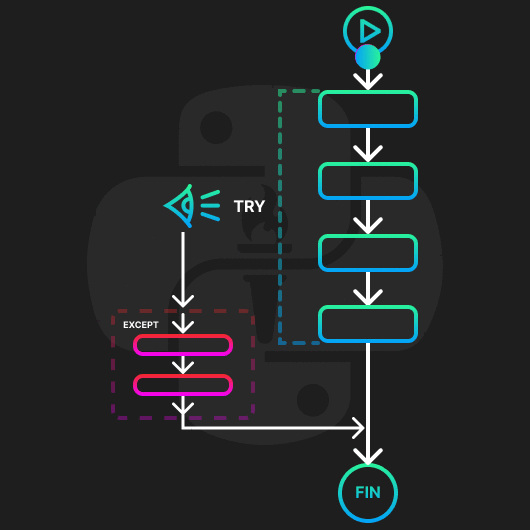

<!-- .slide: data-background-image="../../content/psg-bg-dark.png" data-background-size="100%"-->
 <!-- .element  hidden="true" -->

<br>
<br>
<br>

### Sesión  15
### Errores y Excepciones
### Try - Except

---
No podemos controlar lo que un usuario ingresa por lo que debemos anticipar los que pueden ocurrir

---
##### ¿Qué es un error?

---
Un error es una situación que se produce cuando una instrucción no puede ejecutarse correctamente.

En Python, un error puede ser un error de sintaxis o un error de excepción

---
Un error de sintaxis se produce cuando Python no puede interpretar nuestro código

Generalmente porque hemos escrito mal alguna parte del código

```python
print("Hola Mundo)
```

```text
line 1
    print("Hola Mundo)
          ^
SyntaxError: unterminated string literal (detected at line 1)
```

---
##### ¿Qué es una excepción?

Una excepción es un error que ocurre durante la ejecución de un programa

Cuando se produce una excepción, el programa se detiene y muestra un mensaje de error

---
La mayoría de las excepciones son ya gestionadas por Python

Aveces es necesario gestionar las excepciones nosotros mismos

---
En Python las excepciones se pueden manejar para evitar que el programa se detenga inesperadamente

---
Visualmente

 <!-- .element width="40%" -->


---
##### Estructura de una excepción Simple

```python
try:
    # Código que puede lanzar una excepción
except Exception as e:
    # Código que se ejecuta si se produce una excepción
# Código que se ejecuta siempre fuera del bloque try-except
```

- `try`: Bloque de código que puede lanzar una excepción posee indentación
- `except`: Bloque de código que se ejecuta si se produce una excepción
- `Exception as e`: Captura la excepción y la almacena en la variable `e`

---

Ejemplo 1, División por cero

```python [1|2|3|4]
print ("Inicio Ejemplo 1")
x = 1 / 0
print (x)
print ("Fin Ejemplo 1")
```

```text
Inicio Ejemplo 1
ERROR!
Traceback (most recent call last):
  File "<main.py>", line 2, in <module>
ZeroDivisionError: division by zero
```

---
Ejemplo 1, División por cero

```python [1|2-4|5-6|7]
print ("Inicio Ejemplo 1")
try:
    x = 1 / 0
    print (x)
except Exception as e:
    print("💀 Error:", e, type(e))
print ("Fin Ejemplo 1")
```

```text
Inicio Ejemplo 1
💀 Error: division by zero <class 'ZeroDivisionError'>
Fin Ejemplo 1
```

---
Ejercicio 1, Crear un programa que solicite dos números  y realice la división de ambos números
Si hay un error mostrar un mensaje de error
El programa se detiene si se ingresa "salir"

2 minutos

<iframe src="https://time-stuff.com/embed.html" frameborder="0" scrolling="no" width="391" height="140"></iframe>

---
Solución Ejercicio 1

```python
while True:
    try:
        num1 = input("Ingrese el primer número: ")
        if num1 == "salir":
            break
        num2 = input("Ingrese el segundo número: ")
        if num2 == "salir":
            break
        num1 = float(num1)
        num2 = float(num2)
        print("Resultado:", num1 / num2)
    except Exception as e:
        print("💀 Error:", e)
```

```text
Ingrese el primer número: 1
Ingrese el segundo número: 0
ERROR!
💀 Error: float division by zero
Ingrese el primer número: salir
```

---
##### Tipos de excepciones

Algunos tipos de excepciones son:

- ZeroDivisionError: Se produce cuando se intenta dividir por cero
- NameError: Se produce cuando no se encuentra una variable
- TypeError: Se produce cuando se intenta realizar una operación no permitida

---
- ValueError: Se produce cuando se intenta realizar una operación con un valor incorrecto
- KeyError: Se produce cuando se intenta acceder a una clave que no existe en un diccionario
- IndexError: Se produce cuando se intenta acceder a un índice que no existe en una lista

---
##### Excepciones múltiples

`try` puede detectar un tipo de excepción específico y ejecutar un bloque de código diferente para cada tipo de excepción

Se debe poner un bloque `except` el tipo de excepción que se desea capturar con jerarquía de arriba hacía abajo

```python
try:
    # Código que puede lanzar una excepción
except ZeroDivisionError as e:
    # Código si se produce una excepción de división por cero
except Exception as e:
    # Código si se produce una excepción genérica
```

---
Ejemplo 2, División por cero

```python [1-2|3-5|6-7|10]
print ("Inicio Ejemplo 2")
divisor = 0
try:
    x = 1 / divisor
    print (x)
except ZeroDivisionError as e:
    print("0️⃣ Error:", e, type(e))
except Exception as e:
    print("💀 Error:", e, type(e))
print ("Fin Ejemplo 2")
```

```text
Inicio Ejemplo 2
0️⃣ Error: division by zero <class 'ZeroDivisionError'>
Fin Ejemplo 2
```

---
Ejemplo 2, División por cero

```python [1-2|3-5|8-9|10]
print ("Inicio Ejemplo 2")
divisor = "0"
try:
    x = 1 / divisor
    print (x)
except ZeroDivisionError as e:
    print("0️⃣ Error:", e, type(e))
except Exception as e:
    print("💀 Error:", e, type(e))
print ("Fin Ejemplo 2")
```

```text
Inicio Ejemplo 2
💀 Error: unsupported operand type(s) for /: 'int' and 'str' <class 'TypeError'>
Fin Ejemplo 2
```

---
Jerarquía de excepciones

Ejemplo 2, División por cero

```python [1-2|3-5|6-7|10]
print ("Inicio Ejemplo 2")
divisor = 0
try:
    x = 1 / divisor
    print (x)
except Exception as e: # Captura cualquier excepción
    print("💀 Error:", e, type(e))
except ZeroDivisionError as e:
    print("0️⃣ Error:", e, type(e))
print ("Fin Ejemplo 2")
```

```text
Inicio Ejemplo 2
💀 Error: division by zero <class 'ZeroDivisionError'>
Fin Ejemplo 2
```

---
Ejemplo 3, De la lista de calificaciones obtener el promedio

```python
calificaciones = [20,40,80,"A"]
suma = 0
try:
    for i in range(len(calificaciones)+1):
        suma += calificaciones[i] 
    promedio = suma / len(calificaciones)
    print("Promedio:", promedio)
except ZeroDivisionError as e:
    print("0️⃣ Error:", e, type(e))
except TypeError as e:
    print("🎭 Error:", e, type(e))
except Exception as e:
    print("💀 Error:", e, type(e))
```

```text
🎭 Error: unsupported operand type(s) for +=: 'int' and 'str' <class 'TypeError'>
```

---
Ejemplo 3, De la lista de calificaciones obtener el promedio

```python
calificaciones = [20,40,80]
suma = 0
try:
    for i in range(len(calificaciones)+1):
        suma += calificaciones[i]
    promedio = suma / len(calificaciones)
    print("Promedio:", promedio)
except ZeroDivisionError as e:
    print("0️⃣ Error:", e, type(e))
except TypeError as e:
    print("🎭 Error:", e, type(e))
except Exception as e: # Captura cualquier excepción
    print("💀 Error:", e, type(e))
```

```text
💀 Error: list index out of range <class 'IndexError'>
```

---
Ejemplo 3, De la lista de calificaciones obtener el promedio

```python
calificaciones = [20,40,80]
suma = 0
try:
    for i in range(len(calificaciones)):
        suma += calificaciones[i] # suma = suma + calificaciones[i]
    promedio = suma / len(calificaciones)
    print("Promedio:", promedio)
except ZeroDivisionError as e:
    print("0️⃣ Error:", e, type(e))
except TypeError as e:
    print("🎭 Error:", e, type(e))
except Exception as e:
    print("💀 Error:", e, type(e))
```

```text
Promedio: 46.666666666666664
```

---
##### Bloque `else`

Se puede agregar un bloque `else` que se ejecuta si no se produce ninguna excepción

Se debe poner después de todos los bloques `except`

Lo utilizamos validar la entrada de datos o para mostrar un mensaje de éxito

---
Estructura de un bloque `else`

```python [5-6]
try:
    # Código que puede lanzar una excepción
except Exception as e:
    # Código si se produce una excepción
else:
    # Código si no se produce ninguna excepción
```

---
Ejemplo 4, De la lista de calificaciones obtener el promedio

```python [1-3|4-8|11-12|13]
print ("Inicio Ejemplo 4")
calificaciones = [20,40,80]
suma = 0
try:
    for i in range(len(calificaciones)):
        suma += calificaciones[i]
    promedio = suma / len(calificaciones)
    print("Promedio:", promedio)
except Exception as e:
    print("💀 Error:", e, type(e))
else:
    print ("🎉 Sin errores")
print ("Fin Ejemplo 4")
```

```text
Inicio Ejemplo 4
Promedio: 46.666666666666664
🎉 Sin errores
Fin Ejemplo 4
```

---
- Ejercicio 2, Crear un programa que solicite dos números y mediante una función devuelva la división de ambos
- Si hay un error mostrar un mensaje de error. El programa se detiene si se ingresa "salir"
- Añadir un bloque `else` que muestre el resultado de la función

2 minutos

<iframe src="https://time-stuff.com/embed.html" frameborder="0" scrolling="no" width="391" height="140"></iframe>

---
Solución Ejercicio 2

```python
def division(num1, num2):
    return num1 / num2

while True:
    try:
        num1 = input("Ingrese el primer número: ")
        if num1 == "salir":
            break
        num2 = input("Ingrese el segundo número: ")
        if num2 == "salir":
            break
        num1 = float(num1)
        num2 = float(num2)
        resultado = division(num1, num2))
    except Exception as e:
        print("💀 Error:", e)
    else:
        print("🎉 Resultado: ",resultado)
```

```text
Ingrese el primer número: 1
Ingrese el segundo número: 1
🎉 Resultado:  1.0
```

---
##### Bloque `finally`

Se puede agregar un bloque `finally` que se ejecuta siempre, independientemente de si se produce una excepción

Se debe poner después de todos los bloques `except` y `else`

---
Se utiliza para liberar recursos o cerrar archivos

Para garantizar que se ejecute un código importante sin importar si se produce una excepción o no

---
Estructura de un bloque `finally`

```python [7-8]
try:
    # Código que puede lanzar una excepción
except Exception as e:
    # Código si se produce una excepción
else:
    # Código si no se produce ninguna excepción
finally:
    # Código que se ejecuta siempre
```

---
Ejemplo 5, Simula una conexión a internet que haga ping y cerrar la conexión

```python [1|2-3|6-7|8-9]
print ("Inicio Ejemplo 5")
try:
    print("🔗 Ping...")
except Exception as e:
    print("💀 Error:", e)
else:
    print("🎉 Ping Exitoso")
finally:
    print("🔌 Cerrando conexión")
```

```text
Inicio Ejemplo 5
🔗 Ping...
🎉 Ping Exitoso
🔌 Cerrando conexión
```

---
¿Cómo generamos una excepción? 

Para probar que finally se ejecuta siempre

---
##### Raise

`raise` se utiliza para generar una excepción

Se puede generar una excepción específica o una excepción genérica

---
Estructura de `raise`

```python
raise Exception("Mensaje de error")
```

- `raise` es una palabra reservada de Python
- `Exception` es el tipo de excepción que se desea generar
- `"Mensaje de error"` es el mensaje que se mostrará

---
Ejemplo 6, Simula una conexión a internet que haga ping y cerrar la conexión

```python [1|2-4|4|5-6|9-10]
print ("Inicio Ejemplo 6")
try:
    print("🔗 Ping...")
    raise Exception("Error de conexión") #Excepción genérica
except Exception as e: # Captura cualquier excepción
    print("💀 Error:", e)
else:
    print("🎉 Ping Exitoso")
finally:
    print("🔌 Cerrando conexión")
```

```text
Inicio Ejemplo 6
🔗 Ping...
💀 Error: Error de conexión
🔌 Cerrando conexión
```

---
- Ejercicio 3, Escriba un programa que solicite un número por teclado y se almacene en una lista
- Si es 0 se genera una excepción
- Si la ejecución es correcta muestra "🎉Agregado"
- Termina la ejecución sólo con la palabra "salir" utilizar la excepción `KeyboardInterrupt` 
- Finalmente imprima siempre la suma de los números y la lista

4 minutos

<iframe src="https://time-stuff.com/embed.html" frameborder="0" scrolling="no" width="391" height="140"></iframe>

---
Solución Ejercicio 3

```python
numeros = []
while True:
    try:
        num = input("Ingrese un número: ")
        if num == "salir":
            break
        num = float(num)
        if num == 0:
            raise Exception("No se puede agregar el número 0")
        numeros.append(num)
    except KeyboardInterrupt as e:
        print('🚫 Para salir escriba "salir"')
    except Exception as e:
        print("💀 Error:", e)
    else:
        print("🎉 Número agregado")
    finally:
        print("Suma:", sum(numeros))
```

---
```text
Ingrese un número: 1
🎉 Número agregado
Lista: [1.0]
Suma: 1.0
Ingrese un número: 2
🎉 Número agregado
Lista: [1.0, 2.0]
Suma: 3.0
Ingrese un número: 🚫 Para salir escriba "salir"
Lista: [1.0, 2.0]
Suma: 3.0
Ingrese un número: salir
Lista: [1.0, 2.0]
Suma: 3.0
```

---
##### Pass

`pass` es una palabra reservada de Python que no hace nada

Se utiliza para evitar errores de sintaxis

Se puede utilizar para evitar errores de indentación

---
Ejemplo 7, Crea una función que no hace nada

```python
print("Inicio Ejemplo 7")
def funcion():
    pass

funcion()
print("Fin Ejemplo 7")
```

```text
Inicio Ejemplo 7
Fin Ejemplo 7
```

---
##### Excepciones personalizadas

Se pueden crear excepciones personalizadas

Nos permite crear excepciones específicas para nuestro programa

---
Se utiliza para crear excepciones de acuerdo a las necesidades del programa

---
Estructura de una excepción personalizada

```python
class MiError(Exception):
    pass

raise MiError("Mensaje de error")
```

- `class`: palabra reservada de Python para crear una clase
- `MiError (Exception)`: nombre de la clase y la excepción de la que hereda
- `pass`: palabra reservada de Python para indicar que no hace nada

---
Ejemplo 8, Tienes un frutero, saca las frutas mientras no sea un gusano y genera una excepción 

---
```python [1-3|5|6|7-10|11-12|15]
print("Inicio Ejemplo 8")
class GusanoError(Exception):
    pass

frutero = ['🍎', '🍌', '🍐', '🐛', '🍇']
for fruta in frutero:
    try:
        if fruta == '🐛':
            raise GusanoError("😱 Ewww!")
        print(fruta)
    except GusanoError as e:
        print("🐛 Error:", e)
    except Exception as e:
        print("💀 Error:", e)
print("Fin Ejemplo 8")
```

```text
Inicio Ejemplo 8
🍎
🍌
🍐
🐛 Error: 😱 Ewww!
🍇
Fin Ejemplo 8
```

---
- Ejercicio 4, Crear un programa que solicite palabras por teclado y almacene en una lista
- Si se inserta caracteres no alfabéticos se genera una excepción personalizada y no se almacena
- Si se ingresa "salir" se termina la ejecución
- Mostrar el mensaje "🎉 Palabra agregada" si no hay errores
- Finalmente imprimir la lista de palabras

3 minutos

<iframe src="https://time-stuff.com/embed.html" frameborder="0" scrolling="no" width="391" height="140"></iframe>

---
Solución Ejercicio 4

```python
class NoAlfabeticoError(Exception):
    pass

palabras = []
while True:
    try:
        palabra = input("Ingrese una palabra: ")
        if palabra == "salir":
            break
        if not palabra.isalpha():
            raise NoAlfabeticoError("Solo se permiten letras")
        palabras.append(palabra)
    except NoAlfabeticoError as e:
        print("🚫 Error:", e)
    except Exception as e:
        print("💀 Error:", e)
    else:
        print("🎉 Palabra agregada")
    finally:
        print("Lista:", palabras)
```

---
##### Resumen

- `try`: Bloque de código que puede lanzar una excepción
- `except`: Bloque de código que se ejecuta si se produce una excepción
- `else`: Bloque de código que se ejecuta si no se produce ninguna excepción

---
- `finally`: Bloque de código que se ejecuta siempre
- `raise`: Genera una excepción
- `pass`: No hace nada
- Podemos crear excepciones personalizadas con `class`

---
##### Retos

Crear una carpeta con el nombre "retos_sesion_15" en la cual por cada ejercicio debe crear un script de python

```bash
# Ejemplo carpeta 
psg-example/
    retos_sesion_15/
        ejercicio_01.py
        ejercicio_02.py
        ejercicio_03.py
        sesion15.ipynb
```

Subir la carpeta a su repositorio en GitHub cuando termine los retos

---

1. Crea una calculadora interactiva que solicite dos números por teclado y realice las operaciones de suma, resta, multiplicación y división. El programa debe seguir solicitando dos números hasta que se ingrese "salir". Se debe incluir el manejo de excepciones para evitar errores al ingresar datos no numéricos, al intentar dividir entre cero, o ante cualquier otro error inesperado.

---

2. Crea un programa que permita construir una canasta de frutas solicitando ingresar frutas por teclado, una por una, y almacenándolas en una lista. El programa debe finalizar cuando se ingrese "salir". 

Solo se permiten las siguientes frutas: `🍅, 🍇, 🍈, 🍉, 🍊, 🍌, 🍍, 🍑`

Si se ingresa una fruta no permitida, el programa debe lanzar una excepción personalizada que indique que la fruta no es válida.

---

3. Crea un programa que simule el funcionamiento de un cajero automático solicitando al usuario un monto a retirar. Si el monto ingresado es mayor al saldo disponible, el programa debe lanzar una excepción personalizada que indique que no hay fondos suficientes. Además, si el monto ingresado es mayor a 1000, debe lanzarse una excepción genérica que advierta que el monto excede el límite permitido por transacción.

---

1. Convertir y ejecutar el archivo de la "sesion15.py" a un Jupyter Notebook

---
<!-- .slide: data-background-image="../../content/psg-bg-dark.png" data-background-size="100%"-->

<br>
<br>
<br>
<br>
<br>

[ <!-- .element width="20%"-->](https://github.com/python-la-paz/python-study-group-fundamentals/tree/main/content/sesion15)

Repositorio de la Sesión

---
<!--.slide: data-visibility="hidden"-->
## Bibliografía y Referencias

- [Python Learn](https://do1.dr-chuck.com/pythonlearn/ES_es/pythonlearn.pdf)
- [Errors](https://docs.python.org/es/3/tutorial/errors.html)
- [Exceptions](https://docs.python.org/es/3/library/exceptions.html)
- [Bltin-exceptions](https://docs.python.org/es/3/library/exceptions.html#bltin-exceptions)
- [Handling-exceptions](https://docs.python.org/es/3/tutorial/errors.html#handling-exceptions)
- [Raising-exceptions](https://docs.python.org/es/3/tutorial/errors.html#raising-exceptions)
- [The-try-statement](https://docs.python.org/es/3/reference/compound_stmts.html#the-try-statement)
- [Except-star](https://docs.python.org/es/3/reference/compound_stmts.html#except-star)
- [Else-clause](https://docs.python.org/es/3/reference/compound_stmts.html#else-clause)
- [Finally-clause](https://docs.python.org/es/3/reference/compound_stmts.html#finally-clause)
- [The-pass-statement](https://docs.python.org/3/reference/simple_stmts.html#the-pass-statement)
- [Tut-userexceptions](https://docs.python.org/3/tutorial/errors.html#tut-userexceptions)
- [KeyboardInterrupt](https://docs.python.org/es/3/library/exceptions.html#KeyboardInterrupt)
- [Exception-hierarchy](https://docs.python.org/es/3/library/exceptions.html#exception-hierarchy)
