<!-- .slide: data-background-image="../../content/psg-bg-dark.png" data-background-size="100%"-->
 <!-- .element  hidden="true" -->

<br>
<br>
<br>

### Sesión  Bonus
### Depuración
### Debug en Visual Studio Code

---
Vamos a aprender a debuggear o depurar nuestro código en Python

---
##### ¿Qué es Debug?

---
Depurar o debuggear es el proceso de encontrar y corregir errores en el código fuente de un programa

---
##### Importancia de Debug

El proceso de depuración es una parte esencial del desarrollo de software

A través de la depuración, podemos identificar errores y problemas en nuestro código.

Nos permite corregirlos y mejorar la calidad de nuestro software

---
##### Conceptos básicos de Debug

1. **Punto de interrupción (Breakpoint)**: Es un punto en el código fuente donde la ejecución del programa se detiene temporalmente. Nos permite inspeccionar el estado del programa en ese punto

---
2. **Comandos de Debug**: Son comandos que nos permiten controlar la ejecución del programa durante la depuración

---
3. **Inspección de variables**: Nos permite ver el valor de las variables en un punto específico del programa

---
4. **Evaluación de expresiones en tiempo de ejecución**: Nos permite evaluar expresiones en tiempo de ejecución

---
5. **Consola de Debug**: Es una consola que nos permite interactuar con el programa durante la depuración

---
6. **Depuración de un script**: Es el proceso de depurar un archivo de código fuente en un programa

---
##### Debug en Visual Studio Code

Una de las características más útiles de Visual Studio Code es su capacidad para depurar código

Posee un depurador integrado que nos permite depurar código en varios lenguajes de programación

incluido Python

---

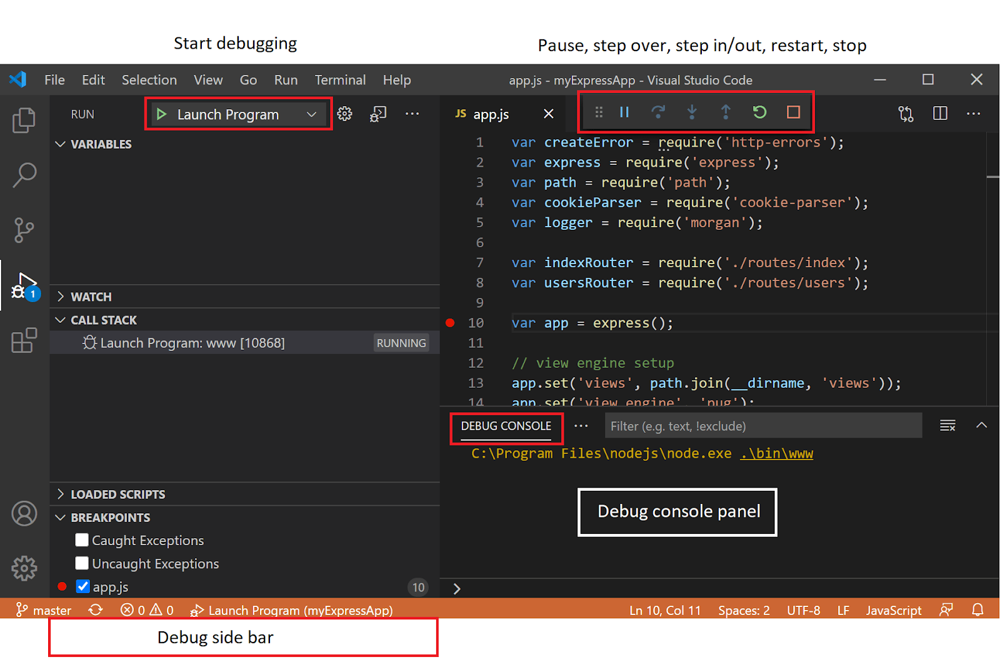 <!-- .element width="90%" -->

---

Visual Studio Code no es un IDE de Python especializado en solo Python

Visual Studio Code es un editor de código que soporta varios lenguajes de programación

Para depurar código en Python en Visual Studio Code, necesitamos instalar la extensión de Python

---
##### Configuración de Debug en Visual Studio Code

Primero, necesitamos instalar la extensión de Python en Visual Studio Code

Para instalar la extensión de Python, abrimos Visual Studio Code y hacemos clic en la pestaña de Extensiones

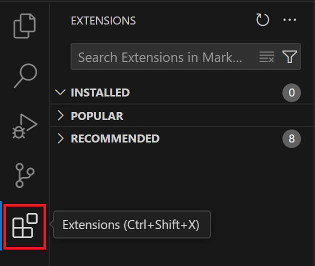 <!-- .element width="35%" -->

---
En la barra de búsqueda, escribimos Python vemos que el Publicador es Microsoft

Es la extensión oficial de Python para Visual Studio Code

Hacemos clic en la extensión de Python

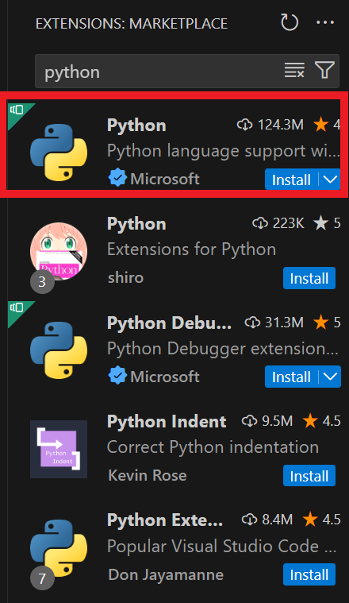 <!-- .element width="40%" -->

---
Si vamos a la pestaña Extension Pack observamos que posee varias extensiones útiles cómo:

- Pylance: Mejora la experiencia de desarrollo añadiendo soporte IntelliSense para el autocompletado
- Python Debugger: Proporciona soporte para depurar código en Python utilizando debugpy

---
 <!-- .element width="90%" -->

---

Presionamos el botón de instalar para instalar la extensión de Python en Visual Studio Code

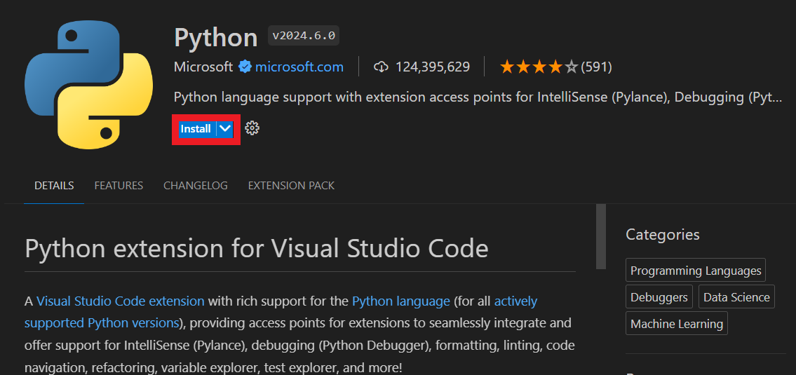 <!-- .element width="90%" -->

---
Una vez que la extensión de Python está instalada, podemos comenzar a depurar código en Python en Visual Studio Code

---
Crearemos el archivo `sesion_bonus.py`  donde vamos a empezar a depurar código en Python

---
```python
# sesion_bonus.py
def suma(a, b):
    c = a + b
    return c

def resta(a, b):
    return a - b

def multiplicacion(x, y):
    z = x * y
    return z

def division(x, y):
    return x / y

def division_controlada(x,y):
    try:
        return x / y
    except ZeroDivisionError as e:
        return "Division entre cero"

a = 11
b = 0
print (suma(a, b))
print (resta(a, b))
print (multiplicacion(a, b))
print (division_controlada(a, b))
print (division(a, b))
```


---
##### Puntos de interrupción (Breakpoints)

Un punto de interrupción es un punto en el código fuente donde la ejecución del programa se detiene temporalmente

Para agregar un punto de interrupción en Visual Studio Code, hacemos clic en el margen izquierdo del editor de código

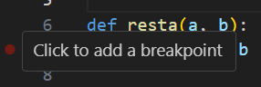 <!-- .element width="40%" -->

---
Después de agregar un punto de interrupción, veremos un círculo rojo en el margen izquierdo del editor de código

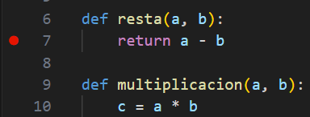 <!-- .element width="40%" -->

---
Después de agregar un punto de interrupción, tenemos que iniciar la depuración del programa

No es lo mismo que ejecutar el programa normalmente

La depuración nos permite inspeccionar el estado del programa en un punto específico mientras se ejecuta

---
Para iniciar la depuración del programa, hacemos clic en el botón de Depurar en la barra de herramientas 

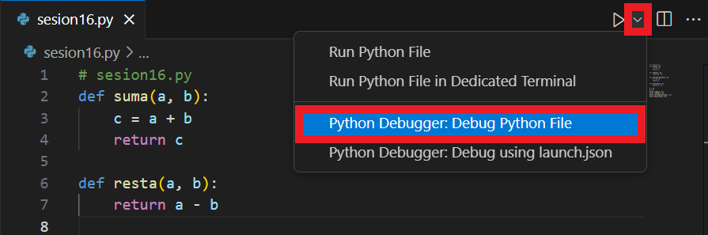 <!-- .element width="70%" -->

Cuando hacemos clic en el botón de Depurar, Visual Studio Code inicia la depuración del programa y detiene la ejecución siempre que se encuentre un punto de interrupción

---
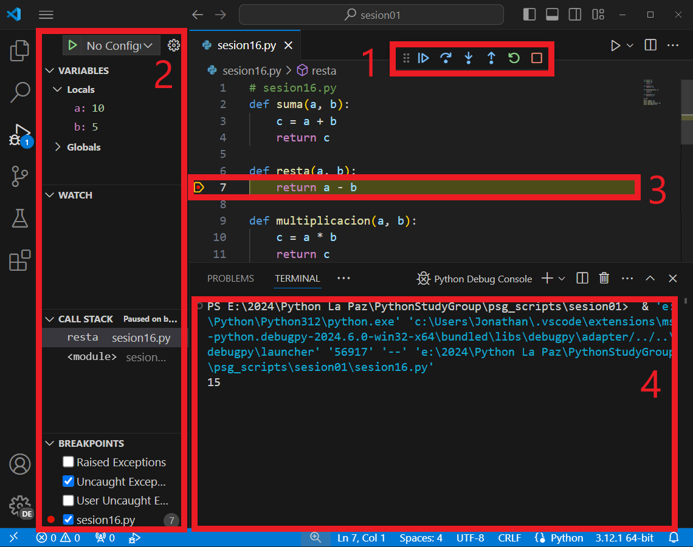 <!-- .element width="80%" -->

---
Observamos

1. En la parte superior, vemos la barra de herramientas de depuración
2. En la izquierda vemos la barra de navegación de depuración 
3. Vemos en el script que la ejecución se detiene en el punto de interrupción
4. En la parte inferior vemos en la terminal la salida del programa en Python Debug Console

---
##### Navegación de depuración

La barra de herramientas de depuración nos permite controlar la ejecución del programa durante la depuración

---
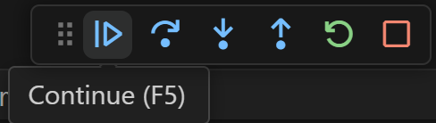 <!-- .element width="40%" -->

1. **Continuar (Continue)**: Continúa la ejecución del programa hasta el siguiente punto de interrupción

---
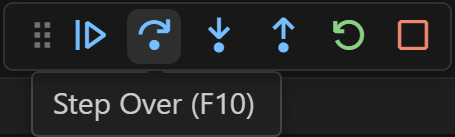 <!-- .element width="40%" -->

2. **Paso siguiente (Step Over)**: Ejecuta la siguiente línea de código

---
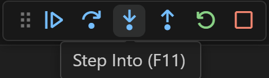 <!-- .element width="40%" -->

3. **Paso en (Step Into)**: Entra en la función actual

---
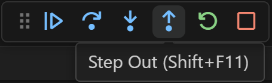 <!-- .element width="40%" -->

4. **Paso fuera (Step Out)**: Sale de la función actual

---
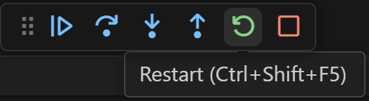 <!-- .element width="40%" -->

5. **Reiniciar (Restart)**: Reinicia la depuración del programa

---
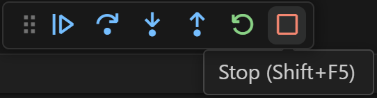 <!-- .element width="40%" -->

6. **Detener (Stop)**: Detiene la depuración del programa 

---
##### Inspección de variables

La inspección de variables nos permite ver el valor de las variables en un punto específico del programa

Para inspeccionar una variable en Visual Studio Code, colocamos el cursor sobre la variable y vemos el valor de la variable

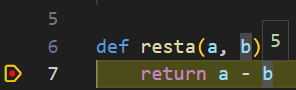 <!-- .element width="40%" -->

---
También podemos inspeccionar variables en el panel de Variables en la barra de navegación de depuración

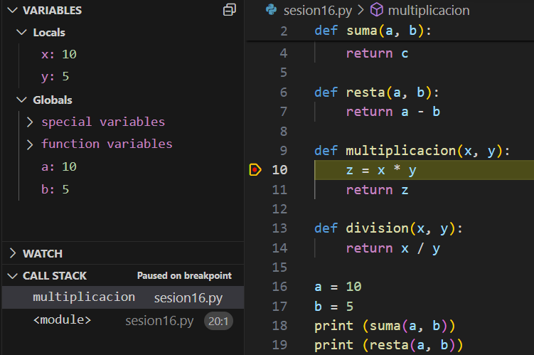 <!-- .element width="70%" -->

---
##### Evaluación de expresiones en tiempo de ejecución

La evaluación de expresiones nos permite evaluar durante la ejecución del programa

Para evaluar una expresión en Visual Studio Code, utilizaremos el panel Watch para agregar una expresión y ver su valor en tiempo de ejecución con las variables del programa

---
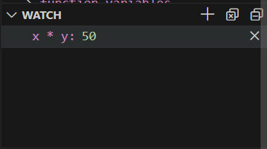 <!-- .element width="40%" -->


---
##### Call Stack (Pila de llamadas)

Almacena información sobre las llamadas a funciones en el programa

Nos permite ver la secuencia de llamadas hasta el punto actual del programa

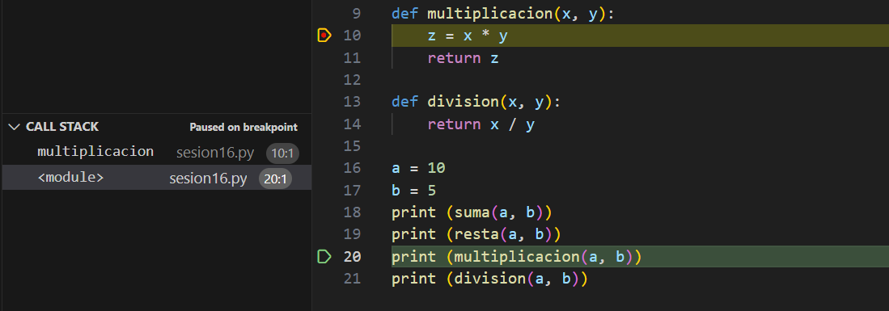 <!-- .element width="40%" -->


---
##### Breakpoints condicionales

Los breakpoints condicionales nos permiten detener la ejecución del programa solo si se cumple una condición

Para agregar un breakpoint condicional, hacemos clic con el botón derecho en el breakpoint y seleccionamos Edit Breakpoint

---
Por ejemplo, si z es igual a 50, el programa se detendrá en el breakpoint

```
z == 50
```

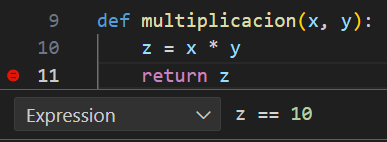 <!-- .element width="40%" -->

---
##### Breakpoints Panel

El panel de Breakpoints nos permite ver todos los breakpoints en el programa

Podemos habilitar o deshabilitar breakpoints, editar breakpoints y eliminar breakpoints

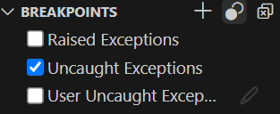 <!-- .element width="40%" -->

---
Raised Exceptions

Habilitar esta opción nos permite detener la ejecución del programa cuando se lanza una excepción

Sin importar si la excepción es manejada o no mediante un bloque try-except

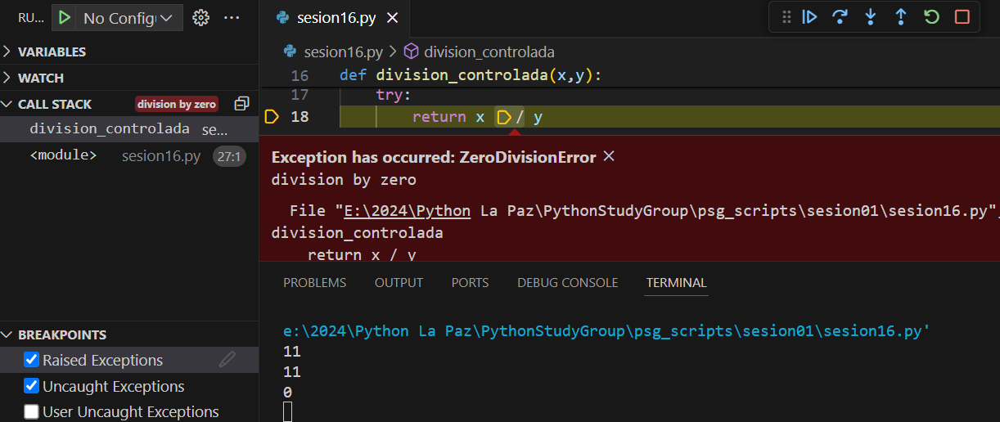 <!-- .element width="80%" -->

---
Uncaught Exceptions

Habilitar esta opción nos permite detener la ejecución del programa cuando se lanza una excepción no manejada

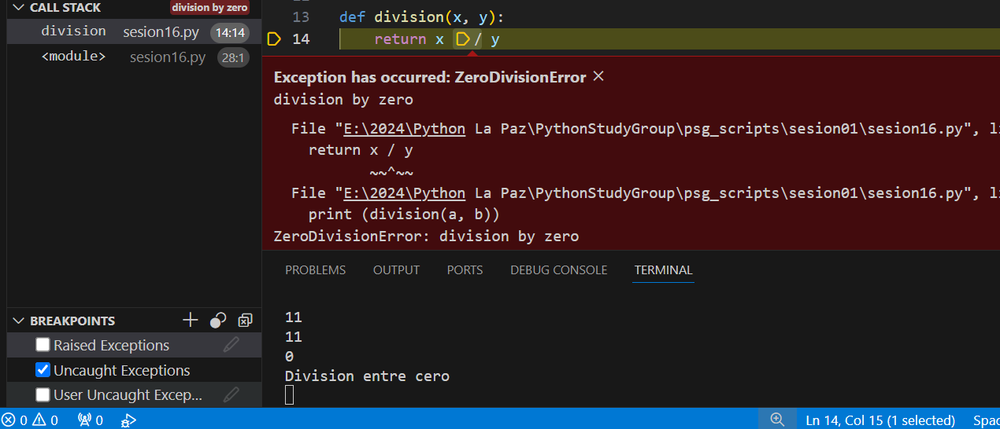 <!-- .element width="80%" -->

---
Add Function Breakpoint

Nos permite agregar un breakpoint en una función específica en el programa mediante el nombre de la función

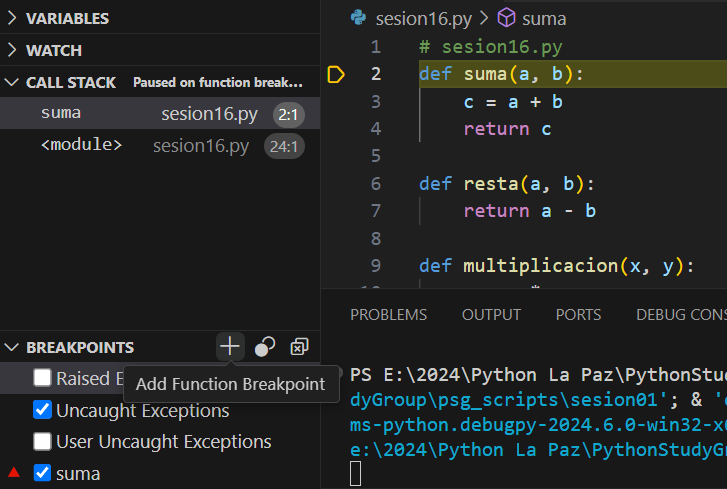 <!-- .element width="60%" -->

---
##### Consola de Debug

La consola de Debug es una consola que nos permite interactuar con el programa durante la depuración

Podemos ejecutar comandos en la consola de Debug para inspeccionar variables, evaluar expresiones y controlar la ejecución del programa

---
Para abrir la consola de Debug, hacemos clic en la pestaña de Debug Console cerca de la terminal en la parte inferior de Visual Studio Code

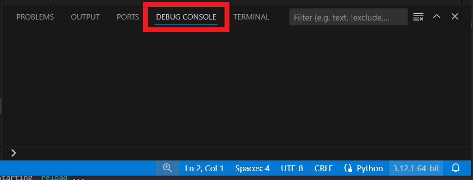 <!-- .element width="60%" -->

---
Podemos ejecutar comandos en la consola de Debug para inspeccionar variables, evaluar expresiones y controlar la ejecución del programa

Ejecutando

```python
print (a, b)
```
```python	
print (suma(10, 5))
```

---
Podemos cambiar el valor de las variables en la consola de Debug

```python
a = 20
b = 10
```

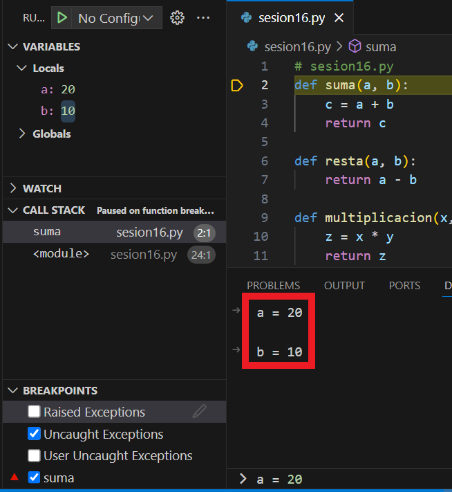 <!-- .element width="40%" -->

---
##### Depuración de un script

La depuración de un script es el proceso de identificar y corregir errores en un archivo de código fuente en un programa

Tenemos este script `calculadora.py` que contiene errores

---
```python
def add(a, b):
    return a + b

def subtract(a, b):
    return a - b

def multiply(a, b):
    return str(a) * b

def divide(a, b):
    return a / b

def pow(a):
    b = 0b100
    return a ** b

def calculator():
    while True:
        print("\nSimple Calculator")
        print("Options:")
        print("1. Add")
        print("2. Subtract")
        print("3. Multiply")
        print("4. Divide")
        print("5. Pow")
        print("6. Exit")
        choice = input("Select an operation (1/2/3/4/5): ")
        if choice == 'Exit':
            print("Exiting calculator.")
            break
        if choice in ('1', '2', '3', '4', '5'):
                num1 = float(input("Enter first number: "))
                num2 = float(input("Enter second number: "))
                if choice == '1':
                    print(f"Result: {num1} + {num2} = {add(num1, num2)}")
                elif choice == '2':
                    print(f"Result: {num1} - {num2} = {subtract(num1, num2)}")
                elif choice == '3':
                    print(f"Result: {num1} * {num2} = {multiply(num1, num2)}")
                elif choice == '4 ':
                    print(f"Result: {num1} / {num2} = {divide(num1, num2)}")
        else:
            print("Invalid choice. Please select a valid option.")
calculator()
```

---
Vamos a depurar el script `calculadora.py` en Visual Studio Code 


---
##### launch.json

El archivo `launch.json` es un archivo de configuración que nos permite configurar varios aspectos de la depuración en Visual Studio Code

Podemos configurar el tipo de depurador, el programa que queremos depurar, los argumentos del programa, el entorno de depuración y más

---
Para crear un archivo `launch.json`, hacemos clic en el botón de configuración en la barra de herramientas de depuración

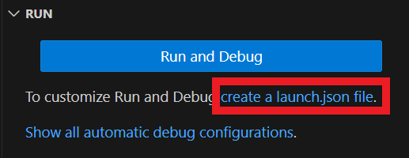 <!-- .element width="60%" -->

---

Después de hacer clic en el botón de configuración, seleccionamos la opción de Python en la lista de entornos de depuración

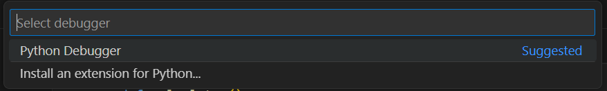 <!-- .element width="80%" -->

---
Seleccionamos la opción de Python File en la lista de entornos de depuración porque queremos depurar un archivo de Python 

Existen configuraciones predefinidas para depurar diferentes tipos de programas en Python

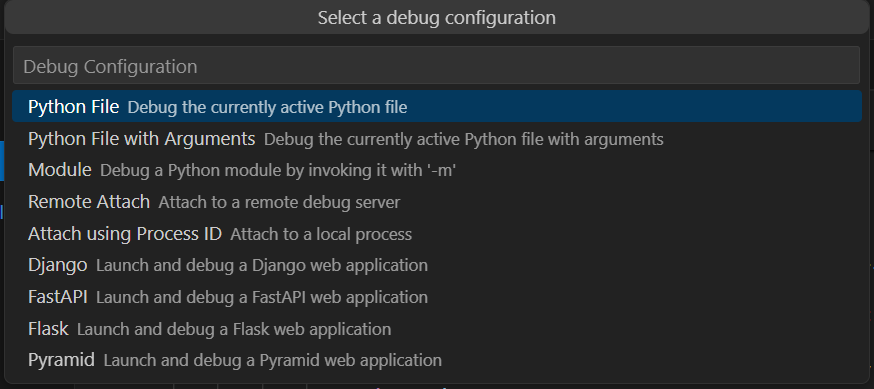 <!-- .element width="80%" -->

---
Después de seleccionar la opción de Python File, Visual Studio Code crea un archivo `launch.json` en la carpeta `.vscode` del proyecto

---
El archivo `launch.json` contiene la configuración de depuración para el archivo de Python

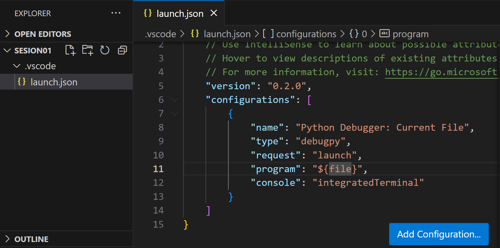 <!-- .element width="80%" -->

---
Una vez que hemos creado el archivo `launch.json`, veremos que en el panel de depuración aparece la configuración de depuración para el archivo de Python

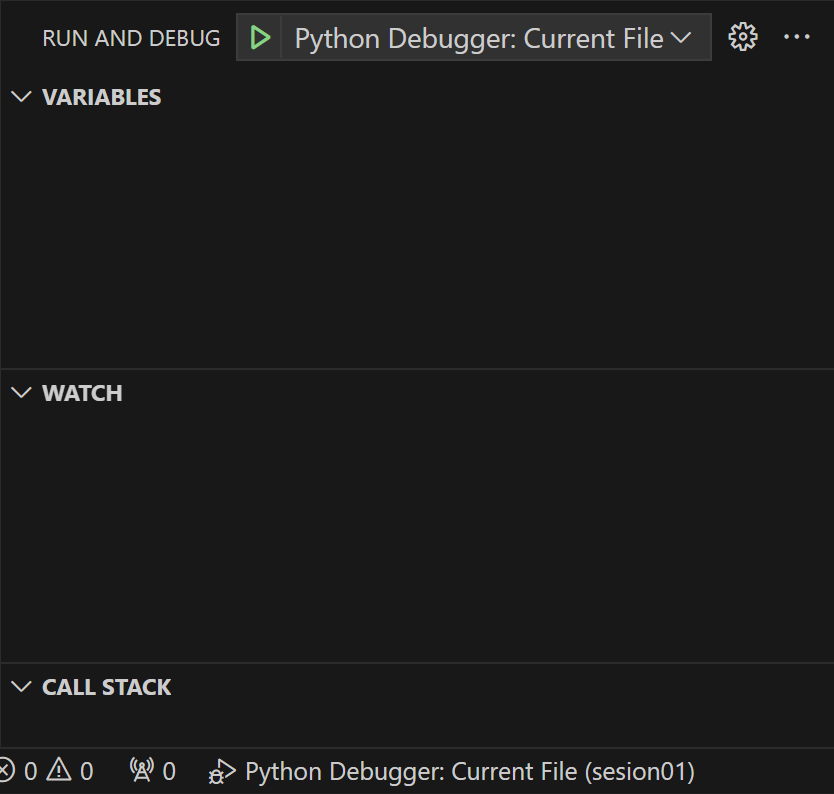 <!-- .element width="40%" -->

---
Desde el panel de depuración, podemos iniciar la depuración del programa haciendo clic en el botón de Iniciar Depuración

---
Es útil tener un archivo `launch.json` para tener una configuración de depuración predefinida para un programa

---
##### Resumen

1. Depurar es el proceso de encontrar y corregir errores en el código fuente de un programa
2. Visual Studio Code es un editor de código que soporta varios lenguajes de programación
3. Visual Studio Code NO es un IDE de Python especializado en solo Python

---
4. Para depurar código en Python en Visual Studio Code, necesitamos instalar la extensión de Python
5. Los puntos de interrupción son puntos en el código fuente donde la ejecución del programa se detiene temporalmente
6. La barra de herramientas de depuración nos permite controlar la ejecución del programa durante la depuración

---
7. La inspección de variables nos permite ver el valor de las variables en un punto específico del programa
8. La evaluación de expresiones en tiempo de ejecución nos permite evaluar expresiones en tiempo de ejecución
9. La consola de Debug es una consola que nos permite interactuar con el programa durante la depuración

---
10. La depuración es el proceso de localizar y corregir errores en un programa
11. El archivo `launch.json` es un archivo de configuración que nos permite configurar varios aspectos de la depuración en Visual Studio Code
12. Es útil tener un archivo `launch.json` para tener una configuración de depuración predefinida para un programa

---
##### Retos
Crear una carpeta con el nombre "retos_sesion_bonus" en la cual por cada ejercicio debe crear un script de python

```bash
# Ejemplo carpeta
psg-example/
    retos_sesion_bonus/
        ejercicio_01.py
        ejercicio_02.py
```

Subir la carpeta a su repositorio en GitHub cuando termine los retos


---
1. Tienes un programa que cuenta la cantidad de frutas que aparecen en una lista y las guarda en un diccionario. El programa no muestra correctamente la información. Corrigelo!

```python
frutas = ['🍅','🍇','🍈','🍉','🍊','🍌','🍍','🍌','🍊','🍉','🍈','🍇','🍅','🍅','🍇']

# Función para contar las frutas
def contar_frutas(lista_frutas):
    contador = {}
    for fruta in lista_frutas:
        if fruta in contador:
            contador[fruta] += 1
        else:
            contador[fruta] = 0
    return contador

# Función para imprimir el conteo de frutas
def imprimir_conteo(conteo):
    for fruta, cantidad in conteo:
        print(f"Hay {cantidad} {fruta}(s).")

# Llamando a las funciones
conteo_frutas = contar_frutas(frutas)
imprimir_conteo(conteo_frutas)
```

---
Resultado esperado

```bash
python ejercicio_01.py
```

```bash
Hay 3 🍅s.
Hay 3 🍇s.
Hay 2 🍈s.
Hay 2 🍉s.
Hay 2 🍊s.
Hay 2 🍌s.
Hay 1 🍍.
```

---
2. Tienes un juego de adivinanzas en el que el jugador tiene que adivinar un número entre 1 y 100. El juego tiene bugs, arréglalos!

```python
def obtener_aleatorio():
    numeros = list(range(1, 101))
    secreto = numeros.pop()
    return secreto

def adivina(secreto):
        intentos = 0
        print ("Que número estoy pensando? (1-100)")
        while True:
            try:
                intento = int(input(f"Intento N°: {intentos+1}: "))
                if intento == secreto:
                    print ("Felicidades! Has adivinado el número!")
                    break
                elif intento < secreto:
                    print ("El número es mayor.")
                else:
                    print ("El número es menor.")
            except ValueError:
                print ("Por favor, ingresa un número válido.")
            finally:
                intentos += 1
        print (f"Has adivinado el número en {intentos*10} intentos.\n")

nombre_jugador = "Guest"

def jugar():
    while True:
        print ("Bienvenido al juego de adivinanzas! del Python Study Group 2024")
        print ("="*63)
        nombre_jugador = input("¿Cuál es tu nombre?: ")
        print (f"Bienvenido, {nombre_jugador}!")
        print ("="*63)
        print ()
        opcion = input("Quieres jugar? (s/n): ")
        if opcion.lower() != 'S':
            break
        secreto = obtener_aleatorio()
        adivina(secreto)
    print ("Gracias por participar!")
    print (f"🐍 Gracias {nombre_jugador.upper()} por ser parte del Python Study Group 2024! 🐍")

jugar()
```

---
Gracias por Participar del Python Study Group 2024🐍

> Cada línea de código es el reflejo de un pensamiento
> 
> Domina tu código, domina tu futuro

---
<!-- .slide: data-background-image="../../content/psg-bg-dark.png" data-background-size="100%"-->

<br>
<br>
<br>
<br>
<br>

[ <!-- .element width="20%"-->](https://github.com/python-la-paz/python-study-group-fundamentals/tree/main/content/sesionBonus)

Repositorio de la Sesión

---
<!--.slide: data-visibility="hidden"-->
## Bibliografía y Referencias
- [Debugging in Visual Studio Code](https://code.visualstudio.com/docs/editor/debugging)
- [Python Extension for Visual Studio Code](https://marketplace.visualstudio.com/items?itemName=ms-python.python)
- [Python Debugging in Visual Studio Code](https://code.visualstudio.com/docs/python/debugging)
- [Debugpy](https://github.com/microsoft/debugpy/)